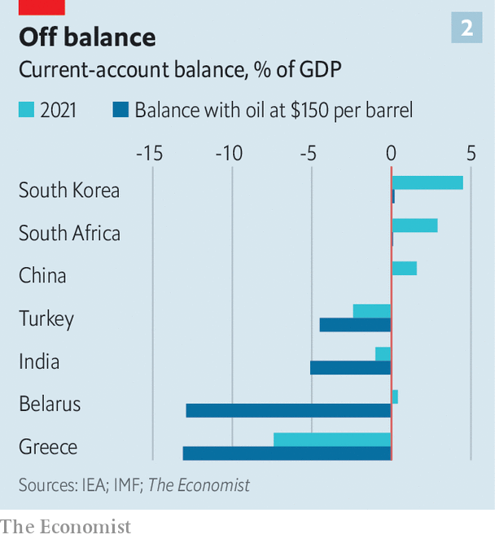

###### Barrelled over

# Can the world cope without Russia’s huge commodity stash? 

##### High prices will outlast the war 

 

> Mar 12th 2022 

IN 1866 NIKOLAI NEKRASOV, a Russian author, started publishing “Who is happy in Russia”, a four-part poem describing how the abolition of serfdom, enacted a few years before, had failed to enrich most peasants. “The chain has been broken,” its first chapter concludes, and the recoiling ends have hit both sides at once.

A century and a half later his verses are a parable for the ostracism of Russia—and its likely fallout. Crushing the world’s 11th-largest economy, comparable in size to Australia, should not necessarily cause global mayhem. But since Nekrasov’s time, and further still since the Soviet Union collapsed, the chain of dependence linking Russia to the world economy has strengthened and grown more complex. Russia ranks number one, two and three, respectively, among the world’s exporters of natural gas, oil and coal. Europe gets the bulk of its energy from its eastern neighbour. Russia also accounts for half of America’s uranium imports. It supplies a tenth of the world’s aluminium and copper, and a fifth of battery-grade nickel. Its dominance in precious metals such as palladium, key in the automotive and electronics industries, is even greater. It is also a .


So far its exports of raw materials have been spared the kind of comprehensive bans the West has imposed on other sectors. America announced an embargo on Russian oil on March 8th, but it buys little of the stuff; Britain will phase out purchases this year. However, growing signs the West could go further have shocked commodities markets. After America’s secretary of state, Antony Blinken, said on March 6th that it was speaking to allies about a common ban, Brent crude soared to $139 a barrel, double the price of December 1st—though by March 10th it had fallen back to $113. Price swings were violent in gas too: on March 8th contracts linked to the European wholesale gas price surged by a third to €285 ($316) per MWh, 18 times their level a year ago, as Russia threatened to retaliate. On the same day, the London Metal Exchange (LME) suspended nickel trading for only the second time in its 145-year history after the metal hit double its previous record price. This week other metals hit or neared all-time highs.

A shock of such depth and breadth is without precedent. A core-commodity index compiled by Thomson Reuters has risen by more than in any period since 1973, on a three-month basis. In the week ending March 4th it showed its biggest increase since at least 1956. Beyond trading floors, hysteria is not yet visible. The calm is unlikely to last. “Right now prices are prints on a screen. In four weeks they become reality,” says a trader. If tensions rise further, energy and metals may have to be rationed. Private firms and personal lives will have to painfully adjust. The rich world would sputter. Poor countries could go bust. In the end Russia may buckle—but not before the broken chain snaps back at the rest of the world with huge violence.

Commodity markets are panicking for two reasons. First, many were tight even before the war, owing to strong demand. A robust post-lockdown economic recovery had fuelled appetite for energy and metals, dragging stocks down to record-low levels. Supply, which is easy to cut but takes longer to ramp up, had not caught up, says Giovanni Serio of Vitol, a big oil-trading firm. Many “midstream” facilities that had shut during covid-19, such as oil refineries, remained offline, creating bottlenecks.

 


The second reason for worry is vanishing supply, which has been the main problem since the invasion of Ukraine. Some Russian oil is still flowing out: millions of barrels are currently crossing the Atlantic. But most of it was bought and paid for a fortnight ago or longer. Fresher supplies of Urals crude, the variety Russia pumps, are no longer moving—despite 25% price discounts. Western firms, loth to find themselves stuck with unsaleable cargo, are pre-empting possible sanctions. Many also fear a public backlash: on March 8th Shell said it would stop buying Russian oil after days of negative press coverage following a purchase of Urals crude.

Particularly problematic is the lack of financing. Most foreign banks, even Chinese ones, have stopped issuing letters of credit for Russian trades. After a decade of paying steep fines for breaching sanctions against Iran and other pariahs, banks are taking no chances. Increasingly that also applies to big commodity traders like Glencore, which not that long ago still dealt with autocrats in the name of powering the planet (and pocketing profits). Many fear being cut off from bank funding, their lifeline, if they continue to deal with Russia.

Problems with logistics are no less important. Unable to get insurance, foreign ships are avoiding the Black Sea. Last week Maersk and MSC, which together account for a third of container operations in Russia, pulled away from the country. Britain has banned Russian ships from its ports; the EU is mulling similar measures. France has intercepted Russian ships carrying steel and soya bound for other countries.

Idle cargo and erratic prices are straining the physical and financial infrastructure of commodity trading. Some European ports are severely congested. Wrong-footed traders are facing hefty margin calls. On March 7th China Construction Bank, a big lender, missed a payment at the LME (it has since made it). Bunker-fuel prices have risen by a third since the invasion, constraining shipping worldwide.

A proper oil embargo by the West could make all that look like a pleasant punt on the Cam. In normal years Russia exports 7m-8m barrels per day (bpd), half of which go to the EU. In theory China could buy more from Russia, freeing up some other supply. But Rystad Energy, a consultancy, estimates that Russia’s pipelines could re-route just 500,000 bpd from Europe to Asia, with rail adding another 200,000 bpd. Ferrying Russian oil to Europe takes 5-10 days; shipping it to Asia takes 45. Redirecting flows would get even harder if “secondary” sanctions target non-Western firms. With Western payment systems out of bounds, traders would turn to clunky bartering. Better alternatives, used by China or others, could take years to scale up.

This suggests a fair chunk of Russia’s oil supply could exit the market. Other commodities would probably be affected. Russia has pledged to respond to a full-blown oil embargo by curtailing gas exports to the West. Limits on coal sales would also be painful, and would complicate Europe’s effort to shift away from gas. As the quality of its own supply has deteriorated, the share of the bloc’s imports of coal coming from Russia has doubled over the past ten years, to 80%. In the case of both gas and coal, much of Russia's supply would simply not get to market. Its gas-storage facilities are almost full. It does not have a big enough fleet to ship coal to Asia, where it is most in demand (it sends coal to Europe by rail).

Call the cartel

The big question is whether an increase in supply from elsewhere could mitigate such losses. Start with oil. America has already scheduled an increase in oil output of 1m bpd. The West could also press members of the Organisation of the Petroleum Exporting Countries (OPEC) to increase supply, yielding perhaps another 2m bpd. Lifting sanctions on Iran may add another 1m bpd. Tapping emergency stocks would help, too. Last week America and other big oil-consuming countries agreed to release 60m barrels from their stash. Hints have been given that they could release more.

All this may increase global supply by 3m-4m bpd—a lot, but perhaps not enough. And the extra supply would take too long to arrive. OPEC members cannot crank up production fast, because they have not invested in new fields for years. Restarting American shale wells takes six months; delivering crude from them another six. In the interim, prices would remain excruciatingly high. And there would be other problems. Retrofitting refineries meant to guzzle Urals crude, which has a high sulphur content, is hard. Lebanon has just run out of diesel not for want of oil but capacity to process non-Urals grades.

Finding new gas supplies is Europe’s big problem. As spring comes the continent will need less of it, and post-winter restocking could be delayed until the autumn. Meanwhile, Europe could start importing more liquefied natural gas from America, though that would require Europe to crank up its “regasification” capacity (for converting liquefied gas back into gaseous state). Scheduled summer maintenance on Norwegian rigs could be postponed so they continue to produce. Azerbaijan could pipe more to Europe. Altogether such fixes could replace about 60% of Russian imports, Rystad reckons. A strong effort—but still insufficient.

Rebalancing the market thus seems impossible without a forced reduction in demand. The least brutal way to achieve this would be through policies seeking to limit consumption, such as caps on the heating of buildings or the rationing of power for industrial use. More likely the market will adjust to soaring prices the hard way, through what economists call “demand destruction”: self-imposed cuts. Mr Serio of Vitol says a jump in crude prices to $200 a barrel could induce “voluntary” cuts of 2m bpd, with another 2m bpd not consumed as incomes are squeezed. On March 9th Rystad said prices could reach $240 a barrel this summer if more countries join the American embargo.

Such energy hell would take a huge toll on firms and people. Demand destruction in metals would add to the pain. Aluminium shortages could hamper the making of anything from cars to cans. A nickel scarcity could halt electric-vehicle production.

All this will surely hobble rich economies. JPMorgan Chase, a bank, already expects the world economy to grow by 0.8 percentage points less in 2022 than it did a week before the invasion, with the euro zone taking a hit of 2.1 percentage points.

 


For poorer countries the immediate threat is that of walloping current-account deficits. Analysis by The Economist suggests that, all else being equal, oil at $150 a barrel for a year would cause the current-account balances of 37 oil importers to sink by an average 2.3 percentage points. That would clobber countries already under stress, such as Pakistan and Turkey (see chart 2). China would see a percentage point knocked off its current-account surplus. Even big commodity exporters like Chile could suffer, because metals have not appreciated as much. Oil-exporting countries would gain but still face issues, such as currency appreciation that weighed on non-energy exports.

High prices are likely to outlast the lifting of sanctions. Russia, seen as a disreputable and risky trading partner, will remain marginalised, says Tom Price of Liberum, a bank. As its capital markets and export proceeds struggle to recover, investment in commodity production will dwindle. Together with a loss of skills and assets, this will cause capacity to shrink. Beyond 2022 higher interest rates and slower global growth may prompt the market finally to cool—at an exorbitant cost. In 1876 Nekrasov started writing the final and jolliest part of his poem, calling it “The feast for all the world”. The happy ending never came: the chapter remains unfinished. ■


