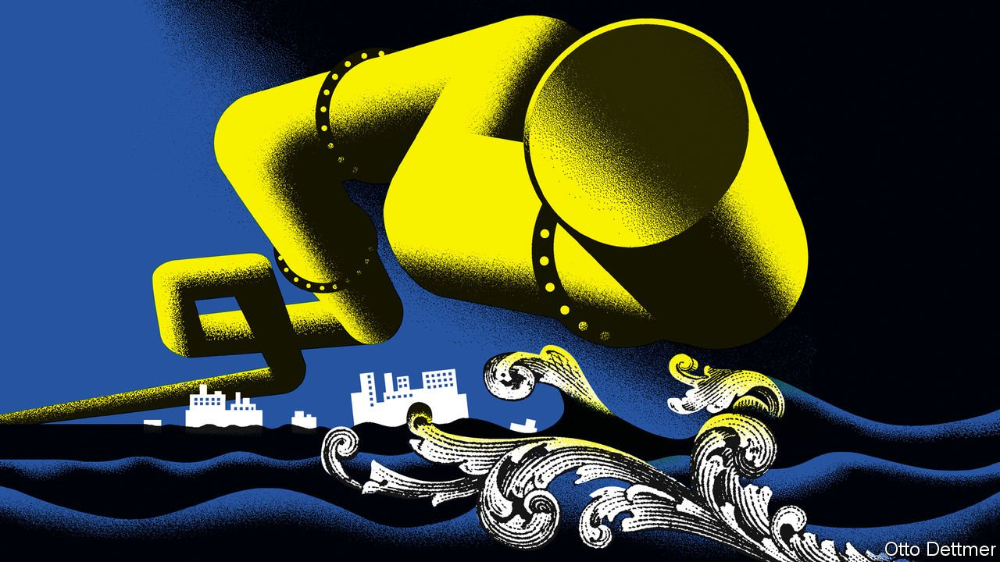

###### Free exchange

# How oil shocks have become less shocking 

##### Soaring crude prices stoke fears of recession, but the global economy looks resilient 

 

> Mar 12th 2022 

THE OMENS are bad for the world economy. When oil prices surge, growth typically moves in the opposite direction. Sometimes the price shock begins with a political earthquake, like the Suez crisis of 1956. Sometimes oil producers deliberately create the shock, as with the OPEC embargo of 1973. And sometimes the culprit is soaring demand, such as when oil prices hit record highs in 2008. The common denominator in all these cases is that America and most other rich countries soon enough faced recessions.

So it would hardly be surprising if the current surge in oil prices—a doubling in three months, fuelled by Russia’s invasion of Ukraine—foreshadows a sharp downturn in growth. Pictet, an asset manager, counts six episodes since 1970 in which real oil prices rose by more than 50% from their previous trend; each preceded a recession. As of late February oil prices had already surpassed this 50% threshold, and have only climbed higher since then.


Nevertheless, the easily observed relationship between oil and the economy is no iron law. There have been times when crude prices soared and yet recessions were averted, including the peak of a global commodities boom in 2011. The type of shock matters, as does the economic backdrop. Moreover, much of the world appears to have become better insulated from oil markets over time. Old dismal patterns may not perfectly repeat themselves.

Consider the mechanics by which rising oil prices hurt growth. Energy is an important factor of production, so a sharp decrease in its supply or increase in its price may drag down output. It may also hurt demand: if people spend more of their incomes on oil, less is left over for other things. Add to this the possibility that central banks may tighten monetary policy aggressively when higher oil prices push up inflation, as the Federal Reserve did following the OPEC crisis of 1973 and the Iranian revolution of 1979.

Yet no two oil shocks are the same. A critical variable is whether the shock stems from the economy’s supply side or demand side. If there is a sudden shortfall in supply, as during an embargo, that functions as a new tax on production and consumption. If, however, robust demand is the cause, rising oil prices reflect economic vitality. Lutz Kilian, an economist with the Fed’s branch in Dallas, has shown that broad demand strength can, for a time, outweigh the negative effects of higher oil prices. A pure supply shock is, by contrast, more harmful. The period since the pandemic struck has featured a bit of both. The quadrupling in crude prices from the spring of 2020 to the start of 2022 reflected growth roaring back from its pandemic-induced slowdown. Only the most recent surge is unquestionably a supply shock, caused by the Ukraine war and associated sanctions.

Three changes in the structure of the global economy may dampen the effects of the price surge. Most obviously oil’s role in growth cycles is not what it used to be. In 1973 the world used nearly one barrel of oil to produce $1,000-worth of GDP (in inflation-adjusted terms). By 2019 that was down to 0.43 barrels, with the energy intensity of growth falling annually “in an almost perfectly linear fashion”, according to a report last year by the Centre on Global Energy Policy at Columbia University. A shift in economic output from industry to services is part of the explanation. The world has also become more efficient in using oil. Cars, for instance, go twice as far per gallon of petrol as in the 1970s.

A related change is the way that governments respond to oil shocks. As James Hamilton of the University of California, San Diego, has observed, in the 1970s American officials aggravated economic dislocations with price controls on petrol, which resulted in shortages. Since 1981 they have steered clear of such controls, which has made for more volatile crude prices but smoother market adjustments. Some tweaks in behaviour have got easier thanks to the pandemic: if air fares soar, why fly to that business meeting when you can log on to Zoom instead?

Central bankers may also be less tempted to jack up interest rates simply because of soaring energy prices, thereby reducing the risks of a recession. There is a debate over whether the pass-through from oil shocks to core inflation is basically nil, as argued in a paper for the Fed by Todd Clark and Stephen Terry, or small, as argued in another Fed paper by Cristina Conflitti and Matteo Luciani. However, the experts agree that the pass-through has weakened, in part because of the diminished energy intensity of growth. Even before the war in Ukraine, the Fed was set to raise interest rates several times this year in order to rein in inflation. The salient point is that, according to market pricing, investors do not believe that the oil shock will lead to much more aggressive moves by the Fed than previously expected.

Shale fellow well met

A final difference with past oil shocks is the momentous evolution of America’s status in the global crude industry. In the first decade of the 2000s America imported more than 10m barrels of oil per day in net terms. With the shale revolution, American oil production has soared, such that it now meets most of its energy needs from its domestic production. In 2020 America became a net exporter for the first time since at least 1949.

One effect is that oil shocks are now less destabilising for the American economy in aggregate. Consumers may dislike rising crude prices but oil producers enjoy them. A key question in the months ahead will be the extent to which they expand drilling. That would help offset the economic loss from softer consumer spending. And for the rest of the world, a resilient American economy would provide useful ballast amid all the turbulence. The EU must worry not just about oil but also about a much more acute shortage of natural gas. Should it join America and Britain in banning Russian imports, the price of crude could go much higher still. But at oil’s current price, the world economy can, with luck, withstand the shock. ■

Read more from Free Exchange, our column on economics: (Mar 5th)

 (Feb 26th) (Feb 19th)


