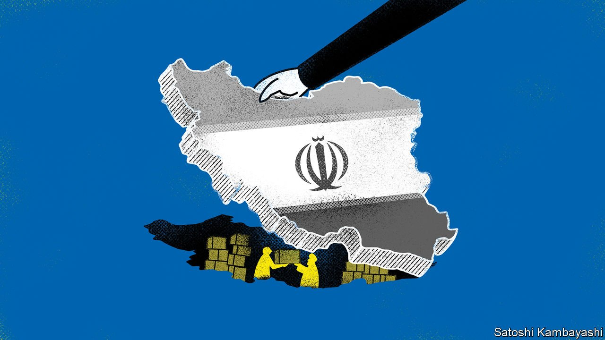

###### Buttonwood

# Iran’s flourishing stockmarket reflects its resilient economy 

##### The economy was hurt badly by sanctions but did not collapse 

 

> Mar 12th 2022 

AS ONE DOOR slams shut, another creaks open. In the past fortnight the global pressure on Russia’s finances has increased dramatically. Meanwhile, in Iran, the grip of sanctions is set to be relaxed again. In 2018 America withdrew from a multilateral nuclear accord with Iran. A year-long negotiation to revive it has moved to the final stages. A deal appears close. It is not unhelpful to its chances that an accord would bring Iranian oil back to the global market.

Iran’s experience is instructive. In the past decade it has suffered recessions, devaluations and chronic inflation under the pressure of worldwide sanctions. Its economy has been whacked. But it has not collapsed. That is in large part because Iran’s manufacturers have proved resilient. Tehran’s flourishing stockmarket is testimony to the economy’s hardiness. Many of the firms that have survived and prospered are listed there.


American sanctions have been a fact of life in Iran for decades. They began in 1979 when President Jimmy Carter imposed a ban on imports of oil from Iran and froze Iranian assets held in America following the seizure of the American embassy in Tehran. But sanctions on Iran really started to bite when other countries joined in. To press Iran into curbing its nuclear programme, a wave of international sanctions was imposed and steadily tightened between 2010 and 2012. Iran’s oil exports and banks were targeted. The foreign assets of its central bank were frozen. And commercial banks worldwide were proscribed by America from financing any business with Iran in dollars. Since then, a sanctions regime of varying degrees of severity has remained in place.

The damage has been extensive. Iran’s oil exports fell from 2.5m barrels per day in 2011 to 1.1m in 2014. Its economy suffered deep recessions in 2012 and 2018. The embargo on Iran’s oil exports left a large hole in government finances. Lacking access to its reserves or reliable dollar revenue from oil exports, the authorities have been unable to support the exchange rate. The result has been chronically high inflation. There has been a lot of hardship. The latest World Bank report on Iran refers to a lost decade of negligible GDP growth. It might have been a lot worse, though.

There are three explanations for Iran’s resilience. First, though sanctions have been extensive and assiduously policed, they are subject to leakage. Iran has been able to export several hundred thousand barrels of oil a day. Much of it ends up in China, marked as oil from Malaysia, Oman or the United Arab Emirates (UAE). Sanctions-busting is risky. But some privately owned refiners are willing to take the risk in exchange for a hefty price discount. And dollars are not the only hard currency: there is the yuan, of course, but also the UAE’s dollar-pegged dirham.

A second source of resilience is export diversification. Iran has a range of manufacturing industries. Some of the bigger ones, such as mining and metal-bashing, benefit from access to cheap, reliable energy. In addition Iran has land borders with several populous countries, including Pakistan and Turkey. A chunk of Iran’s land-based trade is undocumented and thus hard to police.

A third factor is import substitution. The weaker rial has put imported goods beyond the reach of many Iranians. But it has been a boon for manufacturers serving the home market of 83m. Go shopping in Tehran, says a local, and you will find Iranian-made clothing, toys and household goods. “If there were a global self-sufficiency index, Iran would be ranked highly,” he says.

Iran’s stockmarket reflects this resilient economy. Some of the larger firms are on the sanctions list, but hundreds of smaller ones are not. Stocks have proved a good hedge against devaluation and inflation. Many locals have noticed this. The market exploded in 2020 as retail investors piled in. That mini-bubble has since burst. Stocks are cheap again, says Maciej Wojtal of Amtelon Capital, a fund that invests in Iran. The median price-to-earnings ratio for the top 100 companies is around five, based on the forecasts of local analysts.

Iran’s leaders have boasted of a “resistance economy”. But its hardiness mostly reflects a bottom-up struggle for basic survival, not a top-down strategic choice, argues Esfandyar Batmanghelidj of Bourse &amp; Bazaar, a think-tank, in a recent essay. Economies are made up of ordinary people. They adapt to changed circumstances the best they can. For Iranians, there is now a real prospect of better days ahead. For the Russian people, the painful adjustment is just beginning.

Read more from Buttonwood, our columnist on financial markets:

 (Mar 5th) (Feb 26th) (Feb 19th)

For more expert analysis of the biggest stories in economics, business and markets, , our weekly newsletter.

