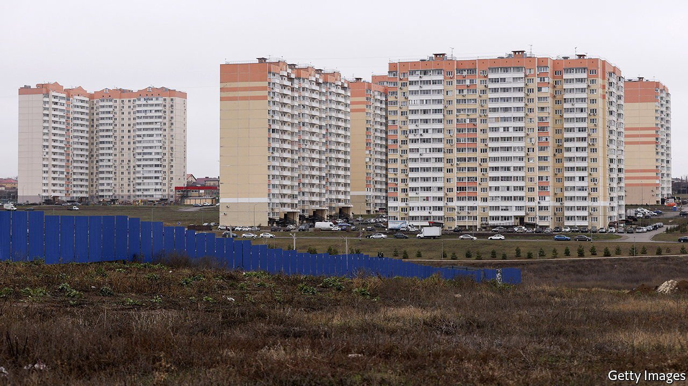
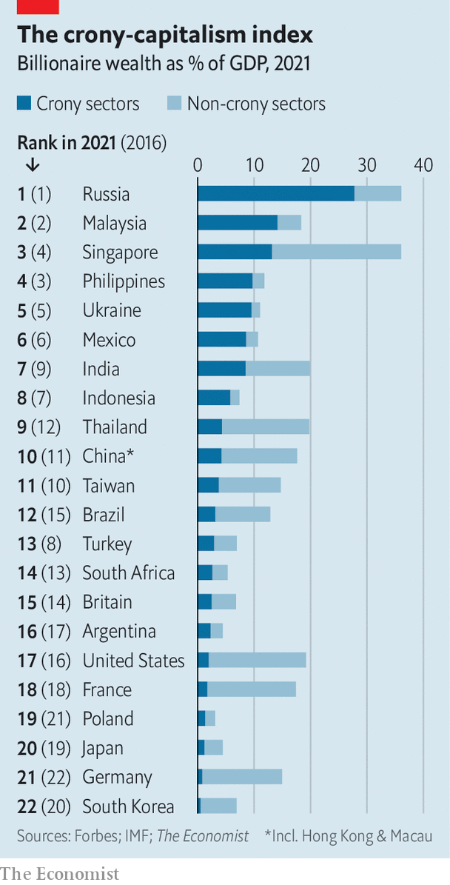
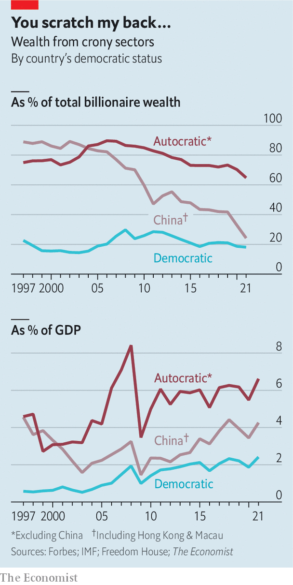

###### The makers and the takers

# Our crony-capitalism index offers a window into Russia’s billionaire wealth 

##### Rich folk in autocratic countries remain vulnerable to the whims of dictators 

 

> Mar 12th 2022 

ALTHOUGH BILLIONAIRES have been getting a bad rap for years, the sanctions levied at Russian oligarchs have intensified scrutiny on the origins of tycoons’ wealth. On March 1st President Joe Biden announced that his government was setting up a “klepto capture” task force to “go after the crimes of Russian oligarchs”.

The murky money sloshing around the favoured plutocratic playgrounds of New York, London and Paris is nothing new. In 2014 The Economist devised a crony-capitalism index to measure whether the world was experiencing a new gilded age, characterised by the modern equivalent of the robber barons in late-19th-century America. In 2016, when we last visited our index, we found that crony-capitalists had thrived during the 2000s but were beginning to feel the heat from trustbusters in the rich world and anti-corruption purges in developing countries. How has crony capitalism performed since?


 


Rent-seeking entrepreneurs tend to use their relationships with the state to maximise profits. Technically speaking, an economic rent is the surplus remaining once capital and labour have been paid a market price. With perfect competition that surplus would not exist. But rents can be artificially elevated if firms win contracts at beneficial prices, form cartels to stitch up consumers or lobby governments for favourable rules. Most rent-seeking businesses are operating perfectly legally.

Our index uses 25 years of data from Forbes’s annual stock-take of the world’s billionaires. In 2021 the publication listed 2,755 individuals with total estimated wealth of $13trn. We have classified the main source of each billionaire’s wealth into crony and non-crony sectors. Our crony sectors include a host of industries that are vulnerable to rent-seeking because of their proximity to the state, such as banking, casinos, defence, extractive industries and construction. We have aggregated the data according to billionaires’ country of citizenship expressed as a share of its GDP.

Russia’s crony economy sticks out like a blinged-up Muscovite in the Algarve. Some 70% of the 120 Russian billionaires, who together hold 80% of its billionaire wealth, fall within our crony-capitalist definition. Wealth equivalent to 28% of Russia’s GDP in 2021 came from crony sectors, up from 18% in 2016. But many Russian oligarchs will be taking haircuts on their empires as sanctions bite.

 


Globally, crony wealth has declined as a share of the total, reflecting in part the surge in tech-related wealth. Nonetheless it remains entrenched in many places. In Malaysia, a former prime minister was jailed for corruption in 2020 after $4.5bn was stolen from the state, but crony capitalism still dominates there. India’s share of billionaire wealth derived from crony sectors has risen from 29% to 43% in six years. The Philippines has fallen to fourth in our index but crony sectors still account for four-fifths of total billionaire wealth.

By contrast, around four-fifths of American billionaires, accounting for 90% of total wealth, operate in non-crony sectors. Led by a boom in tech valuations, wealth in non-crony sectors rose from 11% to 17% of GDP between 2016 and 2021. But in recent years America has opened investigations into the firms of its behemoth-building billionaires. Tech firms do exhibit some of the cosseted characteristics of crony industries: they spend heavily on lobbying to defend their juicy market shares, for instance. Reclassifying technology firms as crony would increase America’s crony wealth from 2% to 7% of GDP.

Over the past decade China has minted new billionaires faster than you can say Yves Saint Laurent. In 2010 there were 89. Now there are 714 with a combined wealth of $3trn, around 70% of the amount in America. The crony-sector share of GDP has changed little in six years, though its share of overall billionaire wealth has fallen from 44% to 24%. This exposes one of the shortcomings of our index: to some extent all businesses operate in China with the consent of the state. Falling out of favour can have grave consequences, as Alibaba’s Jack Ma discovered in 2020. Assuming all Chinese billionaires are cronyistic would place China second in our index.

Billionaires in autocratic countries remain vulnerable to the whims of their leaders. Mikhail Khodorkovsky was worth $15bn in 2004 but he fell out with Vladimir Putin and his oil firm was expropriated. A purge in Saudi Arabia has meant not a single billionaire from the kingdom has appeared on Forbes’s list since 2017. Billionaires in autocratic countries outside China derive about 70% of their wealth from crony sectors. A good chunk of this $750bn is likely to be stashed in Western countries that do not ask too many questions. ■


