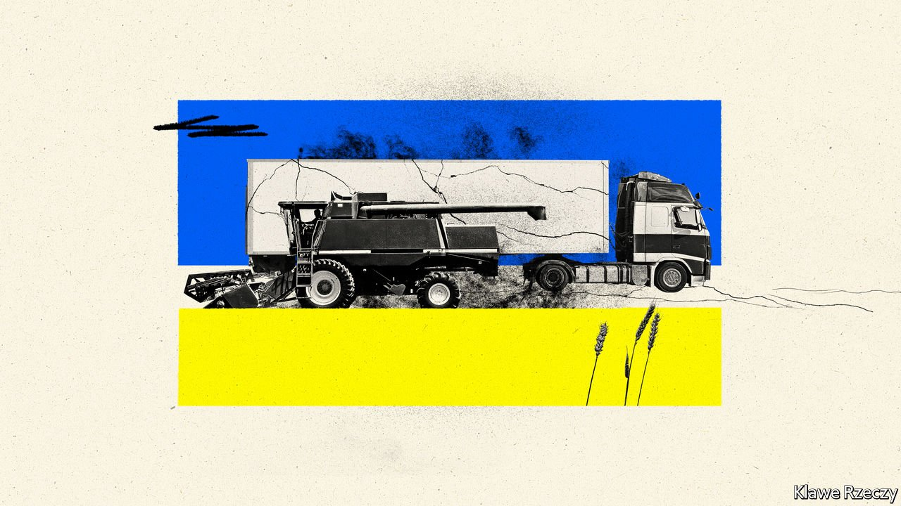
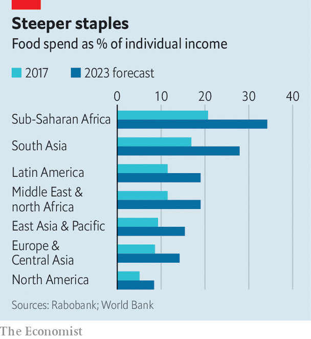

###### Grain damage

# War in Ukraine will cripple global food markets 

##### The share of incomes spent on staples is about to jump everywhere 

 

> Mar 12th 2022 

IN OCTOBER 1914 the Ottoman Empire, having just joined the first world war, blockaded the Dardanelles Strait, the only route for Russian wheat to travel to Britain and France. The world had entered the conflict with wheat stocks 12% above the five-year average, but losing over 20% of the global traded supply of the crop overnight set food markets ablaze. Having risen by a fifth since June 1914, wheat prices in Chicago, the international benchmark, leapt by another 45% over the following quarter.

Today Russia and Ukraine, respectively the largest and fifth-largest wheat exporters, together account for 29% of international annual sales. And after several poor harvests, frantic buying during the pandemic and supply-chain issues since, global stocks are 31% below the five-year average. But this time it is the threat of embargoes from the West that has lit a bonfire—and the flames are higher than even during the Great War. Wheat prices, which were already 49% above their 2017-21 average in mid-February, have risen by another 30% since the invasion of Ukraine started on February 24th. Uncertainty is sky-high: indicators of price volatility compiled by IFPRI, a think-tank, are flashing bright red.


Rabobank, a Dutch lender, reckons wheat prices could climb by another third. But the damage to global food supply will extend far beyond the grain—and last longer than the war itself. Together Russia and Ukraine export 12% of the calories traded worldwide. They rank among the top five exporters of many oilseeds and cereals, from barley and corn to sunflowers, consumed by humans and animals. Russia alone is the biggest supplier of key ingredients in the making of fertilisers, without which crops falter or lose nutrients.

In February, even before the war started, a food-price index compiled by the UN Food and Agriculture Organisation had reached an all-time high; the number of people deemed food-insecure, at 800m, was at its highest for a decade. Many more could soon join them. Higher food prices will also stoke inflation, adding to the price pressures generated by dearer energy.

The fallout from the war will be felt in three ways: disruption to current grain shipments, low or inaccessible future harvests in Ukraine and Russia, and withered production in other parts of the world. Start with shipments. In normal times wheat and barley crops are harvested in the summer and exported in the autumn; by February most ships are gone. But these are not normal times: with global stocks low, big importers of Black Sea wheat, chiefly in the Middle East and North Africa, are anxious to secure more supplies. They are not getting them. Ukrainian ports are shut. Some have been bombed. Inland routes, via the north of Ukraine and onwards through Poland, are too great a diversion to be practical. Vessels trying to pick up grain from Russia have been hit by missiles in the Black Sea. Most cannot get insurance.

Alternative sources are unaffordable. Last week Egypt cancelled its second wheat tender in a row after receiving only three offers—at a stomach-churning price—down from 20 a fortnight before. More concerning still, exports of corn, of which Ukraine accounts for nearly 13% of global exports, usually take place through the spring until the early summer. Much of it is normally shipped from the port of Odessa, which is bracing for a Russian assault.

Future crops are an even bigger worry. In Ukraine the war may result in lower yields and area planted. Winter crops such as wheat and barley, which are sown in October, could be smaller because of a lack of fertiliser and pesticides. Spring crops such as corn and sunflowers, the planting of which would normally start imminently, may not get sown at all. Leonid Tsentilo, whose farm in central Ukraine grows 7,000 tonnes of wheat a year, says local prices for diesel and plant-protection products have risen by 50% in two weeks. Some of his workers have been shipped off to war.

In Russia the risk is not curtailed production but blockaded exports. Although food sales are not yet subject to sanctions, Western banks are reluctant to lend to traders. Fear of being fined by governments in the West or shamed by its press is keeping merchants at bay. While Ukraine is “unreachable”, Russia is “untouchable”, says Michael Magdovitz of Rabobank.

Most alarming will be the conflict’s impact on agriculture worldwide. The region is a big supplier of critical fertiliser components, including natural gas and potash. Fertiliser prices had already doubled or tripled, depending on the type, even before the war, owing to rising energy and transport costs and sanctions imposed in 2021 on Belarus, which produces 18% of the world’s potash, as it cracked down on dissidents. As Russia, which accounts for 20% of global output, finds it harder to export its own potash, prices are sure to rise further. Since four-fifths of the world’s potash is traded internationally, the impact of price spikes will be felt in every agricultural region in the world, warns Humphrey Knight of CRU, a consultancy.

 


As a result of all this, a much greater share of incomes will soon be spent on food (see chart). This will be felt most acutely in the Middle East, Africa and parts of Asia, where some 800m people depend heavily on Black Sea wheat. That includes Turkey, which supplies much of the southern Mediterranean with flour. Egypt usually buys 70% of its wheat from Russia and Ukraine. The latter alone accounts for half of Lebanon’s wheat imports. Many others can hardly do without Ukraine’s corn, soyabeans and vegetable oil.

Meanwhile higher fertiliser and energy costs will crimp farmers’ margins everywhere. Brazil, a huge producer of meat and agricultural products, imports 46% of its potash from either Russia or Belarus, says Cristiano Veloso of Verde AgriTech, a Brazilian startup. Eventually some of the costs will be passed on to the consumer.

Protectionism may pour more fuel on the fire. National restrictions on fertiliser exports increased last year and could accelerate. Limits on food exports, or panic-buying by importers, could trigger a price spike of the kind that sparked riots in dozens of countries in 2007-08. On March 8th and 9th, respectively, Russia and Ukraine banned wheat exports. Argentina, Hungary, Indonesia and Turkey have announced food-export restrictions in recent days.

There is no easy fix. Some of the 160m tonnes of wheat used as animal feed every year could be diverted for human consumption, but substitution may export inflation to other staples. Increasing production in Europe and America and drawing on India’s vast strategic stockpile may yield 10-15m tonnes—a substantial quantity, but less than a third of Ukraine’s and Russia’s combined annual exports. Some could come from farther afield but there are bottlenecks: efforts to export more of Australia’s bumper winter-wheat crop have clogged the supply chains between its farms and ports. With corn, governments may resort to appropriating some of the 148m tonnes used as bioethanol feed to help plug this year’s likely shortfall of 35m tonnes. Fertiliser shortages are even harder to cover: new potash mines take 5-10 years to build.

The war in Ukraine is already a tragedy. As it ravages the world’s breadbasket, a calamity looms. ■


