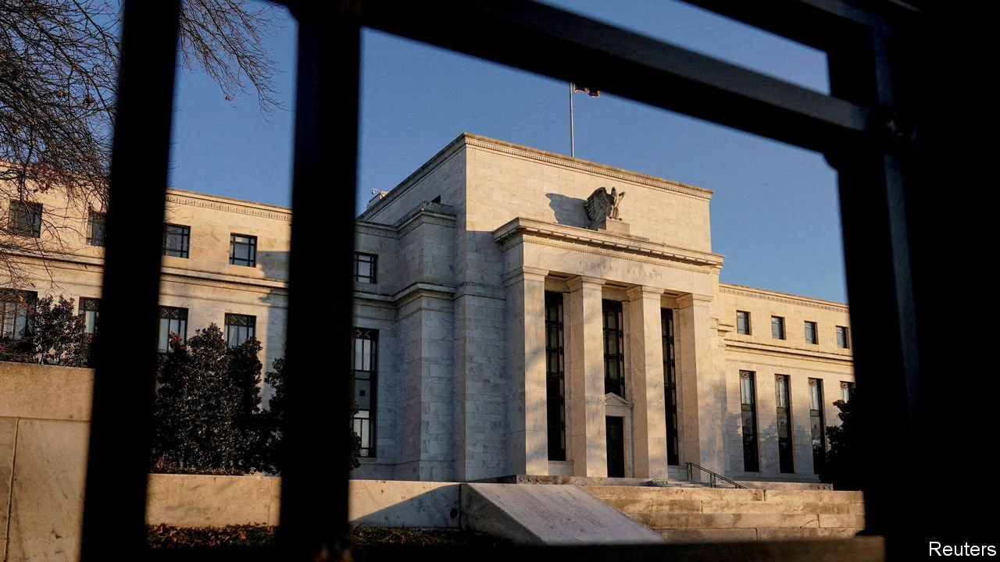
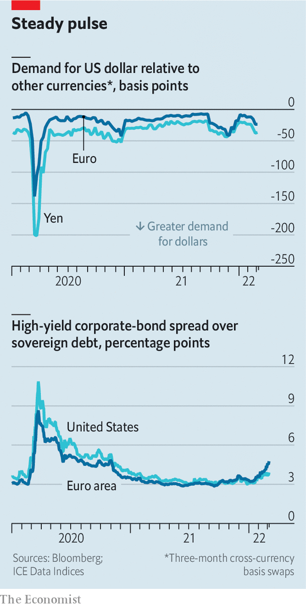

###### War bonds

# Western credit markets are holding up remarkably well 

##### Post-financial-crisis reforms are helping them weather the storm 

 

> Mar 12th 2022 

CREDIT IS THE financial system’s oxygen supply. When it flows freely, it does so unnoticed. When it stops, soon enough everything else does as well. The hypoxic episode that felled the American investment bank Lehman Brothers in 2008 unleashed chaos, turning a subprime-mortgage crunch into a global financial crisis. Ever since, central banks and market pundits have fixed a hawk-like gaze on credit conditions, wary of a repeat.

Today’s scramble for safe assets was prompted not by a financial crash but by Vladimir Putin’s invasion of Ukraine. Nevertheless, there are similarities. Once again, the dollar is ascendant as investors flee riskier currencies. Hedging costs, particularly for the war-adjacent euro, are spiking as volatility rises and traders bet that a protracted conflict will continue to favour the greenback. A rush into American government debt—the safest asset of all—has pushed Treasury yields down even as inflation expectations have risen. Prizing security over returns, lenders have driven corporate-bond spreads up.


This flight to safety causes plenty of problems on its own. A stronger dollar, for instance, increases the debt burden on countries that borrow in it and dents profits for American companies that earn a lot of their revenues abroad. But the greatest threat to financial stability comes from the pressure it exerts on the money market, where firms borrow to meet their short-term funding needs. This market seizing up is the financial equivalent of a pulmonary embolism, quickly forcing otherwise healthy firms up against the wall. A dash for dollars is fine if it merely pushes exchange rates up. The real trouble comes when it also creates a shortage of them.

 


That happened in 2008, as banks became unwilling to lend to each other and the cost of borrowing for a few months jumped whole percentage points above the overnight rate. Events were repeated in a much milder fashion in March 2020 as the world went into covid-induced lockdown. On every measure of money-market stress, from short-term commercial borrowing costs to the demand for dollars relative to other currencies, the impact of Mr Putin’s war has been milder still (see chart).

There are two main reasons for this. The first is that it follows a flood of liquidity from central banks. Since March 2020 the Federal Reserve, the European Central Bank, the Bank of Japan and the Bank of England have issued $9.1trn (11% of global GDP) in new reserves. After that deluge, notes Jonas Goltermann of Capital Economics, a consultancy, it is almost surprising that there are strains on funding at all.

The deeper reason is that money markets are now fitted with a comprehensive ventilation system. Permanent swap lines between the Fed and five other big central banks allow them to exchange their own currency for dollars that can be distributed to domestic firms in times of stress. A second facility allows a bigger group to simply borrow dollars from the Fed.

Meanwhile, banks no longer rely on unsecured loans from each other to plug day-to-day cash shortfalls. For funding in dollars the replacement is the repo market, where financial institutions and large companies borrow some $2.5trn from each other every day using Treasuries as security. The high-quality collateral makes this market less susceptible to runs, making banks (and their clients) less vulnerable to crises. And it is backstopped by the Fed, which has acted as lender of last resort since a series of liquidity wobbles in 2019.

Longer-term credit conditions are also weathering the storm remarkably well. Spreads on risky high-yield (“junk”) bonds have been rising since the beginning of the year but, having started at near-historic lows, are nowhere near the levels they reached in March 2020.

For Lotfi Karoui of Goldman Sachs, a bank, that is unsurprising. Around a fifth of the $1.6trn American high-yield bond market is issued by oil, metals and mining firms that are benefiting from, rather than being hurt by, ballooning commodity prices. More generally, issuers tend to be sitting on high levels of cash and are using spare revenues to pay down debt, keeping their bondholders happy. Europe’s smaller €450bn ($496bn) high-yield market, being geographically closer to the war, has been hit correspondingly harder. But even there, investors are yet to take serious losses.

A fortnight into a conflict that could end up being measured in years, any claim that credit conditions will remain benign indefinitely would be foolish. Mr Karoui points out that central bankers were bound to guard against a money-market shock, as that was what led to disaster during the crisis of 2007-09. More dangerous are the risks monetary guardians have less experience with: who can tell, for instance, if a prolonged war will lead to another, much broader gumming-up of global supply chains? Yet for now at least, the West’s financial system is proving vastly more resilient than that of Fortress Russia. ■


