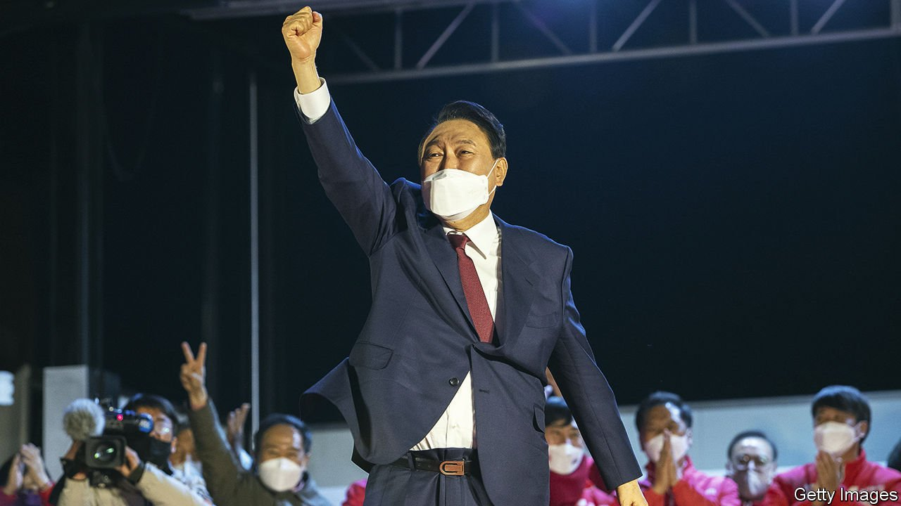

###### From prosecutor to president

# South Korea’s new leader must restore his citizens’ faith in politics 

##### After Yoon Suk-yeol’s narrow victory, time to stop the mudslinging 

 

> Mar 12th 2022 

AT LAST, IT is over. A bitter presidential election campaign between two unpopular candidates, marred by scandal and notable chiefly for mudslinging, culminated on March 9th, when South Koreans turned out in droves to keep from office one of two roundly despised men: Yoon Suk-yeol of the conservative People Power Party, and Lee Jae-myung, a populist from the ruling left-of-centre Minjoo party. In the end it was  who prevailed—by a wafer-thin margin He will take charge of the world’s tenth-largest economy in May.

Mr Yoon, a former prosecutor instrumental in bringing down Park Geun-hye, a scandal-plagued former president, joined politics only last year. He ran on a platform of anti-corruption and a more realist foreign policy. Yet when he takes over from Moon Jae-in, the outgoing president, he will face a set of challenges similar to those that greeted his predecessor five years ago. At home, these include stratospheric house prices, a lack of opportunities for the young and a persistent disillusionment with politics. Abroad, he faces an increasingly tricky balancing act between China and the United States and tetchy relations with South Korea’s close neighbour, Japan.


Geopolitics has taken on a new urgency as Vladimir Putin’s invasion of Ukraine forces smaller states to reconsider their security. South Korea has joined America, Europe and Japan in condemning Russia and imposing sanctions. Mr Yoon has joined analysts in Seoul in stressing the importance of closer alignment with the West and said that he will take a harder line on China and on nuclear negotiations with North Korea. Yet South Korea sends a quarter of its exports to China, making it vulnerable to coercion should its more forceful commitment to its Western partners irritate the government in Beijing. So Mr Yoon must strive to reduce his country’s dependence on its big neighbour, perhaps by forging closer ties in South and South-East Asia. He must also find a way for South Korea to make common cause with Japan, the former colonial power.

On the home front, there are signs that house prices, which nearly doubled during Mr Moon’s term, may be cooling. The central bank has started raising rates, and some of Mr Moon’s policies, such as tightening mortgage rules, may be working. Mr Yoon’s main task will be to avoid the temptation to fiddle.

Yet that will not be enough to solve the economic woes of South Korea’s overqualified young people, who are frustrated by a dearth of high-quality jobs. Mr Yoon should pick up the thread of Mr Moon’s labour-market reforms. That means improving conditions for people in irregular work by expanding unemployment insurance and pension contributions; loosening over-stringent protections for regular employees; and acknowledging discrimination against women and improving their job prospects.

The most important task for Mr Yoon, however, is to tackle the disgust many South Koreans still feel about their country’s politics, despite Mr Moon’s promises to bring about change. After an unedifying campaign that has confirmed citizens’ views of politicians as lying, corrupt and altogether unpleasant, it will not be easy.

For a start, politicians should forswear personal attacks on their opponents and on members of civil society, not least women and minorities. Since his party lacks a majority in the National Assembly, the new president must work with his opponents. That is a chance to set an example, rather than continuing to stoke partisan division. He should show that he works for all the people, not just say it. If Mr Yoon can help voters feel represented by their politicians rather than appalled by them, it would count as a welcome achievement. ■

