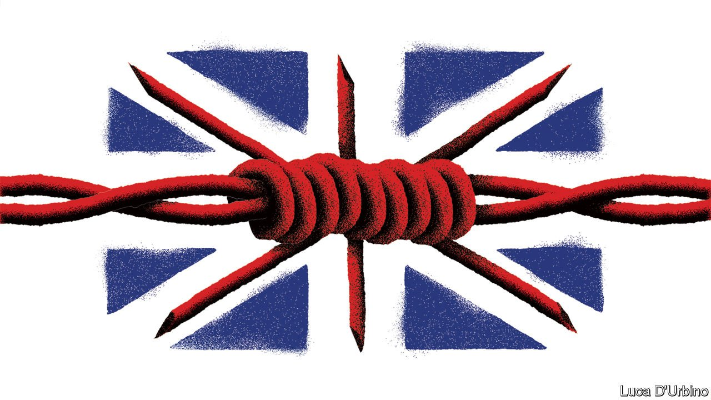

###### Britain and Ukraine

# The British government’s response to Ukrainian refugees is sadly typical 

##### Just ask an Afghan 

 

> Mar 12th 2022 

“O F COURSE WE’RE going to take refugees,” promised Boris Johnson, Britain’s prime minister, as Ukrainians dodged Russian bombs. “The UK is way out in front in our willingness to help.” You hardly dare imagine what unwillingness would look like. Britain’s  so far has combined foot-dragging, hard-heartedness, ineptitude and dishonesty. It is sadly typical of the government.

As the invasion began, European Union countries quickly agreed that all Ukrainians  and could live, work and receive welfare for at least a year. By contrast, the country that Mr Johnson calls “Global Britain”, which supposedly left the stodgy, bureaucratic EU to pursue closer relations with places (like Ukraine) that are outside the bloc, came up with the meanest offer imaginable. The home secretary, Priti Patel, said Ukrainians might be granted refuge if they had close family members already in Britain. But they would have to obtain visas before being let into the country. After all, Russian infiltrators and “extremists” might be trying to sneak in. Officials even insinuated that Ireland was hazarding Britain’s security by opening its doors.


And where could people blasted out of their homes obtain a visa? Not in Calais, the nearest port to Britain. Ms Patel did not want to process applications there, she told Parliament, lest a “surge” occur. Ukrainians who turn up in Calais have been given a KitKat bar and a packet of crisps and told to apply online, then make their way to Paris, Brussels or Lille for an appointment a week later. Offices are thinly staffed and often closed. Incredulous Tory backbenchers have called the response “robotic”, but that is unfair on robots, which are at least efficient.

It is not the first time that Britain has cold-shouldered desperate people while promising to help them. Last year Ms Patel promised not to abandon Afghans “living in terror” after the Taliban took over. When her visa scheme opened in January, it transpired that many of the 5,000 or so slots in the first year would be filled by Afghans already living in Britain. The government is now trying to pass a bill that would  who turn up without permission (as asylum-seekers generally do). In that case, too, it has the nerve to claim that it has their best interests at heart.

One excuse for the government’s behaviour is that Britons are fickle. Although opinion polls show them to be far more generous than their leaders, their sympathy for Ukrainians might last only as long as the war leads the news. If a Ukrainian, or somebody pretending to be a Ukrainian, commits a crime in Britain, they will blame the government. But this excuse is a poor one. Other European countries also have jittery, xenophobic populations. Their leaders have rightly decided to offer shelter while the war rages and sort out the inevitable mess later. Only Britain is following a paperwork-first policy.

Britain can treat foreigners generously. It has allowed about 100,000 Hong Kongers to immigrate in the past year, and regularised 5m-odd EU citizens fairly easily. But when confronted with a fast-moving crisis the government lapses into meanness and pettifoggery, as though piqued that it did not receive advance written notice of events. This time it seems not to have listened to its own spooks, who had warned for months about a Russian invasion.

Let them eat crisps

It is a fundamentally unserious government led by fundamentally unserious people. But more than a change of personnel is required. The Home Office has long been one of Britain’s worst departments, partly because of its sprawling role. It manages both immigration and crime, so tends to view immigrants as actual or potential criminals. It should be cut in two. Neither arm should be run by the incompetent Ms Patel. ■

Our recent coverage of the Ukraine crisis can be found 

