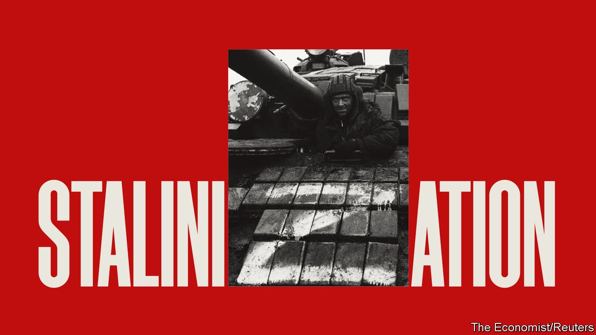

###### Vladimir Putin’s dictatorship

# The Stalinisation of Russia 

##### As it sinks in that he cannot win in Ukraine, Vladimir Putin is resorting to repression at home 

 

> Mar 12th 2022 

WHEN VLADIMIR PUTIN ordered the invasion of Ukraine, he dreamed of restoring the glory of the Russian empire. He has ended up restoring the terror of Josef Stalin. That is not only because he has unleashed the most violent act of unprovoked aggression in Europe since 1939, but also because, as a result, he is turning himself into a dictator at home—a 21st-century Stalin, resorting as never before to lies, violence and paranoia.

To understand the scale of Mr Putin’s lies, consider how the war was planned. Russia’s president thought Ukraine would rapidly collapse, so he did not prepare his people for the invasion or his soldiers for their mission—indeed, he assured the elites that it would not happen. After two terrible weeks on the battlefield, he is still denying that he is waging what may become Europe’s biggest war since 1945. To sustain this all-encompassing lie, he has shut down almost the entire independent media, threatened journalists with up to 15 years in jail if they do not parrot official falsehoods, and had anti-war protesters arrested in their thousands. By insisting that his military “operation” is de-Nazifying Ukraine, state television is re-Stalinising Russia.


To grasp Mr Putin’s appetite for violence, look at how the war is being fought. Having failed to win a quick victory, Russia is trying to sow panic by starving Ukrainian cities and pounding them blindly. On March 9th it hit a maternity hospital in Mariupol. If Mr Putin is committing war crimes against the fellow Slavs he eulogised in his writings, he is ready to inflict slaughter at home.

And to gauge Mr Putin’s paranoia, imagine how the war ends. Russia has more firepower than Ukraine. It is still making progress, especially in the south. It may yet capture the capital, Kyiv. And yet, even if the war drags on for months, it is hard to see Mr Putin as the victor.

Suppose that Russia manages to impose a new government. . Mr Putin’s puppet could not rule without an occupation, but Russia does not have the money or the troops to garrison even half of Ukraine. American army doctrine says that to face down an insurgency—in this case, one backed by NATO—occupiers need 20 to 25 soldiers per 1,000 people; Russia has a little over four.

If, as the Kremlin may have started to signal, Mr Putin will not impose a puppet government—because he cannot—then he will have to compromise with Ukraine in peace talks. Yet he will struggle to enforce any such agreement. After all, what will he do if post-war Ukraine resumes its Westward drift: invade?

The truth is sinking in that, by attacking Ukraine, Mr Putin has committed a catastrophic error. He has wrecked the reputation of Russia’s supposedly formidable armed forces, which have proved tactically inept against a smaller, worse-armed but motivated opponent. Russia has lost mountains of equipment and endured thousands of casualties, almost as many in two weeks as America has suffered in Iraq since it invaded in 2003.

Mr Putin has brought ruinous sanctions on his country. The central bank does not have access to the hard currency it needs to support the banking system and stabilise the rouble. Brands that stand for openness, including IKEA and Coca-Cola, have closed their doors. Some goods are being rationed. Western exporters are withholding vital components, leading to factory stoppages. Sanctions on energy—for now, limited—threaten to crimp the foreign exchange Russia needs to pay for its imports.

And, as Stalin did, Mr Putin is destroying the bourgeoisie, the great motor of Russia’s modernisation. Instead of being sent to the gulag, they are fleeing to cities like Istanbul, in Turkey, and Yerevan, in Armenia. Those who choose to stay are being muzzled by restrictions on free speech and free association. They will be battered by high inflation and economic dislocation. In just two weeks, they have lost their country.

Stalin presided over a growing economy. However murderously, he drew on a real ideology. Even as he committed outrages, he consolidated the Soviet empire. After being attacked by Nazi Germany, he was saved by the unbelievable sacrifice of his country, which did more than any other to win the war.

Mr Putin has none of those advantages. Not only is he failing to win a war of choice while impoverishing his people: his regime lacks an ideological core. “Putinism”, such as it is, blends nationalism and orthodox religion for a television audience. Russia’s regions, stretched across 11 time zones, are already muttering about this being Moscow’s war.

As the scale of Mr Putin’s failure becomes clear, Russia will enter the most dangerous moment in this conflict. Factions in the regime will turn on each other in a spiral of blame. Mr Putin, fearful of a coup, will trust nobody and may have to fight for power. He may also try to change the course of the war by terrifying his Ukrainian foes and driving off their Western backers with chemical weapons, or even a nuclear strike.

As the world looks on, it should set out to limit the danger ahead. It must puncture Mr Putin’s lies by fostering the truth. Western tech firms are wrong to shut their operations in Russia, because they are handing the regime total control over the flow of information. Governments welcoming Ukrainian refugees should welcome Russian émigrés, too.

NATO can help temper Mr Putin’s violence—in Ukraine, at least—by continuing to arm the government of Volodymyr Zelensky and supporting him if he decides that the time has come to enter serious negotiations. It can also increase pressure on Mr Putin by pushing ahead faster and deeper with energy sanctions, though at a .

And the West can try to contain Mr Putin’s paranoia. NATO should state that it will not shoot at Russian forces, so long as they do not attack first. It must not give Mr Putin a reason to draw Russia into a wider war by a declaring no-fly zone that would need enforcing militarily. However much the West would like a new regime in Moscow, it must state that it will not directly engineer one. Liberation is a task for the Russian people.

As Russia sinks, the contrast with the president next door is glaring. Mr Putin is isolated and morally dead; Mr Zelensky is a brave Everyman who has rallied his people and the world. He is Mr Putin’s antithesis—and perhaps his nemesis. Think what Russia might become once freed from its 21st-century Stalin. ■

Read more of our recent coverage of the 

For subscribers only: to see how we design each week’s cover, sign up to our weekly 

