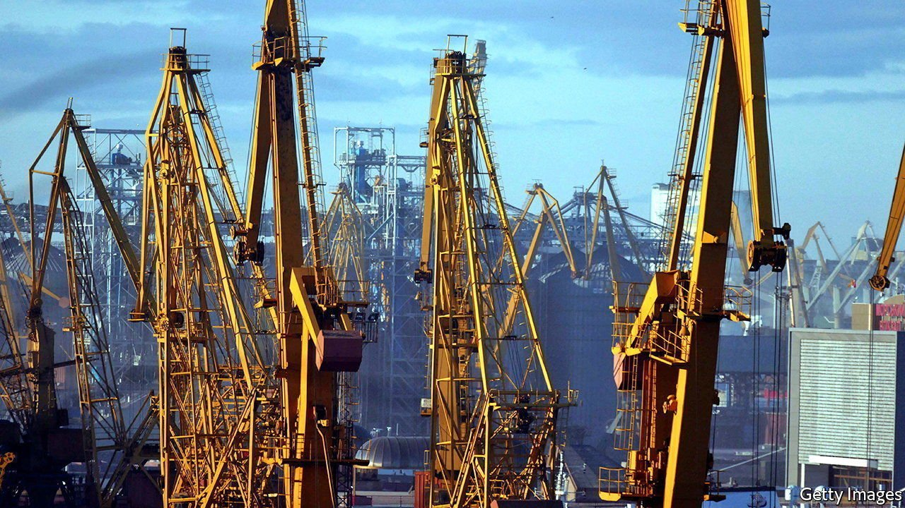
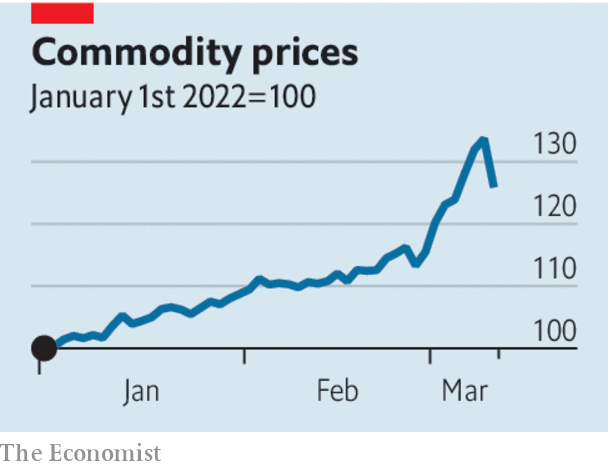

###### Fuel, food and fury

# War and sanctions have caused commodities chaos 

##### The world must rise to the challenge 

 

> Mar 12th 2022 

GLOBAL COMMODITY crises tend to cause severe economic damage and political upheaval. The oil shocks of the 1970s left Western economies with runaway inflation and deep recessions. Oil revenues also helped prop up the Soviet Union and fuelled the export of Saudi extremism. Soaring grain prices in 2010 and 2011 were a trigger for the street protests that led to the Arab spring and the toppling of dictators.

Today Russia’s invasion of Ukraine is unleashing the biggest commodity shock since 1973, and one of the worst  since the first world war. Although commodity exchanges are already in chaos, ordinary folk have yet to feel the full effects of rising petrol bills, empty stomachs and political instability. But make no mistake, those things are coming—and dramatically so if sanctions on Russia tighten further, and if Vladimir Putin retaliates. Western governments need to respond to the commodity threat as determinedly as to Mr Putin’s aggression.


The turmoil unfolding in energy, metals and food markets is broad and savage. Overall indices of commodity prices are now 26% higher than at the start of 2022. The cost of a barrel of Brent crude oil has swung wildly around levels that indicate the biggest supply shock since Saddam Hussein’s army crossed from Iraq into Kuwait in 1990. European gas prices have almost trebled amid panic that pipelines from the east will be blown up or starved of supply. The price of nickel, used in all electric cars among other things, has spiralled so high that trading in London has been halted and Chinese speculators are nursing multi-billion-dollar losses.

 


Such are the consequences of Mr Putin’s decision to drive his tanks across the breadbasket of Europe, and the subsequent isolation of Russia, one of the world’s biggest commodities exporters. Western sanctions on Russian banks have made lenders, insurers and shipping firms wary of striking deals to carry Russian cargoes, leaving growing piles of unsold industrial metals and an armada of vessels full of unwanted Urals crude. Stigma and danger have caused others to stay away. Shell has abandoned buying Russian crude oil after a backlash. The Black Sea is a no-go zone for commercial shipping because some vessels have been hit by missiles and Russia is menacing Ukrainian ports. Not many seeds will be planted in Ukraine’s blood-soaked fields this spring.

It could get worse. On March 8th, in the latest measure to increase pressure on Mr Putin, America announced that it would ban purchases of Russian oil. The United States is a small consumer of Russian crude, but if the European Union were to join the embargo, about two-thirds of the 7m-8m barrels a day of exports of Russian crude and refined products would be affected, equivalent to about 5% of global supply. A full global embargo, enforced by America, could send the oil price towards $200 a barrel. If Russia were to retaliate by limiting gas flows, Europe would reel: last year the EU relied on Russia for 40% of its consumption. Meanwhile, bitter experience teaches that countries often respond to food shortages by banning exports, leading to a tit-for-tat breakdown in global trade.

The effects of this  could be brutal. If you look narrowly at the economy, the world is far less energy-intensive per unit of GDP than in the 1970s. Nonetheless, global inflation, already at 7%, may rise by another two to three percentage points, to a level last seen for a sustained period in the early 1990s, when Mr Putin was doing mafia deals in St Petersburg and globalisation had yet to flourish. Growth may slow as firms’ confidence is knocked and interest rates rise.

In the political realm, leaders in the West will have to face furious voters, not least in America’s mid-term elections in November. Remember the gilets jaunes protesters in France in 2018, furious at the cost of petrol. In poorer countries where food and fuel are a larger part of people’s spending, the backlash could be still more violent:  in 2007-08 led to riots in 48 countries, and there are already signs of panic and unrest today.

Such a panorama of suffering and instability is worrying in its own right. But it also threatens to undermine the credibility of the Western response to Russia’s decision to start what may become the largest war in Europe since 1945. The greater the global pain, Mr Putin may judge, the harder it will be for the West to sustain the sanctions: all he has to do is wait it out.

That is one more reason for Western governments to counter the ill effects of the commodity crunch. The priority is to boost supply. American allies in OPEC, including Saudi Arabia, have declined to pump more oil, but more adept American diplomacy could yield results. Rich countries could speed up the release of the 1.5bn barrels of oil they hold in reserve. Having disparaged America’s shale-frackers, the Biden administration needs to prod them to drill more. The EU must promote or prolong its use of nuclear, renewable and coal-powered generation, so as to stock up on gas for the winter. It should also prepare for the worst case: gas rationing. Rich-country governments may have to protect the poor at home with handouts. Stimulus could mean higher interest rates or taxes, but that is a risk worth taking to protect the world against an aggressor.

Digging deep

Whatever the privations of rich countries, poorer ones are in worse trouble. So the West must strengthen the global financial safety-net. Some food and oil importers may face a balance-of-payments squeeze and tumbling currencies. Even in Europe, some countries, such as the Baltic states, are vulnerable to gas cut-offs. The Federal Reserve and the IMF should make it easier for friendly but fragile countries to gain access to hard-currency loans. And Europe should press ahead with an idea to issue joint debt to help spread the costs of the crisis.

A world facing a physical shortage of raw materials dug up from the ground seems like a throwback to an earlier age. Yet that is exactly the predicament that lies ahead. After decades of drift, the West has shown resolve and cohesion by confronting Mr Putin’s aggression. Now it must match that by showing leadership in the teeth of the economic storm. ■

Read more of our recent coverage of the 

