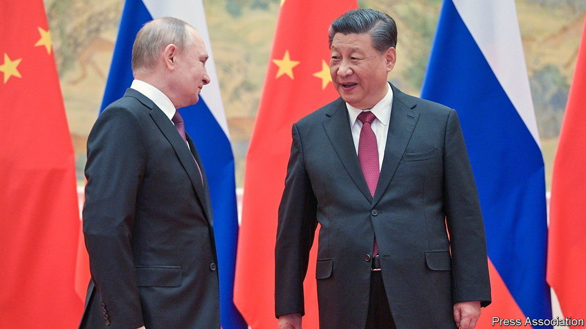

###### Sanctions

# Will China offer Russia financial help? 

##### A bit. But it will mostly seek to learn from Russia’s mistakes 

 

> Mar 12th 2022 

IF YOU BELIEVE China’s diplomats, relations with Russia are “rock solid” and the friendship between Xi Jinping and Vlad imir Putin has “no limits”. Western sanctions are about to put those warm words to the test. Russia needs an economic and financial lifeline. It would like to use China as a conduit through which to continue trading with the rest of the world. China, however, must strike a delicate balance between helping Mr Putin stand up to their joint rival, America, and retaining its own access to the global financial system. No doubt to Mr Putin’s regret, its financial aid to Russia is likely to be qualified at best.

Although China abstained in UN votes condemning Russia for invading Ukraine, its rhetorical support has been more fulsome. On March 7th, as civilian casualties mounted, Wang Yi, the foreign minister, called Russia his country’s “most important strategic partner”. It is just a month since Mr Xi and Mr Putin heralded a new era for their countries. As well as preserving relations, China probably wants to undermine the legitimacy of sanctions as a tool of Western policy, given they have been used against it over Hong Kong and Xinjiang. Chinese firms may spot an opening in Russia as Western ones, such as McDonald’s and Shell, close their doors. Bloomberg news says that some are eyeing cheap energy assets.


 


Yet this  faces several problems. China’s technical abilities are no substitute for the West’s. CIPS, its payments network, has a small global footprint and low volumes and relies on sending messages through SWIFT, a European body from which some Russian banks are now barred. Another difficulty is that Chinese multinationals with a legal presence in Western-allied countries may fall foul of the existing sanctions regime. China’s international banks are wary. Volvo (based in Sweden but owned by a Chinese firm) and TikTok (run from Singapore but Chinese-owned) have suspended some operations in Russia. Even Chinese firms without a legal presence in the West could be hit by “secondary sanctions”, which take aim at third countries that help the subject of primary ones. America has not yet used this weapon over Russia, but it might. Chinese banks that dealt with Iran and North Korea were penalised by America.

Given all this, China’s help to Russia is likely to be half-hearted. It may stick to its existing Russian trade arrangements, hoping that America will tolerate them. Chief among these is energy. China received 32% of all Russian crude exports in 2020 and 17% of its exports of liquefied natural gas. China may also conduct trade and financial transactions through smaller banks that do not have a legal presence in the West, using roubles and yuan rather than the dollar. It may also grant Russia’s central bank access to its yuan holdings. Last, China will probably try to limit the overall scale of trade volumes and payment flows so as to avoid provoking a direct confrontation with America.

Chinese officials must juggle several priorities. China wants to see Russia survive these sanctions, to teach America and allies that they are not a magic weapon, but is anxious to limit collateral damage to Chinese interests. In the process, it plans to learn from Russia’s mistakes. If it comes to blows with America, China wants its financial system to be shielded. Its aims will include improving its payments system and diversifying its $3.2trn of reserve holdings out of Western currencies and accounts by, for example, investing in commodities. It could get foreign firms and governments to issue more securities in China’s own capital markets, creating a new pool of assets for China to buy. Russia may hope for a Chinese bail-out; China’s priority will be to learn from a case study of failure. ■

