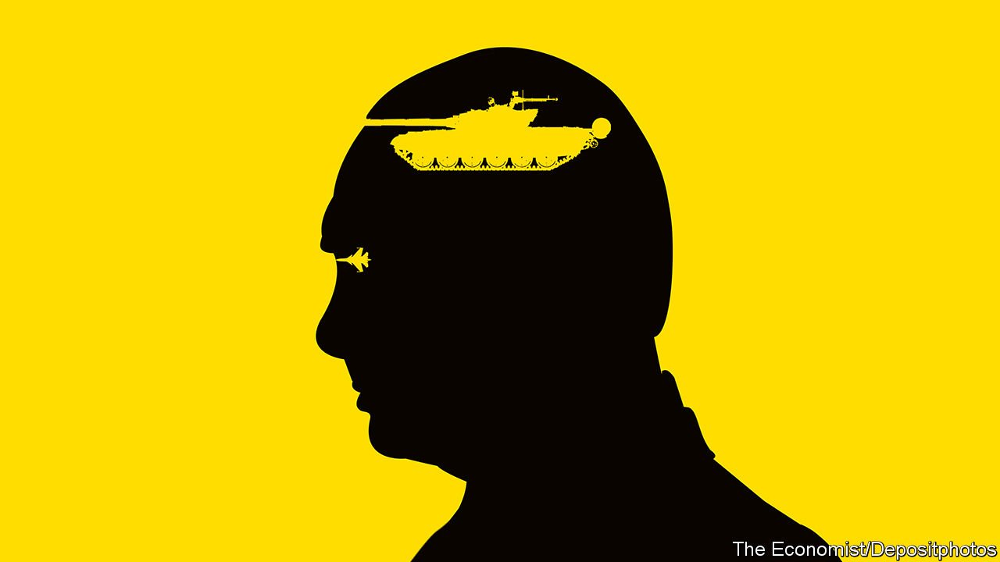

###### On Cambodian diplomacy, green subsidies, “Peaky Blinders”, Keynes, Colorado, nutritional ratings, robots, video meetings

# Letters to the editor 

##### A selection of correspondence 

 

> Mar 12th 2022 


Cambodia and Myanmar

You trivialised serious attempts by the government of Cambodia to improve matters in Myanmar (“”, February 26th). Hun Sen, the Cambodian prime minister, visited Naypyidaw, Myanmar’s capital, in January. He conveyed the important message to military leaders that Myanmar would be welcomed back into ASEAN only if it made substantial progress implementing the five-point consensus, namely: the immediate cessation of violence; holding constructive dialogue with all stakeholders; letting ASEAN help mediate that dialogue; allowing safe access for humanitarian assistance; and enabling regular visits by ASEAN’s special envoy.


These diplomatic efforts do not lend legitimacy to Myanmar’s military government. Rather, they are part of an ongoing process that, in the short term, pushes for the delivery of humanitarian assistance and that, one hopes, will ultimately lead to peace and a return to an ASEAN of ten members.

Contrary to your article, Cambodia, an independent, sovereign country with a long, proud history, is no stranger to international diplomacy. Our UN peacekeepers participate in programmes around the world to clear landmines, administer medical assistance and provide civil-engineering expertise. We take seriously our chairmanship of ASEAN, pursuing peace, stability and prosperity in the region.

KAO KIM HOURN

Minister delegate attached to the prime minister in charge of foreign affairs and ASEANPhnom Penh

 


Subsidies to fossil fuels

I read your leader about companies’ environmental, social and governance (ESG) rules, and in particular oil-related investments (“”, February 12th). The shift from publicly listed investment to the private sphere in order to avoid the scrutiny of the markets should be called out, and thank you for doing so. But the biggest issue in this debate strikes me as being the one relating to public investments.

The IMF, in a report published in September 2021, found that fossil fuels are still receiving subsidies of $5.9trn, or $11m a minute. So the same governments signing pledges to reduce carbon-dioxide emissions in the framework of the Paris agreement, as witnessed at the COP26 summit in Glasgow, are, in the same breath, actively promoting the use of carbon to support the unsustainable growth of our economies.

Calling out inconsistencies in the investment world should not be limited to the private sector. Maybe the first really disruptive public-private partnership could be the promotion of transparency across the whole system.

ANDRE HOFFMANN

Vice-chairman

Roche

Basel, Switzerland

 


A popular cultural export

It was interesting to read “” (digital editions, February 21st) and about the themed bars that have sprung up in British cities, such as Liverpool and Manchester. In downtown Toulouse there is a Peaky Barbers hairdressing saloon, complete with period decor from the television series and door handles that resemble handguns. Such is the authenticity that I find myself unable to resist popping my head around the corner occasionally and shouting, “Don’t mess with the Peaky Blinders” (I know, it’s a misquote). And one day I overheard one of the apple ladies at our traditional Saint Aubin Market say of a blue-eyed customer Oh, il a les mêmes yeux que Thomas Shelby! (Oh, he has the same eyes as Thomas Shelby).

Whatever chord Les Peakies has struck in popular culture it seems that it is not just a British one.

NICOLA SCICLUNA

Toulouse

 


One hundred years later

Zachary Carter’s book on John Maynard Keynes quotes some correspondence from 1922. Keynes wrote,


A review of recent events and the behaviour of powerful people suggests that we haven’t come far in the past century (“”, February 26th).

DERRIN DAVIS

Richmond Hill, Australia

 


Not a waste

I was surprised to see you criticise Colorado’s efforts to establish a universal preschool programme (“”, February 26th). Less than a month earlier The Economist noted that, despite the mixed record of such programmes in terms of educational outcomes, “the economic benefits of child-care or pre- K programmes vastly outweigh the costs” (“”, February 5th). Surely the efforts to establish the infrastructure for such a programme should not be equated with the spending white elephants identified elsewhere in the article?

AL KELLY

Denver

 


Nutritional ratings

Charlemagne correctly pointed out that under the Nutri-Score labelling system in Europe, Zero Coke fares better than Parmigiano, or Parmesan (). It might be worth noting that it also gets a better grade than milk. The Nutrinform system proposed by Italy might look less intuitive than Nutri-Score, but, as opposed to the latter, it is not misleading. It is based on the assumption that nutritional properties of different kinds of food should be weighted on the average quantity you are supposed to take. An assumption on which you seem to concur. We probably also agree on the fact that oversimplification is seldom healthy, and that information and education are always preferable.

RAFFAELE TROMBETTA

Ambassador for Italy

London

 


Automaton for the people

You said that in 1920 Karel Capek coined the word “robot” in his play “R.U.R.”, or Rossum’s Universal Robots (“”, February 26th). Actually, Capek simply dropped the final “a” from the Czech word robota, which means “forced labour” imposed on ordinary citizens, much like the obligations of peasants throughout the feudal system.

Capek’s word gained much publicity and entered into common usage, but its etymological history gives it a more complex and rich meaning; that of a machine bound to do the will of its creator, just as modern robots do, or are supposed to do, and which the forced workers actually did.

HENRY PLOEGSTRA

Holland, Michigan

I read with a chuckle your assertion that checkout staff who have been booted out of their jobs by machines may find deeper “reward” in helping customers pick items from shelves instead of sitting on their proverbial all day. May I suggest that whatever your writers believe is to be found after eight hours of being ordered around a shop by often-disgruntled customers, it is rarely a sense of reward.

DANIEL SHERWOOD-CLARKE

Edinburgh

 


The camera always lies

Bartleby’s meaningful take on body language in the post-pandemic workplace () overlooked an emerging trend about video meetings: switching off one’s camera. Being the only person on a video call with a camera on is gruelling. The body language employed to look nonchalant tells us more about that person than anything the behavioural scientists can.

One usually stares at blank circles in place of people, their initials appended in bold. A few proudly display a photogenic picture of themselves taken years before, airbrushed to look like what they think they still look like. Photos of others seem to have been lifted from the police archives.

ZUBIN AIBARA

Bülach, Switzerland

