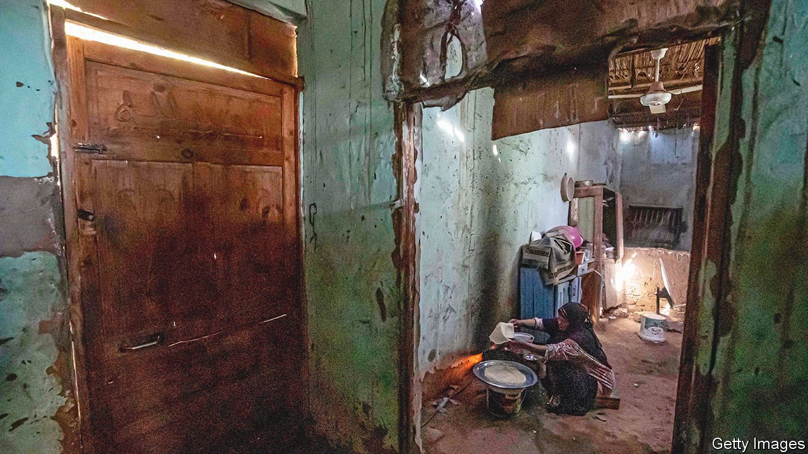
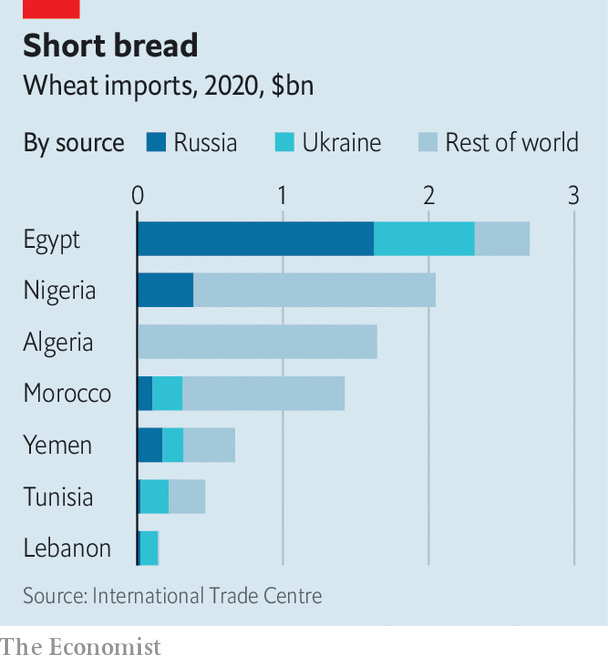

###### Bread and oil

# How the invasion of Ukraine will spread hunger in the Middle East and Africa 

##### By raising the price of food and fuel, Vladimir Putin’s war will cause misery and unrest 

 

> Mar 12th 2022 

THE LAST time Egypt raised bread prices, the Soviet Union was still intact. Since 1989 subsidised bakeries have offered 20 loaves of aish baladi, a glutinous pita that is a staple, for one Egyptian pound. Back then that sum was worth almost $1. Today it is worth about six cents, less than a tenth of what it costs to produce the bread.

The state spends 45bn pounds ($2.9bn) a year to make up the difference, more than half its total food-subsidy bill. No government has dared tinker with this costly arrangement. Bread is the main source of calories for millions of Arabs, and thus an explosive political issue.


, which has sent , will cause widespread hardship. Pricey wheat will , perhaps forcing subsidy cuts that leave citizens hungry. In sub-Saharan Africa,  will strain economies that are already creaking.

All this may lead to unrest. President Anwar Sadat tried to do away with Egypt’s bread subsidy in 1977; he reversed his decision within days after riots that had to be quelled by the army. Ethiopia’s revolution of 1974 followed an oil-price shock. Higher food prices in 2008 and 2009 helped set off the revolts of the Arab spring, and protests that led to the toppling of Omar al-Bashir in Sudan in 2019. In Rabat, Morocco’s capital, riot police are already on the streets. “Bread price hikes have long been a trigger for riots in north Africa,” says Amin Rboub, a Moroccan journalist. Many Arab and African governments have refused to express support for either side in the Russia-Ukraine conflict, arguing that it is not their war. They will feel its effects nonetheless.

Start with wheat, of which Russia and Ukraine are, respectively, the biggest and fifth-biggest exporters in the world. The war has halted shipments from the Black Sea. That is dire news for Egypt, the world’s largest wheat buyer. It needs 21m tonnes a year to feed its 102m people but produces less than half of that. Russia and Ukraine provide 86% of its imports (see chart).

 


This year’s budget assumed that imports would cost $255 a tonne. Prices on futures markets are already flirting with $400. That could add at least $1.5bn (0.4% of GDP) to Egypt’s import bill. The price of unsubsidised bread has increased by 50% in some shops in recent days.

Abdel-Fattah al-Sisi, Egypt’s authoritarian president, has never liked the bread subsidy. “It’s unreasonable to sell 20 loaves of bread for the price of one cigarette,” he said last year. Soaring prices would give him an excuse to try to change it. But he may not like the reaction. Almost one-third of Egyptians live below the paltry official poverty line of 857 pounds a month.

Many of Egypt’s neighbours are in a similar bind. Fadhila Rabhi, the Tunisian trade minister, says subsidised baguettes that sell for 190 millimes (six cents) already cost 420 millimes to produce. The country has a budget deficit of around 9% of GDP and annual debt-service payments at around the same level. In Lebanon, mired since 2019 in a financial crisis, the price of a bag of flatbread had already increased by more than 400% in the two years before the war. Lebanon’s main grain silos were destroyed in an explosion at Beirut’s port in 2020, leaving the country able to store only a month’s worth of wheat.

A drop in maize shipments from Ukraine could hurt Egypt, which gets 26% of its imports from there. Because it is used for animal feed, higher maize prices will lead to more expensive meat in Egypt, as well as pricier maize porridge in southern Africa, where it is a staple. Ukraine is also the biggest exporter of sunflower oil. Soaring prices are spilling over into substitutes such as palm oil, which is popular in west Africa. In January the UN’s vegetable-oil index touched its highest level ever. The manager of a cannery in Western Sahara says the costs of the sunflower oil and aluminium he needs to can sardines have risen by 40% in a week.

Across sub-Saharan Africa food makes up roughly 40% of the consumer-price basket. Food inflation, which had been running at about 9% a year in 2019-20, started ticking up a year ago to reach 11% in October because of rising transport, oil and fertiliser prices and disruptions to farming from the pandemic. The first to be hit by higher wheat prices will be the likes of Ghana and Kenya, where it accounts for about a third of cereal consumption, or Nigeria, where poorer urban families slurp a lot of instant noodles.

Higher food prices hurt the urban poor most of all, since they tend not to grow their own. This matters for political stability. Urbanites are more densely packed and closer to the seat of government than their rural cousins. So riots in cities can overthrow governments.

Rural folk might in theory benefit from higher food prices, since many of them sell food as well as eating it. Subsistence farmers are a higher share of the population in sub-Saharan Africa than in the Middle East, and not especially reliant on imports of food. Yet even they will be hurt by higher prices for fertiliser and transport. The cost of ammonia, a key input for fertiliser, had already shot up by 260% between December 2020 and December 2021, says Wandile Sihlobo of Stellenbosch University in South Africa. Reduced shipments from Russia and Belarus, both big exporters, will boost prices further.

Costlier crude oil is a mixed blessing for the Middle East. At current prices all the region’s oil exporters, save Algeria, should be able to run both fiscal and current-account surpluses. Many Gulf governments have reduced fuel subsidies in recent years—motorists in the United Arab Emirates are paying 3.23 dirhams (88 cents) a litre this month, a record high—which will cushion the blow to state budgets.

The picture is worse in sub-Saharan Africa, where 38 of 45 countries are net oil importers. Higher prices will be a “very significant” negative shock, warns Abebe Aemro Selassie, who heads the IMF’s Africa department. Even at the best of times most African countries struggle to export enough to be able to cover the cost of their imports. A thumping increase in the oil price will cause balance-of-payments trouble across the continent. Well before prices started rising, petrol already accounted for about 20% of imports in Kenya and Ghana.

Transport prices were already the biggest cause of headline inflation (which includes food and energy) in Kenya, Ghana and Rwanda last year. In Nigeria, where annual inflation is running at close to 15%, transport and food costs make up around 57% of the inflation index.

The few African countries that produce oil, such as Nigeria and Angola, stand to benefit. However, even they may do less well than hoped. Both countries subsidise petrol for consumers. Fuel subsidies could now cost the governments of Angola and Nigeria the equivalent of about 2% of GDP, up from an expected 1.4% in Angola and 0.8% last year in Nigeria.

Better news may come only in the medium term. Europe is on a desperate hunt for non-Russian oil and gas. Algeria, which has pipelines to Spain and Italy, is looking to take advantage. Other African producers hope to cash in by shipping more liquefied natural gas. The big prize would be European support for one of two mooted gas pipelines that could link Nigeria to Morocco and go on to Europe, or Nigeria to Algeria through the Sahara.

For years Arab autocrats have sought closer ties with Russia. Whereas America lectured them about human rights, Mr Putin urged strongmen to be strong. When he visited Cairo in 2015, for the first time in a decade, he gave a Kalashnikov to Mr Sisi, who in turn treated him to dinner at a restaurant overlooking the Nile (with plenty of bread on offer). Now those same autocrats face broken budgets and angry citizens—courtesy of Mr Putin. ■

Our recent coverage of the Ukraine crisis can be found 

