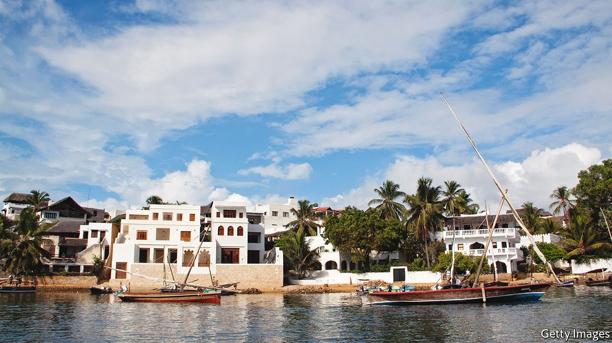

###### Holidays near hell

# Lamu, a beautiful Kenyan tourist bubble surrounded by pins 

##### Locals are wary of jihadists, drugs and modernity 

 

> Mar 10th 2022 

LOUNGING ON CUSHIONS in the prow of a sturdy wooden dhow as it glides in total silence through the mangrove-edged creeks opposite the island of Lamu, the spoilt Western visitor, freed from two years of covid-19 restraints, is lulled into thinking he is in paradise.

The breeze is balmy. The sea is turquoise. A blood-orange sun slips under the equatorial horizon. The sailors at the helm are muscular and friendly, deftly handling the slanting triangular sails as their forebears have done for the past thousand years. It is time for them to proffer a cocktail from the ice-box stowed below.


Lamu has served as a haven for tycoons and backpackers alike for decades, but never has it been so eagerly visited as in the past two years of global plague. Somehow the web of travel curbs has been widely circumvented. Local airlines and private planes have flown in droves to Manda, an island lying next to Lamu. Passengers are then carried by boat to an array of thatch-roofed villas and hotels dotting the coastline on either side of the channel of sea sloshing into the Indian Ocean. Set apart from the fancier villas, the old town of Lamu, famous for its carved Arabesque doorways, is a mesmerising labyrinth of alleys where cars are banned and donkeys hold sway.

Yet it is a bubble that the malevolent would love to burst. For the past few years the people of Lamu have been lapped by a wave of Afghan heroin that is smuggled in boats from Pakistan and Yemen for onward transport. Too many local youngsters have acquired a taste for it. Another threat is posed by the jihadists of al-Shabab, based up the coast in Somalia, only 100km (62 miles) as the fish-eagle flies. They have become more active. If you cross from Lamu to the mainland and head south by road, you must join a convoy; a curfew has been enforced at dusk. In January Kenya’s interior minister declared Lamu county, which includes a chunk of the mainland, to be “a disturbed area”.

Peace has prevailed on Lamu and Manda since two lethal kidnappings of Westerners in 2011 ruined tourism for a while. In 2014 al-Shabab massacred 47 non-Muslim Kenyans in an attack on a nearby mainland village. Two years ago the jihadists killed three Americans in a dawn attack on a discreet military camp across from Lamu island.

“They would love to have a go at tourists in Lamu itself,” meaning the island, says a resident. But the locals, he reckons, would be quick to hand over anyone among them voicing pro-jihadist sentiment, because the economy depends so heavily on tourism. Another kidnapping could spell disaster. The beautiful bubble feels safe enough. Cross your fingers.

