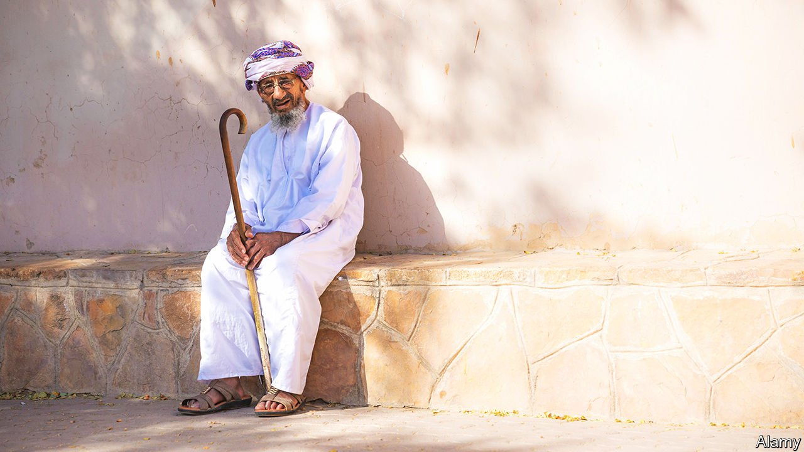

###### Dashing dishdashas

# Why Omanis are required to dress up 

##### Their sultan wants to maintain sartorial standards 

 

> Mar 12th 2022 

ABDULLAH, AN ELEGANT young Omani, says he can tell instantly if someone has bought his dishdasha off the peg, since its cuff would not sit perfectly on the wrist. Like Oman’s government, Abdullah is proud of his national dress, a white garment like a dress shirt that flows down to the ankle. Many Omani men also wrap their head with a turbaned, embroidered headscarf known as a massar. It is a fine sight. The sultan, Haitham bin Tariq al-Said, who ascended the throne two years ago on the death of his long-ruling cousin, Qaboos, intends to keep it that way.

The ministry of commerce recently laid out criteria for how dishdashas should look. They may not have a collar. They must be a single colour, generally white, though they may be embroidered around the cuffs, neckline and chest. Pale colours are the norm, though teenagers tend to flaunt bolder hues.


Under the new rules anyone caught wearing a deviant dishdasha may be fined up to 1,000 Omani riyals ($2,600). The government has weighed in on matters of apparel before. Last year it forbade businesses to put logos or trademarks on traditional clothing. In 2019, under the previous sultan, it required boys to wear the dishdasha at school.

Fines are unlikely to be rigorously enforced. Rainbow dishdashas are not flooding the streets. But the government’s edict signals its determination to preserve Omani culture and foster a national identity. Between 2010 and 2017 the budget of the ministry of culture and heritage, which Sultan Haitham oversaw before he inherited the throne, doubled. The government will soon launch “Oman Across Ages”, a massive museum that aims to instil a sense of pride among young, smartly accoutred Omanis.

Such moves may also boost tourism, a pillar of Oman’s Vision 2040, a set of reforms meant to wean the country off oil. Oman is trying to promote itself as a torch-bearer of “the real Arabia”, says James Worrall, an expert on the country at Leeds University in Britain. It wants to highlight the sultanate’s natural beauty, long history and authenticity, compared with the flashy gimmickry of nearby Dubai. In 2020 the Omani ministry of heritage and culture merged with the ministry of tourism.

Abdullah backs the idea of fining dodgy dressers. If you muck around with the Omani dishdasha, it will “lose its original flavour”. As a public-sector employee, he must wear a white dishdasha to work. It looks good, he notes approvingly, with almost any massar.

