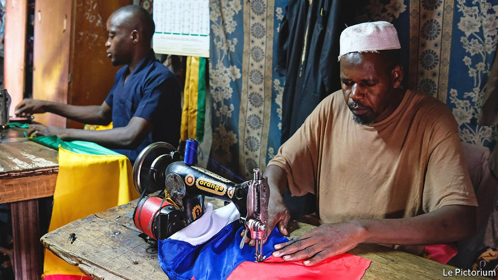
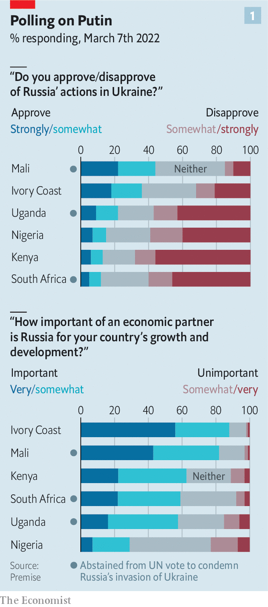
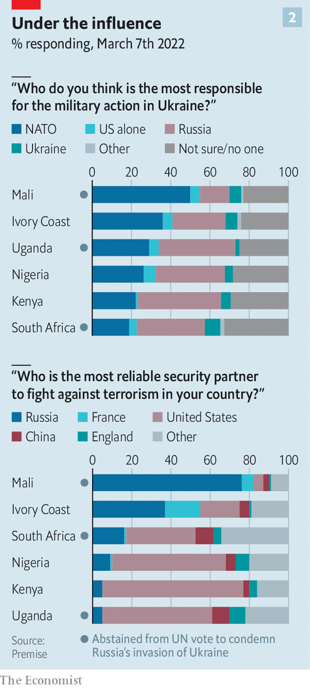

###### Nostalgia and Kalashnikovs

# Why Russia wins some sympathy in Africa and the Middle East 

##### But countries in the region will try to avoid choosing between it and the West 

 

> Mar 12th 2022 

IN 2019 VLADIMIR PUTIN welcomed 43 African leaders to the inaugural Russia-Africa summit, a higher turnout than Britain or France attracted to similar shindigs. At the bash in Sochi the Russian president lambasted the West for how it imposed “political or other conditions” on African countries, a reference to chiding about human rights. “We have a lot to offer to our African friends,” said Mr Putin.

The summit stressed Russia’s increasingly muscular approach to Africa. After Russia annexed Crimea in 2014 and the West imposed sanctions, it boosted efforts to sell arms, extract resources and prop up shaky regimes. Now that Russia is suffering far more sweeping sanctions, it may wish to redouble its activities on the continent. But do African governments think it still has enough to offer?


 


The vote on March 2nd at the UN General Assembly to condemn Russia’s invasion of Ukraine suggests many are hedging their bets. Of the 54 African countries, 28 backed the motion but 17 abstained and eight were no-shows. Eritrea, a gulag state, joined Russia, Belarus, North Korea and Syria in voting against.

Whether these votes reflect ordinary Africans’ views is unclear. Mobile-phone surveys carried out last week in six African states for The Economist by Premise, an American research firm, suggest that governments’ ambivalence is reflected in public attitudes (see chart 1). In Kenya, Nigeria, South Africa and Uganda pluralities held Russia most responsible for the war. But in Mali and the Ivory Coast, NATO was most often cited as the guilty party.

The votes at the UN partly reflect historical ties between Russia and ruling parties, especially in southern Africa. Many of the region’s elite studied in the Soviet Union; some have fond memories of their time there. The liberation parties that still run Angola, Mozambique (whose flag features a Kalashnikov), Namibia, South Africa and Zimbabwe saw the Soviet Union as an ally in their fight to end white rule, and consider Russia to be its successor. All abstained, even though Ukraine was part of the Soviet Union, too.

This nostalgia goes hand-in-hand with latent anti-Western views. Murithi Mutiga of International Crisis Group, a Brussels-based think-tank, notes “resentment” in the Horn at “the way the US behaved in its unipolar moment”. NATO’s intervention in Libya in 2011, which ignored the African Union, angered leaders like Yoweri Museveni of Uganda (another abstainer). The subsequent chaos, which spilled over into the Sahel, alienated governments there.

But Africa’s relations with Russia are mainly about self-interest, not history or ideology. This is acutely so for countries that rely on mercenaries from the Wagner Group, which is backed by Yevgeny Prigozhin, a chum of Mr Putin. There are an estimated 2,000 Wagner troops in the Central African Republic (CAR) keeping rebels from toppling President Faustin-Archange Touadéra, reportedly in exchange for gold and diamonds. He is too dependent on them to change tack.

 


The junta in charge of Mali since a coup last year has also turned to Wagner. About 800 guns-for-hire operate there, says Emmanuel Macron, France’s president, who is withdrawing French forces partly because of the Russian arrivistes. European attention to the Sahel will further diminish because of the war in Ukraine, reckons Paul Stronski of the Carnegie Endowment for International Peace, another think-tank, leaving a “relatively open door” for Wagner. He adds that Russia will see the battle for influence in the Sahel as part of a wider contest against Western enemies—an echo of proxy conflicts during the Cold War.

Guinea is another African country unusually dependent on Russia. It is already a “collateral victim” of the war, laments Amadou Bah of Action Mines Guinée, an NGO. Rusal, a huge Russian aluminium producer with three mines in Guinea, has stopped operations at its refinery in Ukraine, which processes bauxite mined in Guinea. Its junta recently suspended an honorary consul from Ukraine, presumably to keep Mr Putin sweet.

On February 24th, as Russian tanks were rolling into Ukraine, Mohamed Hamdan Dagalo, a powerful Sudanese general known as Hemedti, was hobnobbing with Russian officials. Russia has long sought a military presence at Port Sudan on the Red Sea and reportedly buys smuggled gold from the country. But in the coming months Sudanese angry at high bread prices (see earlier article) may renew protests against their Russian-backed junta.

Russia has tried to extend its reach beyond a few rickety states. It is the biggest arms exporter to Africa. Its trade with the continent has increased since 2014, though it still accounts for just 2% of Africa’s trade in goods with the rest of the world. Kremlin-linked firms have formed an Africa-focused trade association. A subsidiary of VEB (a bank under sanctions) has shares in Afreximbank, a development bank.

For most countries Russia is but one player among many. Like many African leaders, João Lourenço, Angola’s president since 2017, has tried to build a “portfolio of foreign-policy interests”, notes Ricardo Soares de Oliveira of Oxford University. Angola sells its oil to China, has an IMF programme and digs for diamonds with Alrosa, a Russian miner. “Historically we have relations with all these countries. I don’t see it as a major issue,” says an Angolan cabinet minister.

Ethiopia, which did not vote at the UN, is in a similar spot. Russia is its largest arms supplier. At the UN Russia has stymied efforts to constrain Ethiopia’s government in a civil war against rebels from its northern region of Tigray. Gazprom bank has shown interest in a project in Ethiopia’s eastern Somali region. However, “I’m not convinced we need [Russia] more than the West,” says an Ethiopian official.

The newly fickle Gulf

Self-interest and fence-sitting prevail in the Middle East, too. The United Arab Emirates (UAE) shocked America by abstaining in the UN Security Council on February 25th. The Arab League’s statement on the war three days later did not even mention Russia. Though their governments voted in favour of the General Assembly motion, officials in Egypt and other Gulf states argue that this is not their war: they have no formal alliances with either side.

Oil is one reason. Saudi Arabia is keen to preserve OPEC+, an alliance of big producers of which it and Russia are the biggest. Weapons are another factor. Egypt is the region’s second-biggest recipient of American military aid. But President Abdel-Fattah al-Sisi has sought to diversify, including by buying Russian fighter jets.

Gulf states have relied on America for protection. But they now think its security umbrella has holes. Diplomats hope staying neutral on Ukraine will send a message to America. “If we can’t count on you, you can’t count on us,” as one puts it.

Western governments are less likely to chastise African countries for abstaining. They know that all states have interests. “It’s very unlikely that African countries will be forced to choose a side,” says Folashadé Soulé, an academic also at Oxford.

But if Russian firms struggle to find dollars they will be less attractive to Africans. “I don’t think the government of Sudan wants roubles,” says a sanctions lawyer. Big energy or mining deals often involve ancillary Western firms, which may not want Russians involved, if only for reputational risk. If the West stops buying Russian hydrocarbons, that too could have knock-on effects on African buyers.

The next Russia-Africa summit is due later this year in Ethiopia. Its VIP list will show how many “African friends” Mr Putin still has. It may well be less than 43. ■

