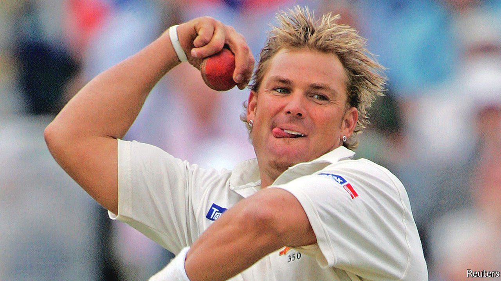

###### The blond bombshell

# Shane Warne believed that cricket should always be fun 

##### The best-ever leg-break bowler died on March 4th, aged 52 

 

> Mar 12th 2022 

IF SOMEONE invited him to a fancy restaurant, Shane Warne could tell them there wasn’t much point. A white-bread cheese sandwich or a bag of chips was just as good for him. Spaghetti bolognese was as far as he went in the gourmet department. And there wasn’t much to beat those warm pies you could buy at stalls, the ones he could demolish in about 30 seconds, with that sauce that inevitably ran down his chin and dribbled all over his jacket.

He drank, too. Not only Castlemaine, Foster’s and other patriotic brews, but the pints he downed in England in his winter seasons, when he discovered pubs. Those really put the weight on. He smoked like a chimney, lighting up a fag as soon as the dawn broke. His credo was “Eat. Go. Party!”, and there were plenty of high jinks to keep the tabloids happy. “Two drinks and two girls later,” began a sentence in his autobiography, and it could have started dozens.


He forgot all that, though, when he walked onto a cricket field. It was as if someone had shut the door behind him. The only traces of playboy were the peroxide hair, the chunky waistline and the sexily unbuttoned shirt, as well as the wildly joyous celebrations when he knocked a batsman over. And there were many, many of those: 708 wickets in Test matches, 293 in one-day internationals, at an average of merely 25.5 runs apiece. Certain spells of skill stood out, such as his 7 for 56 against the then-formidable West Indies in 1992 and, in 1994, his 8 for 71 against England. Perhaps the sweetest moment was when he became the first bowler to take 700 Test wickets, at his home ground in Melbourne, when he leapt off careering round the ‘G as if he was demented.

His secret, a very public one, was that he was a masterly leg-spinner. In an era when most bowling tended to be fast and brutal, his was slow, subtle and cunning. He made it slower by ambling to the crease, quickening for a couple of steps, passing the ball nonchalantly from left hand to demon right, then letting the ball rip, drift and bounce to the batsman’s left and spin in sharply, sometimes square, to hit the leg stump or be snicked to a nearby catcher. The ruse was often invisible, and he had many ways to disguise it, sending the ball low and spinless (a slider), spinning backwards (a zooter), or with his hand actually facing the other way (a wrong ‘un, called a googly by Poms). His favourite was the back-spin flipper, launched with a snap of thumb and forefinger to fizz out of his hand and skid fast and low off the pitch. His greatest delight was not a wicket destroyed but the look of total incredulity on the batsman’s face, as when in his first Ashes Test against England in 1993, and with his first ball, he bamboozled Mike Gatting with a choice Warnie leg-break, “the ball of the century”, and Gatting walked off shaking his head.

He had other weapons, too. He was a strategist, planning his moves about six balls ahead, and a psychologist, always seeking to unsettle a batsman. (Off the field, he became a high-level poker player.) Cricket was both a fierce team game and a duel between two men. Plenty of unsettling he could do with his bowling, luring his opponent out of his crease, or making him think that something special was happening, even when it wasn’t. Sledging, or casual taunting, also came in handy, and he loved it, even when he was sledged back. “Come on, you know you want to!” he would tell a batsman who was tempted to slog it. Or, to any player undone with nerves, “I’ve been waiting so long for this!” The only batsmen who regularly frustrated him were Brian Lara of the West Indies, Kevin Pietersen of England and Sachin Tendulkar of India, for all of whom he had immense respect—off the field, at least.

To find himself a cricketer was surprising. He played a bit as a boy, enough to know that his big strong hands and wrists, a present from his sporty Mum and Dad, were ideal for a spinner. But as a teenager he mostly wanted to play Australian Rules Football, where some stars drove Ferraris and wore ear-studs. (He did both those later, the Ferrari only one of a fleet of beautiful cars.) It took Kerry Packer’s World Series, launched in 1977, to prove to him that cricket could be just as cool.

In the national team he struggled at first, doing badly in his first two Tests against India. He wasn’t ready. But between 1993 and 1998, after rigorous training and dieting with Terry Jenner at the National Cricket Academy, he bowled like a dream. There were ups and downs thereafter, but his career averages were extraordinary. Besides the bowling he was no slouch with the bat, scoring 6,919 first-class runs, and a nifty fielder, especially in close at slip. “Wisden’s Almanack” reckoned him one of the five greatest cricketers of the 20th century, right along with Don Bradman and Garfield Sobers, and the only bowler.

Off the field the scandals went on, including accepting money from an Indian bookmaker in 1994 to supply pre-match information, sending explicit messages, sleeping with porn stars and, on the very eve of the World Cup in 2003, failing a drugs test. Such missteps cost him his chance to captain Australia. That was a shame, as he knew he was a first-rate motivator, both from the one-day internationals he captained and the two teams, Hampshire and the Rajasthan Royals, whom he proudly led to victory.

His legions of fans kept the faith through thick and thin. Warnie had done his all for Australian cricket, and under that cocky charisma, which nearly snared Elizabeth Hurley as his bride, there was, besides, a friendly and ordinary bloke, whose favourite meal was Vege mite toast, who never refused a fan an autograph and who had never finished a book in his life. To see his name in lights was fine, but he didn’t need it. He played cricket because it was fun for him and fun for other people. He retired from internationals in 2007 (having at last run out of arse), lamenting the way the game was now seen as a job and a business, although he had profited from that as much as anyone. There seemed no place now for characters like himself, true entertainers. He had made mistakes, sure, been silly, but that was because he was only human, no better than anyone else. Except at one thing. ■

