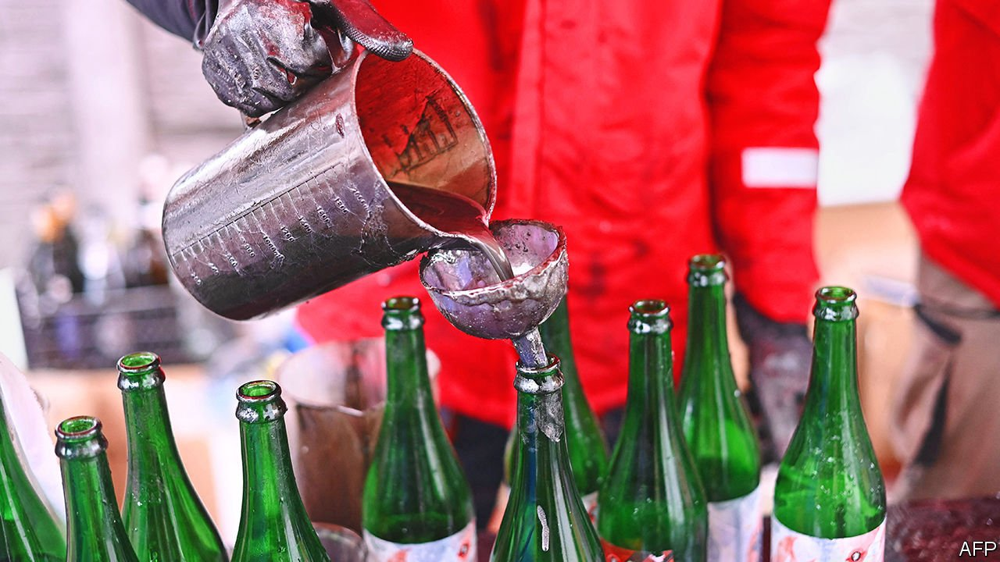

###### Improvised weapons

# Makeshift arms are pouring out of Ukraine’s ateliers 

##### They will make life unpleasant for the invaders 

 

> Mar 12th 2022 

IT DID NOT take long for Pravda, a trendy microbrewery in Lviv, to switch from brewing beer to mixing Molotov cocktails. It began churning out these improvised incendiaries on February 25th, the day after Russia invaded. Equipment previously employed for brews that won awards in Brussels, Munich and Prague now blends and bottles a concoction made from six parts machine oil, three parts petrol, four parts expanded polystyrene dissolved in a solvent called thinner 646, and a sprinkling of powdered aluminium. The result (see picture above) is soupy, sticky and burns like crazy—the better to disable any Russian military vehicle it is hurled at. After running out of its own bottles, the brewery even stooped, jokes Yuri Zastavny, Pravda’s owner, to filling empties that had once held the likes of Corona and Miller.

Nor are Pravda’s employees content only to mix Molotovs. They are also fashioning caltrops. These are tetrahedral structures with a spike at each vertex, which means that, however they fall, one spike points upwards. Caltrops have been used as “area denial” weapons on battlefields since ancient times (Alexander the Great employed them to beat the Persians at Gaugamela in 331BC). Originally, they were intended to bring down charging cavalry and war chariots. Now their targets are vehicle tyres and soldiers’ boots. Pravda’s people make them out of “rebar”—the lengths of twisted steel used to reinforce concrete.


Points of contention

For rapid deployment on city streets that need barricading, caltrops can be welded to chains. Elsewhere in Lviv, other forms of barricade are being prepared. These are six-vertex anti-tank devices called hedgehogs, made from lengths of surplus train rail. They look like giant versions of children’s jacks. Deployed en masse they can halt tanks in their tracks, opening them to attack by the men and women with the Molotovs. And the workshops of Lviv are not alone. Defences of this sort are being cranked out all across Ukraine. Those without access to rebar fashion caltrops by bending and welding nails. And rows of spikes fixed to sheets of thick rubber will also make infantry think twice.

Ukraine has many engineers, computer programmers and other technical specialists who are used to getting things done with limited resources. Sviatoslav Yurash, a young parliamentarian from Lviv, who is in Kyiv to fight, attributes this inventiveness to the country’s distinctive cultural heritage. The “bureaucratic mayhem” of Soviet rule, he says, pushed people to devise creative workarounds. That served as a foundation for the three decades of market-oriented reforms that followed independence. These rewarded an entrepreneurial spunk which, he observes, is “coming in handy right now”. Vladimir Yatsenko, a film producer also in Kyiv to fight, describes this inventive spirit as “our national DARPA”, a reference to a famous American military-research agency.

Some of the makeshift weapons appearing as a consequence of this ingenuity are, indeed, fearsome. Need a grenade launcher? Grab a shotgun and fix a steel cup to the end of its barrel. Then pull the pin from a conventional hand grenade and tuck it inside the cup, so that the cup’s wall holds the grenade’s handle in place. Last, load the gun with a cartridge from which the pellets have been removed.

When you pull the trigger, the blast propels both grenade and cup into the air, ejecting the grenade from the cup. That releases the handle and starts the countdown. Though such contraptions are not exactly safe to fire, they can perform well, for they have a range of about the length of a football pitch. According to Nic Jenzen-Jones, boss of Armament Research Services, a consultancy in Perth, Australia, their use in Ukraine is spreading quickly.

As for the profusion of Molotov cocktails, Ukrainian mixologists are testing a variety of recipes and designs. Some have a divider separating two stages, one filled with kerosene and the other with home-made napalm. And Molotovs are not merely hand-thrown weapons. One Ukrainian army colonel in Kyiv, who requested anonymity, has a photograph of a Molotov-launching crossbow, fashioned from scrap steel and a bed spring.

With or without such improvised launchers, Molotovs can be extremely effective in urban combat. In particular, they make invaders chary of passing within a bottle’s throw of upstairs windows. That is both a constraint on movement and a call on attention that might make a soldier vulnerable to attack from another direction. And makeshift arms which are the fruit of greater technical expertise than that needed to fill a bottle with liquid are also cropping up in Ukraine. These “craft-produced weapons”, as experts call them, are mostly modifications of things that go boom. In Mr Jenzen-Jones’s view two, in particular, stand out in the fighting in Ukraine.

Battle stations

One is a modification of Russian-made RPG-7s. These are rugged and inexpensive shoulder-fired launchers of unguided rocket-propelled grenades. But the grenades’ warheads are designed to pierce armour, so are ill suited to attacking infantry. To remedy this, irregular forces on both sides of the conflict in eastern Ukraine, which began in 2014 and thus long-predates the recent Russian invasion, have reconfigured RPG-7s to fire 82mm mortar rounds with a fragmentation warhead.

The other concoctions noted by Mr Jenzen-Jones are called Khattabka, after Ibn al-Khattab, a Saudi jihadist who fought in Afghanistan, Chechnya, Dagestan and Tajikistan. These are hand grenades adapted from rounds intended for a conventional grenade launcher. They are made by removing the impact fuse and replacing it with a pin-operated countdown fuse of the sort employed in a conventional hand grenade. Since, in the fog of war, it is not unknown for units to be in possession of fuses without conventional hand grenades to fit them to, that is a useful innovation.

Moreover, hand grenades, whether conventional or improvised, need no longer be thrown by hand. Small commercial drones such as the Autel Evo II, a popular model of quadcopter, can also be employed for the task. These drones can be rigged either to drop a grenade on command or to fly to the target and detonate the payload on arrival.

Anti-tank hand grenades, such as the Soviet-era RKG-3, are being modified for use with drones as well. Such munitions have drogue parachutes that cause them, after being thrown, to fall more or less straight down on top of a tank, where the armour is thinnest. These parachutes, however, make them hard to drop accurately from a drone, so an arms maker called Ukroboronprom is removing the ’chutes and adding tail fins, instead.

Drones have other uses, too. Ukraine’s defence ministry has been urging people to fly them to spot Russian forces. They constantly report their GPS co-ordinates, so pinpointing the whereabouts of what they see is easy. Stores in Kyiv have reportedly run out of supplies, and volunteers are trying to bring more in from abroad.

If the war grinds on and fewer shipments of conventional arms and ammunition reach besieged cities, the role of improvised defences will surely grow. That has happened in other wars—for example, in Syria, where improvised artillery has evolved from slingshots employing silicone tubes as elastic to “hell cannons” that launch gas cylinders packed with explosives and shrapnel. War is a dirty business. But necessity is the mother of invention. ■

Our recent coverage of the Ukraine crisis can be found 

