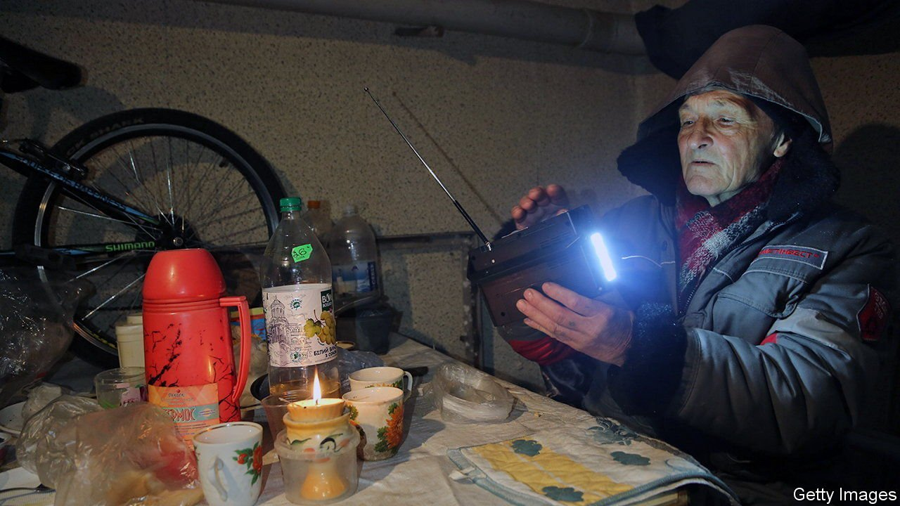
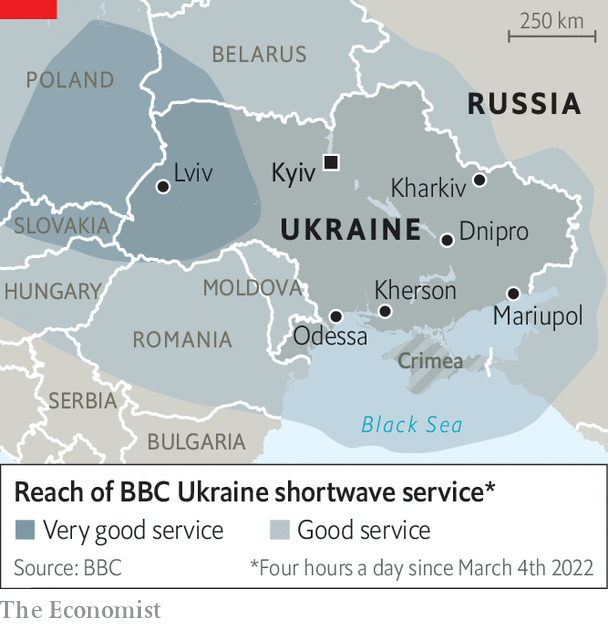

###### Communications in a war zone

# Technologies old and new keep Ukrainians in touch with the world 

##### Battery radios and satellite internet both have jobs to do 

 

> Mar 12th 2022 

IN COMMUNIST Eastern Europe a shortwave radio was a vital piece of equipment for anyone wanting to stay ahead of the censors. Stations such as the BBC World Service, Radio Free Europe and Voice of America broadcast news, entertainment and rock-and-roll across the Iron Curtain.

After the cold war ended, shortwave radios gave way to television and the internet, and the broadcasts were wound down. But on March 3rd, in the aftermath of Russia’s invasion of Ukraine, the BBC announced their return. The World Service has begun nightly news broadcasts into Ukraine and parts of Russia (see map).


 


Radio is an early-20th-century technology. But the BBC hopes it can still be useful in the internet age because it is hard to stop. Shortwave signals bounce off the ionosphere, a layer of charged particles high in the atmosphere. The resulting “skywave” travels for thousands of kilometres, meaning broadcasters can sit safely beyond the reach of censors, secret policemen—and invading armies. And in Ukrainian cities like Mariupol, where days of shelling have left the place without electricity, battery-powered radios still work when the internet and television do not.

Ukraine’s government does rely on the internet where it can, though, to fight the public-relations war and to keep communication with the outside world alive. In the past few days, for example, Volodymyr Zelensky, the president, has addressed America’s Congress, the European Parliament and Britain’s House of Commons via a video link.

With Russian troops massing near Kyiv, ground-based internet links are unlikely to last. But, on February 28th, Mykhailo Fedorov, Ukraine’s vice-prime minister, thanked Elon Musk, an American entrepreneur, for a delivery of “Starlink” satellite-internet dishes. These can provide high-speed, low-latency access to the internet via a network of low-flying satellites run by SpaceX, one of Mr Musk’s companies. A few days later Mr Musk said SpaceX had modified the dishes’ software to allow them to be powered by a car’s cigarette lighter. That could prove useful if and when the siege of Kyiv begins in earnest. ■

Our recent coverage of the Ukraine crisis can be found 

