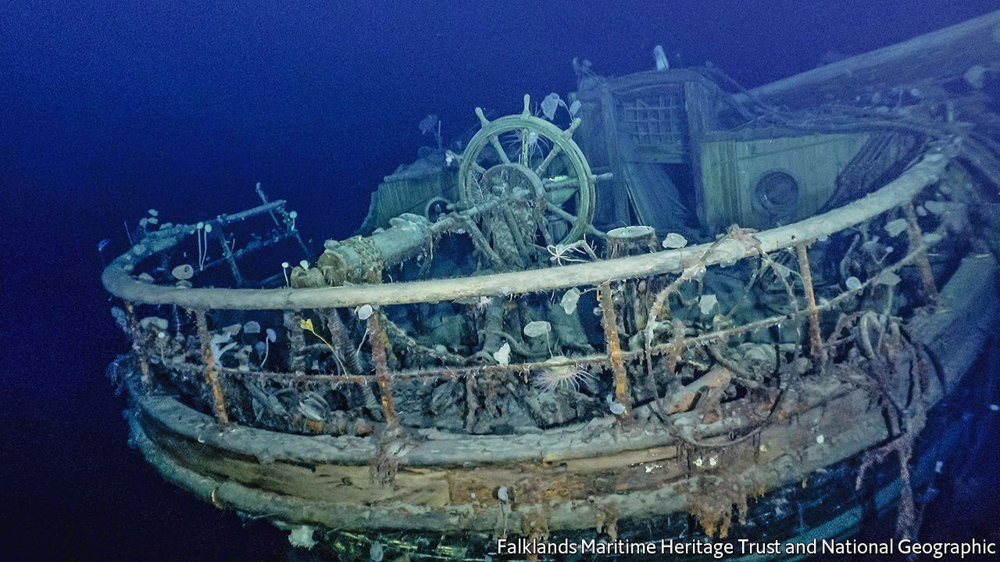

###### Underwater archaeology

# The wreck of Endurance has been located 

##### She lies 1,600 fathoms down in the Weddell Sea 

 

> Mar 12th 2022 

THIS IS THE stern of Endurance, one of the 20th century’s most famous ships. She was lost in 1915, in the Weddell Sea, an icebound part of the Southern Ocean off the coast of Antarctica.

Her captain was Frank Worsley. But the leader of the expedition she was carrying was Ernest Shackleton, a British explorer who, having been beaten to the South Pole by Roald Amundsen’s journey there and back in 1911, planned instead to lead his party across Antarctica from one side to the other.


That ambition ended when Endurance got stuck in the ice, and was then crushed by it. She sank, but slowly enough for the expedition’s supplies to be recovered. Shackleton then led the 27 other men in the party on a perilous trip using Endurance’s boats, which took them ultimately to safety at the whaling station of Grytviken, on South Georgia, about 1,300km from the place where the vessel had foundered.

The discovery of the wreck, which lay at a depth of 1,645 fathoms (3,008 metres), was announced on March 9th by the Falklands Maritime Heritage Trust, which had organised a search of the seabed in the area where  Endurance sank, using uncrewed underwater search vehicles called Sabertooths. She was 6km from her last position on the surface, as recorded by Worsley.

Though some doubt the story’s veracity, Shackleton is said to have recruited his compadres by placing in a newspaper an advert that read, “Men wanted for hazardous journey. Small wages, bitter cold, long months of complete darkness, constant danger, safe return doubtful. Honour and recognition in case of success”. It being early 20th-century Britain, though, honour and recognition were also available for heroic failure. And few failures were more heroic than this one.

