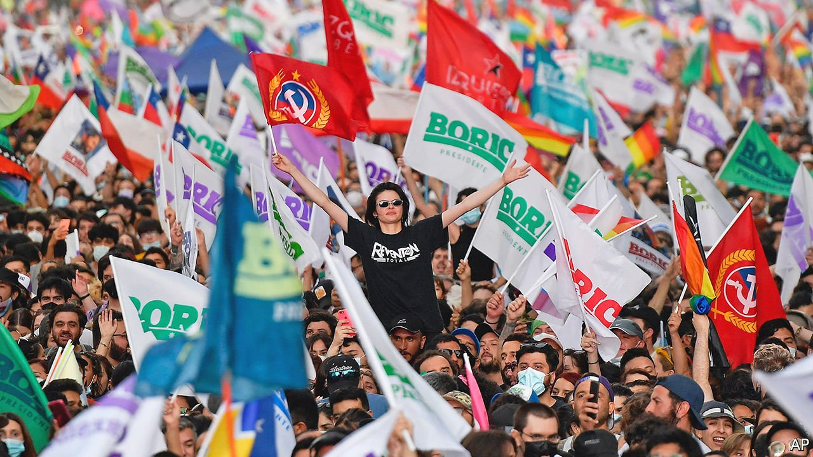
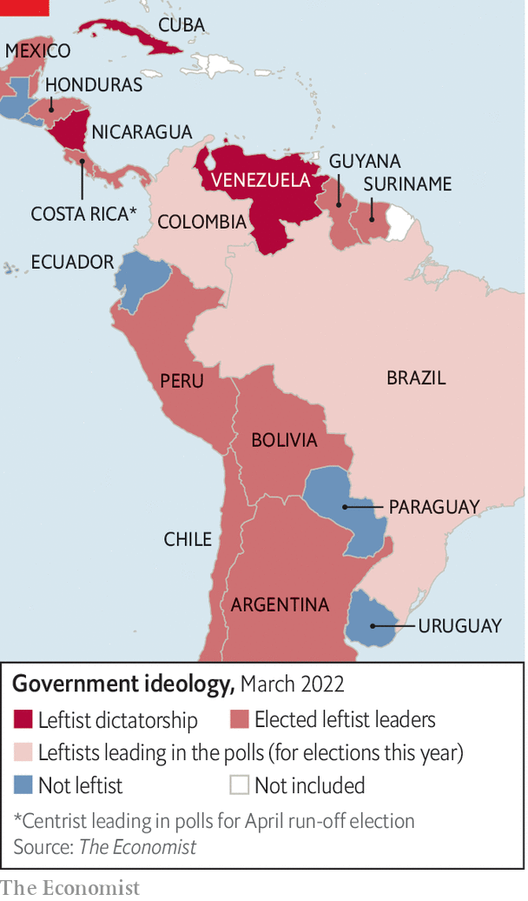

###### Many shades of pink

# A new group of left-wing presidents takes over in Latin America 

##### They have more differences than similarities 

 

> Mar 12th 2022 

WHEN GABRIEL BORIC, who is 36 and calls himself a “libertarian socialist”, is sworn in as Chile’s president on March 11th it will mark the most radical reshaping of his country’s politics in more than 30 years. His election in December is also widely seen as part of a new “pink tide” of left-wing governments in Latin America. It followed the victory of left-of-centre presidential candidates in Mexico, Argentina and Bolivia between 2018 and 2020 and in Peru and Honduras last year. Two left-wingers, Gustavo Petro in Colombia and Luiz Inácio Lula da Silva in Brazil, the region’s most populous country, lead in opinion polls ahead of presidential elections in May and October respectively. Latin America, it seems, is poised to swing decisively to the left (see map).

The picture is more complicated than it looks. The dominant trend for several years has been anti-incumbency, at least where elections are fair. The left has done well mainly because voters rejected right-leaning governments, which have had to deal with economic stagnation and then the pandemic. Region-wide surveys show that voters cluster in the centre. But they want better public services and think that their countries are governed for the benefit of a privileged few, which can help the left.


 


Mr Boric’s victory, and that of Pedro Castillo, a rural schoolteacher with no formal political experience, in Peru last June brought comparisons with an earlier pink tide. That began with the election of Hugo Chávez in Venezuela in 1998. It included the likes of Lula in Brazil, Evo Morales in Bolivia, Néstor Kirchner and his wife Cristina Fernández de Kirchner in Argentina and Rafael Correa in Ecuador. In an article in 2006 in Foreign Affairs, a journal, Jorge Castañeda, a former Mexican foreign minister, argued that there were “two lefts” in the region. One, represented by Lula and the Workers’ Party in Brazil, the Broad Front in Uruguay and the centre-left Concertación coalition in Chile, was “modern, open-minded, reformist, and internationalist”. The other was “nationalist, strident and closed-minded” and came from Latin America’s tradition of populism. This left included Chávez, Mr Morales, the Kirchners and later Mr Correa in Ecuador, all of whom nationalised businesses and railed against American imperialism.

In some respects that distinction still holds today. “I don’t see a homogenous progressive axis from Mexico City to Santiago,” says Mr Castañeda. If anything, there are even more variations than in the past.

In part, that is because of what is about to happen in Santiago. Mr Boric represents something new. Although he, like all leftists, worries about economic inequality and looks to the state to reduce it, he will bring to Chile’s presidency the concerns of his generation. For Mr Boric, the “existential issues” are “climate change, gender inequality and the recognition of indigenous communities”, says Robert Funk, a political scientist. Argentina’s Peronist president, Alberto Fernández, shares Mr Boric’s social liberalism and Mr Petro in Colombia his greenery. The Chilean combines those 21st-century priorities. Mr Boric’s electoral programme mentioned gender 94 times and economic growth just nine times.

Unlike Chávez and Ms Fernández de Kirchner, now Argentina’s vice-president, he is a consensus-builder, not a flame-thrower. Mr Boric uses social media to establish rapport with his supporters rather than to rile them up. He posts poetry, is frank about his obsessive-compulsive disorder and gushes about his caramel-coloured rescue dog, Brownie, which has 389,000 followers on Instagram.

He is distinctive in other ways. Whereas old-fashioned leftists defend dictators who claim to oppose American imperialism, Chile’s president-elect is a full-throated fan of democracy. He condemned the invasion of Ukraine and criticises human-rights abuses by Latin America’s three leftist dictatorships: Cuba, Nicaragua and Venezuela. He has invited to his inauguration writers forced into exile by Nicaragua’s despot, Daniel Ortega.

Mr Petro may join Mr Boric as a rare critic of such strongmen. Until recently a fan of Chávez, he now scolds his successor, Nicolás Maduro, especially for his dependence on fossil fuels, and accuses Mr Ortega of turning “a dream of liberation into a banana dictatorship”.

But several elected leftists defend autocrats as long as they are anti-American. The governments of Argentina and Peru were among the 94 that sponsored a resolution at the UN General Assembly condemning the Russian invasion of Ukraine. But Mr Fernández, Argentina’s president, visited Vladimir Putin in Moscow last month offering to be “the entry point” for Russia in Latin America.

Mexico’s government has tried to have its tortilla and eat it: Marcelo Ebrard, the foreign minister, condemned the invasion. But Andrés Manuel López Obrador, the populist president, who is often known as AMLO, said blandly that he wanted to keep good relations with all countries and criticised the “censorship” of Russian state media by social networks in the West. He praises Cuba as “an example of resistance” but has criticised repression in Nicaragua. Lula refuses to denounce the tyrants.

Some leaders of the last pink tide were themselves aspiring dictators. Mr Morales in Bolivia and Mr Correa in Ecuador followed Chávez’s example in using new constitutions to take over the judiciary and other independent institutions. The newer presidents tend to chip away at, rather than sweep away, the separation of powers. AMLO has given more duties to the army, which he controls. He has placed cronies in regulatory bodies and slashed the budget of the independent electoral authority. But he remains constrained by Mexico’s judiciary and his parliamentary majority was reduced in a mid-term election last year.

Peru’s Mr Castillo, who stood on a hard-left platform, stirred fears that he is plotting a Chávez-like power grab by calling for a constituent assembly to rewrite the constitution. But he is too weak to succeed. His supporters, faction-ridden themselves, have only 44 of the 130 seats in Congress, which repeatedly threatens to impeach him. Mr Petro has dropped his call for a constituent assembly but would seek decree powers to deal with Colombia’s economy. The risks of such overreach seem smaller with Lula. As Brazil’s president from 2003 to 2010 he was generally respectful of independent institutions.

In Chile the main worry is that a constitutional convention elected in May 2021, in which the far-left has a large presence, may not be as liberal as the incoming president. Among its early proposals are the abolition of the Senate, which is split equally between allies of the new government and the opposition, and curbs on free speech.

Today’s left-wing governments face tougher economic times than did their predecessors, which were helped by a commodity boom. Although commodity prices have risen, especially in recent days, the bonanza may be smaller. The pandemic has increased demands for social spending and, with interest rates rising, public debt will be more expensive to service.

This means there is likely to be less statism and more pragmatism than in the previous pink tide. Most leftist leaders are in favour of fiscal responsibility and independent central banks. Lula, who was economically prudent during his presidency, appears poised to pick as his running mate Geraldo Alckmin, a former governor of São Paulo who is close to the private sector.

But pragmatism is not universal. Mr Castillo, who remains an enigma after seven months in office, announced the “nationalisation” of a gas field. But that proposal was stillborn partly because of opposition within his government. Debt-ridden Argentina remains defiantly unorthodox: it has increased untargeted energy and transport subsidies. AMLO’s government spent less than almost every other in the region as a share of GDP to fight the effects of the pandemic. But it has poured money into Pemex, the state-owned oil firm, and is trying to change the constitution to penalise private investors in energy.

Thirty-two years younger than AMLO, Mr Boric has more fashionable views on everything from the economy to social issues, though he retains something of the old left’s scepticism of the private sector. He wants to make Chile more social democratic, with universal free health care and bigger public pensions, and plans to forgive student debt. He champions a “green transition”, which would phase out coal, and plans to set up a state firm to mine lithium, used in electric-car batteries. He backs feminism, abortion and gay rights. The only other leader who comes close to his social liberalism is Argentina’s President Fernández, who secured a law to allow abortion in 2020.

Other leftists are more conservative on social issues and, in most cases, more retrograde on environmental ones. Mr Petro has been guarded in his reaction to a decision by Colombia’s constitutional court last month to allow abortion on demand in the first 24 weeks of pregnancy. Lula is cautious about abortion, too, since he fears losing the votes of evangelical Protestants, who make up almost a third of Brazil’s electorate. The Peruvian and Mexican leaders have both angered feminists. Mr Castillo appointed to his cabinet men accused of beating women (though he sacked them after a public outcry). AMLO has claimed that protests against femicides were staged by his opponents.

Luis Arce, Mr Morales’s successor in Bolivia, shares AMLO’s enthusiasm for fossil fuels, and so probably would Lula, though he would endeavour to slow the despoliation of the Amazon rainforest that has taken place under Brazil’s rightist president, Jair Bolsonaro. At the other extreme is Mr Petro, who wants Colombia to cease to invest in its oil and coal industries, which between them provide half of its exports. He has suggested that coffee and tourism could replace them, but that seems unlikely for a long time.

Despite their differences, there is a lot of fellow-feeling among the new leftists. AMLO talks of a Mexico City-Buenos Aires axis. Mr Boric has said he hopes to work closely with Mr Arce, Lula and Mr Petro. The most significant of them could be Lula, if he wins, because of his experience and the weight of Brazil. While each left-led country has its own ways, “I think Lula will be some sort of equilibrium” among them, says Celso Amorim, his former foreign minister. But for now, all eyes will be on the boyish Mr Boric. ■

