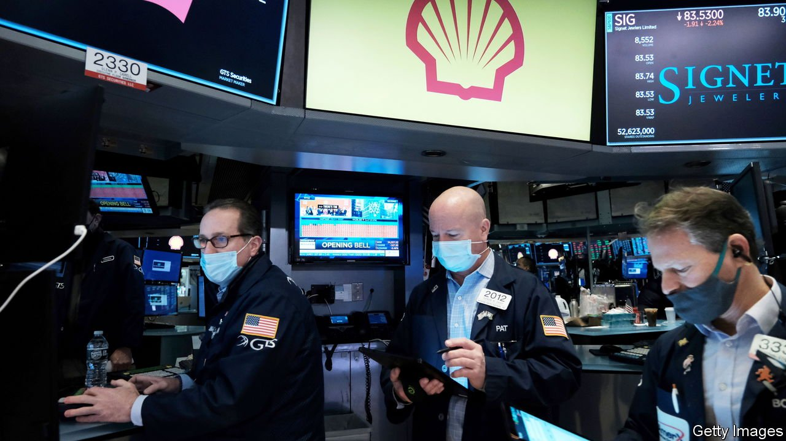
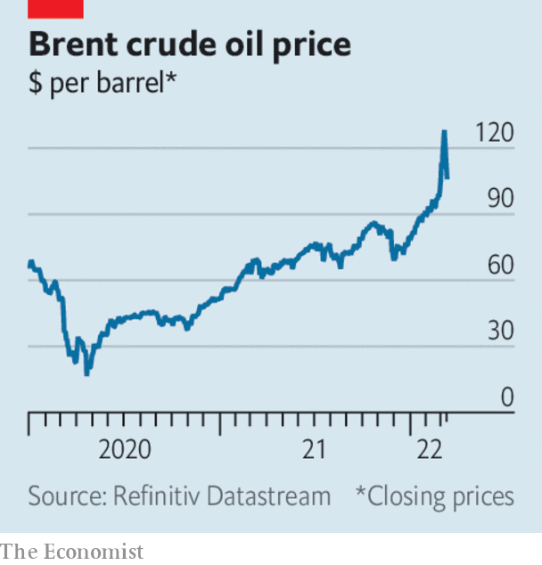

###### The world this week

# Business 

#####  

 

> Mar 10th 2022 

 


The decision by America and Britain to ban Russian oil imports . At one point Brent crude briefly came close to $140 a barrel; Russia warned that the ban would send it hurtling towards $300. But prices retreated when the United Arab Emirates became the first member of OPEC to support ramping up production. Earlier, the International Energy Agency said that its member countries were ready to release more oil from their emergency stockpiles to help tame prices. Shell, meanwhile, said it would withdraw fully from Russia. This came after the energy giant was criticised for buying a ship’s cargo of heavily discounted Russian oil to supply one of its refineries.

European markets for natural gas underwent huge price movements. Benchmark Dutch futures briefly hit a record high of €345 ($380) a megawatt hour before falling back; prices swung back and forth within a spread of €200. The price a year ago was around €17.


Trading in other  was also volatile. Shipments of wheat from Russia, the world’s biggest exporter, and Ukraine, the fifth-biggest, have ground to a halt, pushing crop prices to a record. The London Metal Exchange was forced to halt trading in nickel when prices more than doubled to over $100,000 a tonne; Russia is the biggest supplier of the top-quality nickel used in things like electric-car batteries. Palladium, manufactured in catalytic converters to help curb emissions, hit a new peak. The spot price for gold touched $2,070 an ounce, close to its all-time high, before falling back.

American Express, Mastercard and Visa suspended their operations in Russia. Russian banks are trying out several alternative payment systems, such as China’s UnionPay. Credit cards will be no good anyway for Russians hoping to go on a spending splurge; Cartier, Hermès, LVMH and other luxury-goods companies have stopped selling their products there. Professional-services firms also headed for the exit. Deloitte, Ernst &amp; Young, KPMG and PWc all cut ties with Russian business.

McDonald’s temporarily closed its restaurants in Russia, a move filled with symbolism. The fast-food chain opened its first outlet in Moscow in January 1990, during the glasnost era and two years before the formal dissolution of the Soviet Union. Pictures of hundreds of Muscovites queuing for their first taste of a Big Mac were beamed across the world.

Under public control

The British government imposed sanctions on Roman Abramovich and six other oligarchs suspected of having links to Vladimir Putin, freezing their British assets. The government took control of Chelsea football club, which Mr Abramovich owns. The Premier League side now has to operate under a special licence, which grants “permissions” for the team to continue playing matches.

Aeroflot suspended all flights outside Russia, except to Belarus. This came after the country’s civil-aviation authority warned  that planes leased from foreign entities could be impounded if they land abroad (the British government is making it a criminal offence to fly Russian aircraft into Britain). Russians seeking to return home were advised to transit through countries that have not signed up to sanctions.

The  government set an annual GDP growth target of 5.5%. That is the lowest target in 30 years, but higher than most analysts had expected, given the war in Ukraine.

American regulators have reportedly launched an investigation into whether Barry Diller, a media mogul, used insider information to buy options on Activision Blizzard’s stock days before the announcement that it was being sold to Microsoft. David Geffen, a music tycoon, and Alexander von Furstenberg, the son of Mr Diller’s wife, are also being investigated.

Amazon approved a 20-for-1 stock split and announced a share buy-back of up to $10bn. The move is an effort to boost the company’s stockmarket performance. The share price has fallen more sharply this year than most of Amazon’s other big tech peers.

With cyber-attacks on the rise, Google agreed to pay $5.4bn for Mandiant, a company that specialises in identifying threats and tracking down perpetrators. It helped respond to the ransomware attack on the Colonial Pipeline last year.

The last word

Elon Musk asked a judge to throw out a settlement he reached with the Securities and Exchange Commission requiring Tesla to review and sign off tweets he writes that relate to the business. The SEC and Mr Musk agreed to the settlement in 2018, after he had suggested on Twitter that he would delist the company and take it private (Tesla’s share price soared in response to that tweet; it remains a public company). Tesla’s boss says the settlement is unenforceable.

