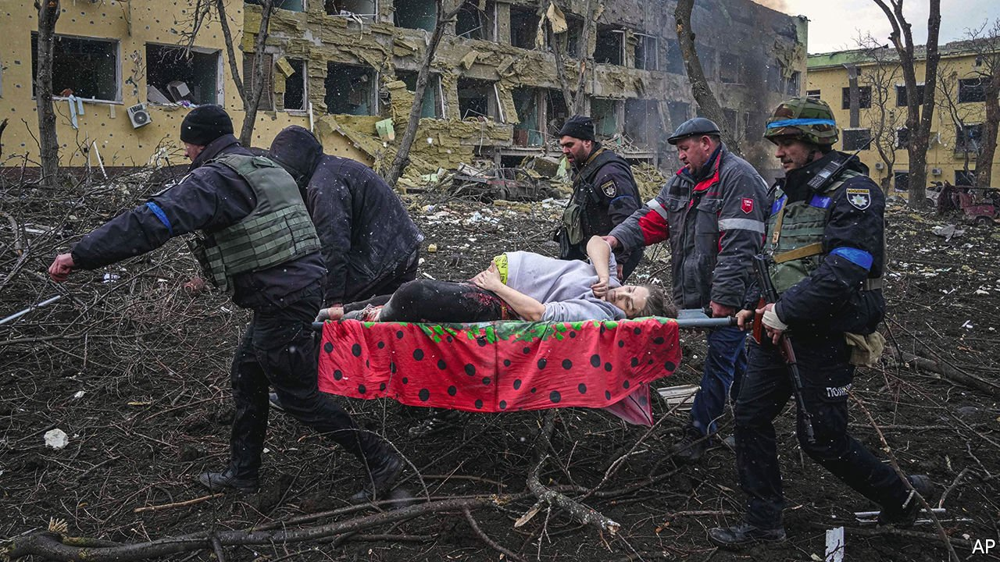
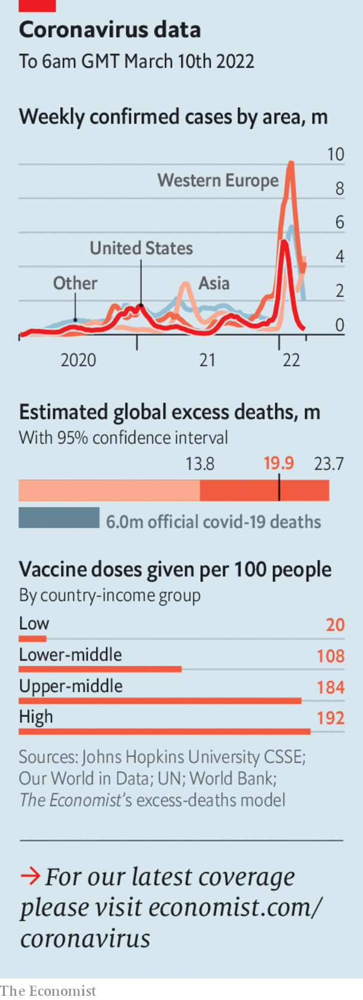

###### The world this week

# Politics 

#####  

 

> Mar 10th 2022 

Vladimir Putin’s forces bombarded , hitting homes, schools and clinics. In at least one besieged city, Russia violated a ceasefire intended to allow civilians to escape. Mariupol, a port, suffered an indiscriminate barrage, including of a maternity hospital. Ukraine’s vastly outnumbered forces fiercely resisted the invasion, killing thousands of Russian troops. Unarmed Ukrainian civilians staged protests in towns occupied by Mr Putin’s forces. Russia moved closer to encircling Kyiv, the capital, and also seized a nuclear power station.


The exodus of Ukrainians exceeded 2.2m, making it the fastest-growing  since the second world war. More than 1.3m have entered Poland. Britain told refugees to apply for visas, and made it bureaucratically difficult for them to do so. The European Union is allowing all Ukrainians in for a year, no questions asked.

President Joe Biden banned the import of Russian oil, gas and coal to the United States. Britain said it would phase out Russian oil imports by the end of the year. The EU, which is more dependent on Russian fuel, moved to reduce Russian gas imports by two-thirds. Russia warned it may retaliate by switching off its main gas pipeline to Europe.

Other countries sent weapons to help Ukraine defend itself, including anti-aircraft and anti-tank rockets.  and America disagreed publicly over the supply of fighter jets. America had suggested that Poland send some of its old MiGs. Poland offered instead to give them to America so that it could hand them over to Ukraine. America said this would risk dragging NATO into a direct conflict with Russia.

Mr . Anyone in Russia who calls his war a war risks 15 years in jail. The last independent TV channel and radio station were closed. Even so, anti-war protests erupted in several cities. Thousands of protesters have been arrested; many were beaten and abused. Polls suggested that fewer Russians now believe Mr Putin’s story that he is protecting Ukrainians from a “Nazi” regime. Support for the war fell sharply as real news seeped into Russia via the internet.

The White House’s top adviser on Latin America met Venezuela’s dictator, Nicolás Maduro. It was the first high-level meeting between the two governments in years. America imposed sanctions on Venezuelan oil in 2019. It now wants to loosen Venezuela’s alliance with Russia and explore conditions under which it might buy oil from Venezuela to offset the boycott of Russian exports. Venezuela released two imprisoned Americans.

Britain, France and Germany, which have been negotiating, along with America, China and Russia to revive a deal that would curb Iran’s nuclear ambitions, urged Russia not to add conditions that would make it harder to clinch an accord, which is said to be close. Russia wants to include a clause that would exempt its trade with Iran from sanctions.

Guatemala’s Congress passed a law to increase the jail sentence for women who have abortions, unless their lives are in danger, from three years to ten. The law also stops schools from teaching that gay sex is “normal”. A human-rights ombudsman said it was unconstitutional.

Turkey’s president, Recep Tayyip Erdogan, said that a visit by his  Israeli counterpart, Isaac Herzog, had marked a turn for the better in relations between the countries. Turkey, he said, was ready to co-operate with Israel over energy.

Yoon Suk-yeol, a conservative opposition candidate, won , narrowly beating the ruling party’s Lee Jae-myung.

Results from the count in five state elections in India showed that the ruling Bharatiya Janata Party will retain , the most populous state. But the Aam Aadmi Party, which opposes corruption, won an upset victory in Punjab.

President Rodrigo Duterte signed into law a bill raising the age of consent in the Philippines from 12, among the lowest in the world, to 16.

China faced its biggest outbreak of covid-19 since the early stages of the pandemic. Hundreds of new cases were reported. Most of China’s provinces have been hit. The surge is much smaller than recent outbreaks in other big countries, but it is testing , which relies on mass testing and lockdowns.

Austria suspended a law that would compel all adults to take a covid-19 vaccine. The law had not yet been enforced. The government now thinks compulsory vaccination is a disproportionate response to the Omicron variant.

 


Michelle Bachelet, the UN’s senior human-rights official, accused Ethiopia of killing hundreds of civilians in bombing raids against the northern regions of Tigray and Afar. Ethiopia’s blockade of Tigray has pushed millions of people to the brink of starvation.

Tanzania’s president, Samia Suluhu Hassan, released Freeman Mbowe, a leading opposition member, from jail. This marked a shift away from the authoritarian style of her predecessor, John Magufuli.

An American man who received the world’s first transplant of a heart from a genetically modified pig died two months after the operation.

Sadiq Khan, London’s mayor, said he hoped to expand an ultra-low emission zone across the whole of the city next year. The £12.50 ($16.50) a day charge for vehicles that do not comply with the standard costs daily drivers over £4,500 a year; public-transport options are less reliable farther out from the city centre.

An enduring tale

A scientific expedition discovered , the ship that carried Ernest Shackleton and his crew of explorers to the Antarctic until it became trapped in sea ice and sank in 1915. The vessel, still remarkably intact, was found in the Weddell Sea at a depth of 3,008 metres. It will be designated a monument under the Antarctic treaty, meaning it cannot be disturbed.

