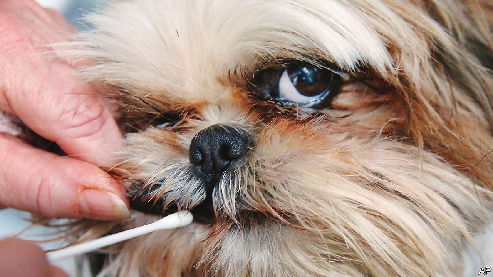

###### Genetic testing for pets

# Americans are testing their dogs’ DNA, with some remarkable results 

##### The practice is becoming increasingly popular 

 

> Mar 12th 2022 

CARNEGIE VIOLET DOG-FULLER lives a happy life in Hollywood. She enjoys munching ice cubes and listening to Snoop Dogg. Life was not always so easy. Found as an injured stray in Santa Monica, she spent time in a rescue centre before being adopted by Gregg and Lindsay Fuller last year. They reckoned she was a French Bulldog mix. But a DNA test revealed her to be more American Staffordshire Terrier (39%) than French Bulldog (24%), with significant Pomeranian genes (16%). “We were shocked,” admits Mr Fuller.

Genealogy was once the preserve of elite dogs. Their breeders take a special interest in keeping bloodlines pure, to create new champions and to raise the prices of puppies. Now common mutts are having their pedigrees traced. Wisdom Panel, a firm that tests pet DNA, said on March 3rd that its database had expanded to 3m animals (over 95% of them dogs), up from 1m in 2018. Embark Veterinary, a similar firm which has 1m dogs in its database, was valued at $700m in July after a $75m investment.


During the pandemic 23m Americans adopted puppies, according to the American Society for the Prevention of Cruelty to Animals. Rebecca Chodroff Foran, research director at Wisdom Panel, thinks this trend has collided with another: the growth of human-DNA business. Owners “now consider their pets to be key members of the family”, she says.

Animal DNA tests work much like human ones. They compare genetic markers with a database of pets with verified pedigrees, revealing canine lineage and potential health problems. Embark claims 99.9% accuracy; Wisdom Panel claims over 98%.

Some owners are horrified to discover that their costly crossbreed is in fact a mix of entirely different breeds. But owners of adopted and rescue dogs, which make up 67% of Wisdom Panel’s database, are keen to learn. Murray, who lives in New York with his owner Erica Hyman, looks like a Jack Russell but with upright ears. He turned out to be a mix of 23 breeds. “Now I just tell people ‘He’s just a dog!’,” says Ms Hyman.

Chico Lopez, who breeds American Pit Bull Terriers, thinks DNA is a decent investment for mutts. He compares them to second-hand cars: “You don’t know if the engine comes from a Toyota, the transmission from a Bugatti and the tyres from a little motorcycle, so you need to…find out what is going to break first.” But those wanting a pureblood, he says, should not rely wholly on DNA, as reputable breeders already have accurate knowledge of a dog’s ancestors.

Owners of adopted dogs like searching for long-lost kin. About 12% of dogs on Embark’s database discover a sibling, parent or offspring. And, as with human DNA testing, there is the possibility of stumbling on a family secret. Some dog owners are now finding that their sweet pooch fathered a litter in another state before absconding. Paw form.

