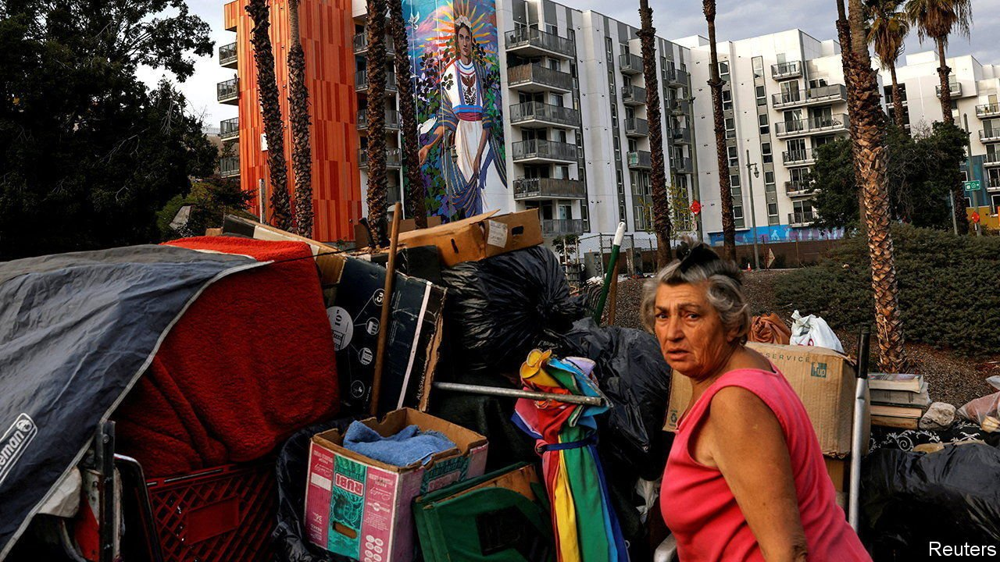

###### The Golden State’s housing shortage

# California’s efforts to house more people have fallen short 

##### A fiasco at UC Berkeley is merely the latest evidence of deep troubles 

 

> Mar 12th 2022 

CALIFORNIA’S NIMBY crowd scored a victory this month when the state’s Supreme Court declined to lift an enrolment freeze for the University of California, Berkeley. A local group, Save Berkeley’s Neighbourhoods, sued the university in 2019 to force it to redo an environmental-impact report which showed that admitting more students would have little effect. Thousands of students who would have been accepted to one of America’s finest public universities will now be turned away. The decision is a potent example of the cunning use of the California Environmental Quality Act (CEQA) by anti-growth activists to limit development.

CEQA, signed in 1970, mandates costly studies. It has spawned “a whole industry” to litigate and redo studies on things like how a housing project might alter a neighbourhood’s racial mix, notes Nolan Gray of the University of California, Los Angeles. CEQA lawsuits can freeze projects for years. That has allowed it to be “weaponised” for extortion, says Ann Sewill, general manager of the Los Angeles Housing Department.


Gavin Newsom, California’s Democratic governor, has signed 17 bills that restrain CEQA. The law retains strong support among his base, including unions and greens. But opposition grows as perverse decisions such as the one in Berkeley reverberate, and YIMBY (yes in my backyard) groups counter their NIMBY nemeses.

California’s failures on housing go well beyond CEQA. Half of America’s unsheltered homeless population lives in California. The number of unhoused Californians has surged, by some estimates, by more than a third in the past five years, compared with a rise of less than 6% nationally.

Housing has become astonishingly expensive. Zillow, a property website, calculates a typical California home value of $745,200—more than double the figure for the country. The Bay Area Economic Institute, a think-tank, reckons California’s median rents are America’s highest. Several academic studies equate every 1% rise in an area’s median rent with a similar increase in the homeless population. The California Housing Partnership, a research outfit, estimates a shortfall of 2.65m dwellings.

Mr Newsom has signed, by some reckonings, more new housing laws than any predecessor. A law that in effect eliminated single-family zoning will help owners turn their houses into several units. Applications to build granny flats in backyards have also spiked: a report from UC Berkeley’s Centre for Community Innovation found that 15,000 units were permitted in 2019, up from almost 6,000 in 2018. Such progress is welcome, but it is not enough.

A “crushing” bureaucracy is also to blame, says Ron Galperin, the Los Angeles city controller: permitting and other processes can cost nearly four times as much as the land itself. London Breed, the mayor of San Francisco, has tried but failed to ditch a cumbersome review process. Her spokesman says it adds between $1.5m and $6m to development projects.

The Council of Economic Advisers estimated in 2019 that removing unnecessary rules would slash homelessness in Los Angeles and San Francisco by 40% and 54%, respectively. By contrast, New York City’s homelessness would drop by 23%. The Government Accountability Office has said that a federal scheme called the Low-Income Housing Tax Credit produced the least bang per buck in California.

Officials hope throwing money at the problem will help. The two most recent state budgets would allocate $26bn for housing and easing homelessness. Even so, Adam Summers of the Independent Institute, a think-tank based in Oakland, expects the crisis to drag on until voters demand far fewer impediments to building. Mr Summers recently moved to Arizona. Many of the people streaming out of California are precisely those who would be inclined to vote for such change. ■

