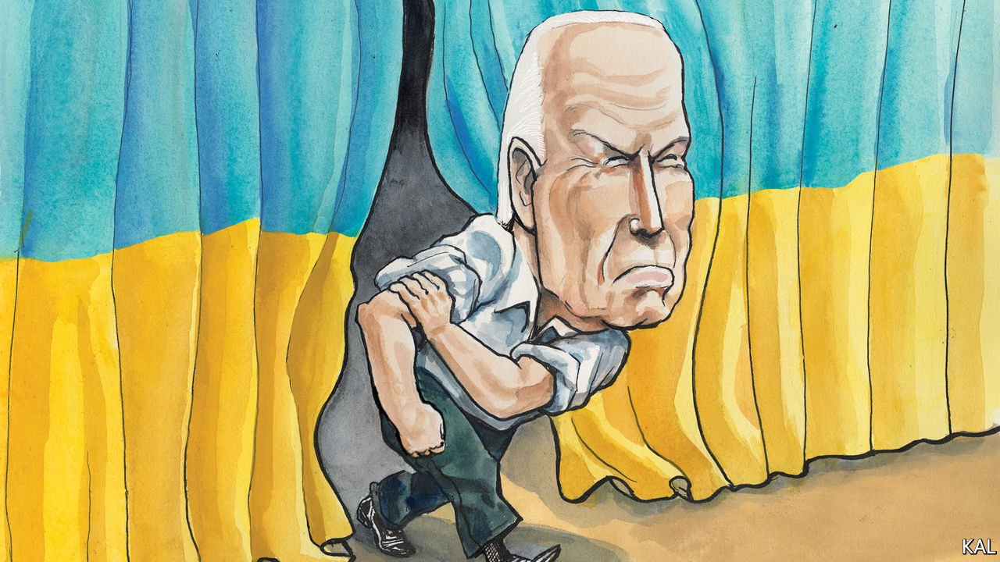

###### Lexington

# Joe Biden’s indispensable leadership 

##### The administration has played a weak diplomatic hand on Ukraine skilfully. But the crisis is only beginning 

 

> Mar 12th 2022 

WHEN JOE BIDEN told the Munich Security Conference last year that “America is back”, it seemed unlikely that any of its high-powered European delegates fully believed him. Donald Trump had just won the second-highest vote-count in the history of presidential elections. Mr Biden, contrary to his stick-in-the-mud reputation, appeared as keen to shift diplomatic focus from Europe to Asia as his immediate predecessors. And indeed his early efforts to do so, including the disastrous retreat from Afghanistan and bungled roll-out of a new Anglo-Saxon security pact, created further doubts about America’s transatlantic leadership.

Mr Biden is now on firmer ground. His administration’s response to Vladimir Putin’s invasion of Ukraine has been prompter, bolder and more effective than even the most faithful Atlanticist could have predicted. NATO is united behind American leadership and pushing the boundaries of collective defence. The penalties imposed on Russia’s economy are unprecedented and mounting—and America, as its ban on Russian energy imports this week signals, is driving them too.


Even in discordant Washington, DC, there is strong support for Mr Biden’s diplomatic approach (though few Republicans dare praise the president for it). You have to look back to the immediate aftermath of the terrorist attacks of September 11th 2001, or to James Baker’s stellar effort to rally a global coalition against Saddam Hussein’s invasion of Kuwait in 1990, for times when so much of the world, at home and abroad, seemed as solidly behind America. “The 40 years of experience that we kept talking about with Joe Biden have finally paid off,” wryly observes Leon Panetta, a former secretary of defence for Barack Obama.

Mr Biden has also had some advantages. Above all, the heinousness of the Russian threat to Europe has underlined the indispensability and relative benignity of the American counterweight. Emmanuel Macron’s shuttle diplomacy, however gallant, is no answer to a Russian dictator issuing nuclear threats. Mr Putin’s aggression has also shocked somnambulant Europeans into action. Olaf Scholz’s vow to sharply raise defence spending shows that Germany, which believed Russia could be tamed through engagement, now accepts its aggression needs to be confronted.

The lessons of past failures against Mr Putin—especially the slow and ineffectual Western response to his seizure of Crimea in 2014—have further reinforced America’s efforts. Memories of Mr Trump have meanwhile made the Europeans appreciative of Mr Biden as well as wary. Merely by refraining from bombing Russia with American planes disguised as Chinese ones, as Mr Trump advocated last week (“And then we say, China did it, we didn’t do it”), the Democratic president has looked like a significant upgrade.

Still, the administration’s diplomacy has in three ways looked impressive by any measure. Mr Biden has a tendency to prevaricate. Yet his Ukraine effort has been decisive. Having predicted Mr Putin’s invasion months ago (in what looks like a big success for American and British intelligence), the administration began corralling NATO’s response long before either its members or Volodymyr Zelensky, Ukraine’s brave leader, considered the war likely. And it has done so with quiet relentlessness—drawing on the top-notch diplomatic expertise that Mr Biden has assembled in Tony Blinken, the secretary of state, Jake Sullivan, the national security adviser, and William Burns, the director of the CIA.

During the Afghanistan debacle, the professionalism of such figures looked perversely like a liability. Former staffers and diplomats, they appeared to lack the necessary political heft to force Mr Biden onto a better track. But on Ukraine their expertise has told. Mr Blinken has won especially good reports, re-establishing the primacy of civil diplomacy over the sabre-rattling Mr Trump loved. But the Biden team appears to be working in unison, as is illustrated by a third and more surprising attribute, its creativity.

The administration’s bold use of intelligence to counter Russian misinformation was an early illustration of this. Its successful effort to curb Russia’s access to its foreign reserves and energy markets is another. “It’s fair to say we’ve stiffened some spines,” says a senior administration figure.

This remains a desperately fraught undertaking. It is unclear, for example, how far America should go to arm the Ukrainians or normalise relations with oil-rich Venezuela, or even Iran. Yet the administration is rightly exploring its options. Implicit in a fine recent biography of Mr Baker, by the journalists Peter Baker and Susan Glasser, is a gloomy sense that America could no longer rise to the global occasion as George H.W. Bush’s master statesman-fixer did in 1990-91. “We’re not leading,” he complained to his biographers. That seems much less true today.

America’s effort on Ukraine cannot yet be considered successful, of course. It did not deter Mr Putin. And it could easily come unstuck. As the war drags on, and the economic damage to Europe accumulates, the anti-Russia coalition may founder; some potential cracks, on the oil embargo for example, are already visible. Or else, with the mid-terms approaching and his ratings underwater, Mr Biden may succumb to domestic pressures. The Republicans do not play fair; they blamed the administration for rising petrol prices even as they clamoured for the sanctions on Russian energy, which will increase the inflationary pressure.

Dealing with the devil

It should also be clear that America does not control this crisis. Mr Putin does, and he seems determined to escalate his war rather than make any concessions. Unless that changes, which seems unlikely for now, the penalties that America and its allies have placed on him will not be sufficient. In which case alternative means to influence the Russian dictator must be found. That might require more creativity and political courage than anyone has yet displayed on Ukraine. May Mr Biden be up to the task. ■

Read more from Lexington, our columnist on American politics:

 (Mar 5th) (Feb 26th) (Feb 19th)

For more coverage of Joe Biden’s presidency, visit our dedicated  and follow along as we track shifts in his . For exclusive insight and reading recommendations from our correspondents in America, , our weekly newsletter.

