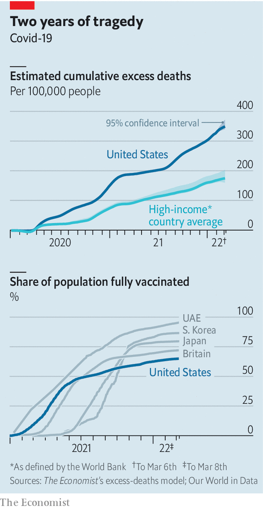

###### The pandemic, two years on

# Taking stock as America moves into a new phase of the pandemic 

##### Planning for the future should involve a frank look at the country’s poor performance over the past two years 

 

> Mar 10th 2022 

TWO YEARS ago on March 11th, the World Health Organisation declared covid-19 a pandemic. Americans are eager to leave the wretchedness behind them. Some are so anxious that they are driving trucks along the Beltway around Washington, DC, hoping to slow traffic in protest against pandemic restrictions, inspired by disruption in Canada last month. The “People’s Convoy” looks strangely out of touch—not because the truckers are alone in their desire to put covid restrictions in the rear-view mirror, but because so many restrictions have already been falling away.

Polls suggest concern about covid is declining. Mask-wearing has waned (a maskless President Joe Biden hobnobbed insouciantly with members of Congress after his state-of-the-union message last week). On March 26th, Hawaii will become the final state to drop its indoor mask mandate, and the Centres for Disease Control and Prevention (CDC) now recommends masks only for the 7% of Americans living in high-risk counties. The vast majority of schools are open for in-person learning. Batman fans packed into cinemas for the opening weekend of the latest film in the franchise.


Some states have long been crowding people into small spaces with few restrictions. Over the past year Florida, Tennessee and Texas banned local governments and public schools from enforcing mask mandates. Restrictions generally fell along partisan lines, with Democratic states steadfastly adhering to them and Republican states tossing them aside. Now even New York, one of the first to impose a lockdown, is starting to lighten up. New York state ended its mask mandate for schools on March 2nd; New York City lifted its own on March 7th. Nationwide, the seven-day moving average of deaths is at its lowest since January 2nd; that of reported cases is at its lowest since the Delta variant began surging in July 2021. For most Americans, covid restrictions are in the past.

In short, the pandemic has reached a punctuation point. Even if it is a comma rather than a full stop, it is a good time to look back at how the country has fared, and ahead to the next phase.

 


America has been hit hard by covid. Over 950,000 people have died from the virus, according to the CDC, though The Economist estimates that the actual count is 1.1m-1.3m. America has the highest death rate among rich countries: nearly double the average (see chart). Many expected America to respond well to a pandemic. Instead, it vastly underperformed.

It has struggled to vaccinate its people: 65% are fully vaccinated, compared with 72% in Britain, 73% in the European Union, 81% in Canada and 95% in the United Arab Emirates. America also fell behind on detection. Last year it ranked 36th in the world in sequencing SARS-Co V-2, hindering early recognition of new variants. The country also lagged behind in testing. Whereas Britons have had access to free rapid tests for over a year, Americans received their first round only last month. Lab tests were hard to come by, too: queues and waits for results were long.

The United States is the only high-income country without universal health care. One in eight adults reports not going to a doctor in the past year because of the cost. The pandemic has aggravated the problem of access. Hospital capacity was strained, and many elective procedures delayed. Some states enacted crisis standards of care, a protocol to delineate who receives treatment when resources are scarce. “Now that the covid admission numbers are falling, we still have enormous numbers of patients requiring admission because of delays of care that have been occurring all through the pandemic,” says Jeffrey Balser, the CEO of Vanderbilt University Medical Centre in Tennessee.

Public-health officials are urging the government to prepare for the next wave. “This is a lull. A moment to prepare so we are never caught again,” says Megan Ranney, a physician and dean at Brown University’s School of Public Health.

On March 2nd the White House released its National Covid-19 Preparedness Plan. It has four parts: protect and treat covid, prepare for new variants, prevent economic and educational lockdowns, and continue to vaccinate the world. The plan includes a one-stop test-to-treat initiative: Americans can get a test for covid and, if they test positive, get a prescription for an antiviral drug free at pharmacy-based clinics and other health facilities. During the last covid surge, antivirals were hard to find, says Dr Balser. He hopes this plan will increase their availability.

The programme outlines better methods to detect new strains. It aims for more efficient data collection, wastewater surveillance (to detect prevalence of covid) and virus sequencing. It includes a “surge-response playbook” to provide guidance for setting up mass vaccination and testing sites, deploying medical workers, expanding hospitals and providing supplies.

“It is a lovely plan. Everything I would focus on is here,” says Dr Ranney. But she fears that the administration will not receive adequate funding. The plan requires money from Congress, and Mr Biden’s last coronavirus package for $1.9trn passed along party lines. “It’s not a typical American thing to say that we’re going to commit resources ahead of time,” says Dr Ranney. “I hope we have learned our lesson.”

Preparedness might be only part of the answer. According to Howard Koh, former assistant secretary for health in the Obama administration, America’s overall health could be to blame. “Covid is a fast pandemic fuelled by a slower pandemic of preventable chronic conditions,” explains Dr Koh. He points to America’s rate of illness. It is the fattest country in the OECD, a club of mostly rich countries. Almost half of Americans have high blood pressure. Heart disease accounts for one in four deaths. About one in ten has type 2 diabetes. These conditions worsen the effects of covid.

Dr Koh calls for more investment in public-health infrastructure, both to prepare for covid surges and to deal with long-standing health concerns. What seems clear is that a multipronged approach is needed. As Dr Ranney notes: “There is very rarely a single magic bullet.” ■

Dig deeper

All our stories relating to the pandemic can be found on our . You can also find trackers showing ,  and the virus’s spread across .

