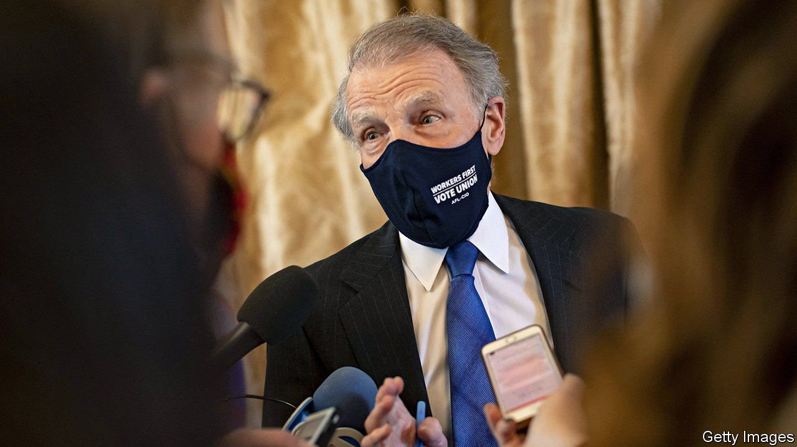

###### Chicagoland politics

# The Michael Madigan indictment is evidence of the turn against patronage 

##### Old-school politics in Chicago is not yet dead, but it is in decline 

 

> Mar 10th 2022 

IS IT CORRUPT to recommend somebody for a job? That is the core of the case made on March 2nd by the United States attorney’s office in Chicago, which charged Michael Madigan, until last year the speaker of the Illinois House of Representatives, with racketeering. Before he quit last year Mr Madigan was the longest-serving speaker in any statehouse in American history, having held the role for 36 years, from 1983 to 2021. His power in Springfield, the state capital, was legendary. Going by the nickname “the velvet hammer”, he could make and break careers. “He was the most powerful figure in Illinois,” says Dick Simpson, a political scientist at the University of Illinois in Chicago.

In the Land of Lincoln, however, such power rarely comes without great responsibility—in particular, to help out the people who got you there. The indictment alleges that Mr Madigan used his position to “cause various businesses to employ, contract with, and make direct and indirect monetary payments” to his political allies. The main business in question was CommonwealthEdison, an electricity supplier, which admitted to its part in the scheme in 2020 and paid $200m in fines. Mr Madigan denies the charges. He argues that “the government is attempting to criminalise a routine constituent service: job recommendations.”


The indictment is the biggest of several cases unfolding at the moment in Chicago. Edward Burke, a veteran alderman (city council member), is due to go on trial for allegations that he used his position to drum up business for his property-tax-appeals law firm—also one of the allegations against Mr Madigan. Last month Patrick Daley Thompson, another alderman and the nephew and grandson respectively of the two Richard Daleys (Chicago’s mayors for most of the period from 1955 to 2011), was convicted of tax fraud, having written off interest that he never actually paid on loans from a failed South Side bank. There are also various corruption cases pending in the city’s suburbs.

Some hope that the cases signal the winding down of decades of patronage politics in Chicagoland. Mr Madigan was a protégé of the first Daley, who used his power to distribute jobs to build up not just local but national power. That model works less well these days, however, partly thanks to a series of federal court rulings, known as the Shakman Decrees, which banned appointing people to non-policy jobs based on political loyalty. The number of jobs in the Chicago region that can be handed out to allies has fallen from over 40,000 in the Daley heyday to less than 5,000 now, says Mr Simpson. Federal prosecutors jump on anything that resembles the old style of politics. “We’re coming to the last gasp of the old machine,” he says.

Yet even as Mr Madigan faces trial, some are raising questions about the state’s governor, J.B. Pritzker, a billionaire, who was interviewed as a witness to the Madigan case by the FBI. According to WBEZ, a Chicago radio station, the governor employed 35 people recommended by the former speaker. Among Mr Pritzker’s projects in recent years has been to attempt to dismantle federal oversight of hiring. The machine may be stuttering, but it has not yet stopped completely. ■

