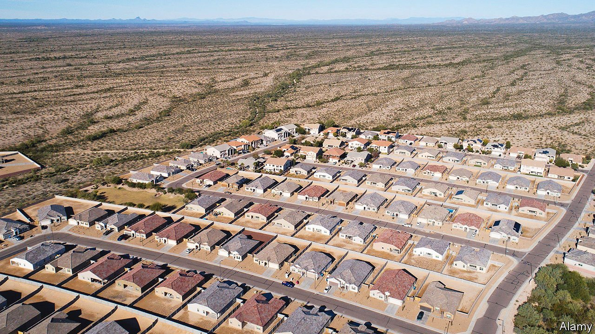
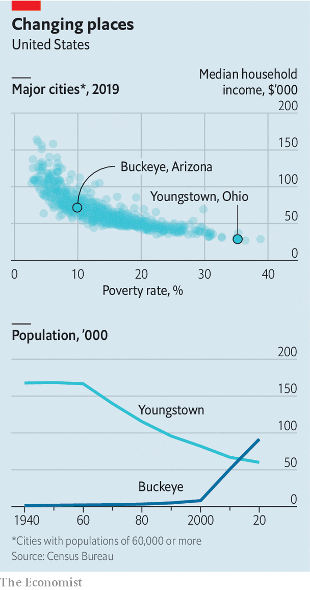
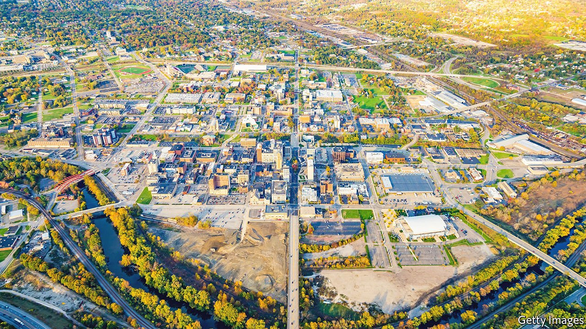

###### A tale of two cities

# What Buckeye and Youngstown say about America’s economy 

##### A boom town and a bust town show surprising signs of convergence 

 

> Mar 12th 2022 

“WHEN I WAS born, the population here was 1,200, and that included every dog, chicken and cat in the community,” Jackie Meck says with a soft chuckle. Mr Meck is now in his 80s, and his city, Buckeye, has come a long way. A whiff of manure from nearby dairy farms still hangs over the main street, but giant new housing developments sprawl out for miles into the scrubby Arizona desert, making it one of America’s fastest-growing cities. Buckeye today has a population of 100,000, up 15-fold over the past two decades. Its planners want at least 1m.

A couple of thousand miles to the north-east is Youngstown, Ohio, a city moving in the opposite direction. “The majority of younger people who can leave do leave, whether because they want to or they feel they don’t have any opportunity here,” says Ian Beniston, a community organiser. Once a manufacturing powerhouse, Youngstown today is one of America’s fastest-shrinking cities. Its population of 60,000 is down by a quarter over the past two decades and is about one-third of what it was at its peak.


At first glance this is an all-too-familiar story. Since the founding of America, its people and its economy have moved steadily westwards and, later, southwards. The pandemic has sharpened the shift. People and businesses have flocked to places like Buckeye in sunbelt states. Youngstown, like dozens of other cities in America’s old industrial heartland in the Midwest and the north-east, is struggling to hold onto its residents and companies.

However, look a little closer, and the story is more complex. There are questions about the limits to growth in Buckeye, an arid corner of a region short on water. And there are hopes that Youngstown may be turning a corner, thanks to a revival of manufacturing. How such cities manage their challenges could determine the future shape of the American economy.

Desert dreams

In the vast beige expanses around Buckeye, the only immediate obstacle to growth is the speed of construction work. Plots for new homes are pegged out alongside the highway, awaiting diggers for their foundations. Median home prices have nearly doubled over the past three years.

Buckeye is less a cohesive city than it is an archipelago of suburban communities. The government has divided the hardscrabble land into massive zones sold to property developers, to build “master planned communities” (MPCs). Most are, in effect, stand-alone towns, with schools, shops, libraries and homes galore on neatly designed streets. Buckeye consists of 27 MPCs, spread out across 639 square miles (nearly 30 times larger than Manhattan). Just 5% of the land has so far been built on. The Howard Hughes Corporation, a real-estate firm, is planning to build the biggest MPC, Douglas Ranch, with homes for 300,000 people.

It is easy to see the attraction of Buckeye, not least in the winter, when daytime highs are around room temperature and the sky is a deep blue. In Verrado, one of the first MPCs, golf carts cruise along the roads in the evening as the sun sets behind the craggy White Tank Mountains. The click-clack of pickleball, a tennis-like game popular with retirees, echoes off walls.

Yet Buckeye is more than a retirement colony. The median age of its residents is 34, younger than the national median of 38. Many of the newcomers are attracted by its affordability compared with Phoenix, Arizona’s capital, a 45-minute drive to the east. That has made Buckeye a bedroom community with little local enterprise. More than 90% of residents with jobs work elsewhere, mainly in Phoenix, enduring traffic jams to make their commutes.

So the city has been trying to woo businesses, and is making progress. KORE Power is building a factory for lithium-ion batteries, used in electric vehicles and grid storage. It aims to eventually have more than 3,000 employees. Parker Fasteners, which produces high-quality screws for everything from military equipment to semiconductor plants, arrived in 2020. Matthew Boyd of Parker says Buckeye had two big selling points: plenty of land and plenty of labour. Nearly 70% of the workers in the factory are aged 40 or under.

 


But Buckeye lacks another critical resource: water. Arizona relies on the Colorado River, now in its 22nd year of drought. It requires new communities to show that they have enough water for a century before beginning construction, which should, in theory, guarantee sustainable development. In practice there has long been a workaround. Developers can register their properties in a “groundwater replenishment district”, a government entity that commits to pumping into the ground whatever water is removed. But as the Colorado dries up, the water for recharging aquifers may itself run out. Mr Meck, Buckeye’s longest-serving mayor, now retired, is withering in his criticism of the pledges for replenished groundwater: “I call it paper water, and I can’t drink paper.”

The current mayor of Buckeye, Eric Orsborn, thinks a solution will be found. One hope is a possible desalination plant in Mexico on the Gulf of California, just 170 miles south. But that will be costly and Buckeye may find itself competing with richer cities such as Phoenix for whatever it produces. In its search for businesses, it prioritises firms that use less water, a strategy which is smart environmentally but restrictive for its industrial ambitions. Still, Mr Orsborn is confident that Buckeye will eventually secure enough water to allow its continued growth. “It’s about putting our destiny in our own hands,” he says.

Youngstown’s focus is less on building new infrastructure than about cleaning up the pieces that have fallen into disrepair. Its steel mills never returned to full capacity after the second world war, and most were demolished by the 1980s (memorialised in a ballad by Bruce Springsteen). General Motors remained a big employer at its plant in Lordstown, a short drive away, but over time it cut back shifts, finally selling up in 2019. With each passing year, Youngstown’s population shrinks.

Post-post-industrial

Physical scars from the decline are everywhere, in abandoned homes and a hollowed-out downtown. About 38% of the population lives below the poverty line, making it the second-poorest city by that metric in America. Its crime rate is nearly double the national average.

Yet perhaps the most striking sight on the streets of Youngstown these days is not urban decay but white trucks with the word “ REVITALIZE” stamped in large black letters on their sides. They are Mr Beniston’s fleet. In 2009 he helped establish the Youngstown Neighbourhood Development Corporation, with a mission to improve the city, from cleaning up streets to renovating homes. “It’s about letting people see that their quality of life is increasing in a tangible way, so that they can understand that there is progress,” he says.

The novel use of land-banking in Ohio has been crucial to this progress. In 2009, during the subprime-mortgage crisis, Ohio introduced a law to allow counties such as Mahoning, which includes Youngstown, to clean up urban blight. Within months, the Mahoning County Land Bank can seize abandoned homes for demolition or sell them to an organisation like Mr Beniston’s. A survey of Youngstown in 2008 counted about 5,000 abandoned homes. Today, the number is down to 750 or so.

The razing of dilapidated homes is not just about beautification. It is also an attempt by Youngstown to find its right size, so that the population can stabilise. There are signs that it may be reaching this point. House prices in Youngstown are rising steeply for the first time in years, though are still about a quarter of what they are in Buckeye. And for the first time in decades the local labour market is tight. The unemployment rate in the greater Youngstown area was 4.3% in December, nearly two percentage points lower than its average during the three years before the pandemic.

Manufacturing is, at last, returning to the region. Youngstown’s industrial heritage, long a millstone around its neck, is increasingly an asset. Given the downward spiral in America’s relationship with China, companies are looking closer to home for at least some of their advanced operations. While places like Buckeye may offer more open space, Youngstown still has the backbone and sinews needed for factories: large, existing industrial sites, plus river networks and rail lines for transportation.

 


Soon after closing its auto plant in 2019, GM teamed up with LG, a South Korean company, to create Ultium Cells, an electric-battery manufacturer, basing it in a new factory just two miles away. Production is slated to start this summer, employing about 1,000 people. That is a far cry from the 13,000 who worked at the GM plant in its heyday, but it may just be a first step. Foxconn, the world’s biggest contract manufacturer of electronics, has agreed in principle to buy the original GM plant and reconfigure it as a production facility for electric vehicles. Lordstown Motors, a struggling electric-truck startup, is already making prototypes there. Mahoning, once known as America’s steel valley, wants to rebrand itself as voltage valley.

The question that hangs over Youngstown’s development is its population drain. It is hard to find the skilled labour needed to make a success of voltage valley. “It sounds good, but are we ready for it? How are we preparing the next generation?” asks Jamael Tito Brown, Youngstown’s mayor. Some are trying. When Ultium was short on qualified workers, Youngstown State University created a test to identify candidates who could train to operate its sophisticated machinery. Local businesses also launched the Mahoning Valley Manufacturers Coalition, with twin goals of selling people on careers in industry and providing them with basic training. “We have a waiting list of manufacturers who want to hire out of the programme,” says Jessica Borza, head of the coalition.

Heartlands, old and new

Buckeye and Youngstown are just two cities out of roughly 800 in America with populations of more than 50,000. Yet they are emblematic of the divergent growth trajectories between ascendant states in the south and west and the post-industrial north. Between 2010 and 2020, the population of Arizona grew by 12%, whereas Ohio’s rose by just 2%. That, however, may indicate the beginnings of convergence: over the previous four decades, the population-growth gap had been far bigger (135% versus 7%).

It is not a winner-takes-all competition. Both can do well. The south may have the sun and space. But the north has water and industrial heft, which after years of neglect count for something again. ■

