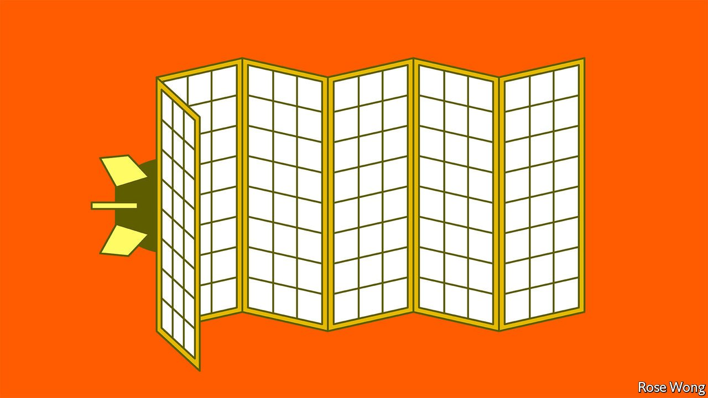

###### Banyan

# A debate about nuclear weapons resurfaces in East Asia 

##### Some in Japan and South Korea worry about a distracted America’s commitment to their security 

 

> Mar 19th 2022 

WELL BEFORE Russia’s invasion of Ukraine, doubts were growing in Asia about the durability of the American-led order that has largely kept the peace since the Vietnam war. One set of doubts concerns China’s bullying, mercantilist approach to economic relations, and its aggressive conduct in the South China Sea, the East China Sea, the Taiwan Strait and along the Himalayas.

The other set had to do with the staying power of America. Its friends were unnerved by then-President Donald Trump’s “America First” rhetoric, his disparaging of allies and his love-in with North Korea’s nuclear-armed despot, Kim Jong Un. President Joe Biden has charted a much more reassuring course, reminding friends of America’s commitment to Asia. But can it last?


Vladimir Putin’s war has turbocharged both sets of doubts. Despite welcome reassurances from the Biden administration, some in Asia still worry. At the same time, China grows only more dangerous. President Xi Jinping declared a  while recently reaffirming co-operation with Mr Kim. To Asian democrats, it looks like a new axis of authoritarianism. Japan’s once-convivial relations with Russia have all but ruptured since Mr Putin attacked Ukraine. Meanwhile, North Korea may have resumed testing long-range, nuclear-capable missiles.

East Asians are debating America’s nuclear umbrella. This formally shields Japan and South Korea. It is the least visible way in which America protects its Asian allies: its intercontinental ballistic missile bases are far away in Wyoming and Montana; its nuclear-armed submarines and bombers are out of sight.

Japan’s is the only country ever to have suffered nuclear attacks. That experience informs its pacifism. Its government has long been committed to three “no’s”: Japan will not own, make or allow on its territory any nuclear weapons. In this context, the umbrella is rarely acknowledged. Discussions about nuclear strategy occurred behind the shoji screen.

That, though, has suddenly changed. Soon after Mr Putin’s invasion began, a former prime minister, Abe Shinzo, suggested that Japan should discuss hosting American nukes, as some countries do in Europe. Mr Abe noted that Ukraine gave up its Soviet-era nuclear weapons in 1994, and that this perhaps made it more vulnerable to its predatory neighbour today. What he left unsaid is that if Japan hosted weapons, it would remove all doubt about its ability to deter an invader or a nuclear aggressor. But in saying as much as he did, he punched a hole through the shoji.

Past attempts by Japanese politicians to raise the topic have been slapped down by establishment security experts. This time, notes Richard Samuels, a political scientist at MIT, the debate is more substantive. The prime minister, Kishida Fumio, who hails from Hiroshima, has dismissed the idea. Yet this week his Liberal Democratic Party said it would begin internal discussions on nuclear deterrence.

Japan still has loads of nuclear inhibitions—and Mr Abe raised a non-starter in part to drive a hard bargain within the ruling coalition to accept other forms of American defence, such as (non-nuclear) missiles, notes Ankit Panda at the Carnegie Endowment for International Peace, a think-tank. Neighbouring South Korea’s nuclear inhibitions are fewer. The hawkish president-elect, Yoon Suk-yeol, promised during his campaign to ask for the redeployment of American battlefield nukes, removed in 1991, in the event of a crisis on the Korean peninsula. A report last month by the Chicago Council on Global Affairs, another think-tank, found that 56% of South Koreans polled supported hosting American nuclear weapons. Even more—71%—favoured South Korea having its own capability.

Both Japan and South Korea could swiftly make their own nuclear weapons if they wanted to. They have the technology, materials and expertise. Easier and less controversial would be to let America station its nukes on their territory. Neither outcome is likely, for now. America insists its nuclear and non-nuclear assurances are cast-iron.

That is all right so long as America keeps providing the political solidarity, the emphasis on shared interests and the constant reassurance that matter more to its Asian allies than missiles on their soil. Mr Biden understands this. But Mr Trump or someone like him could win in 2024. So the debate will not go away. The possibility of a nuclear “cascade” in which Asian powers develop their own nukes cannot be discounted.

Read more from Banyan, our columnist on Asia: (Mar 12th)

 (Mar 5th) 

 (Feb 26th)

Read more of our recent coverage of the 

