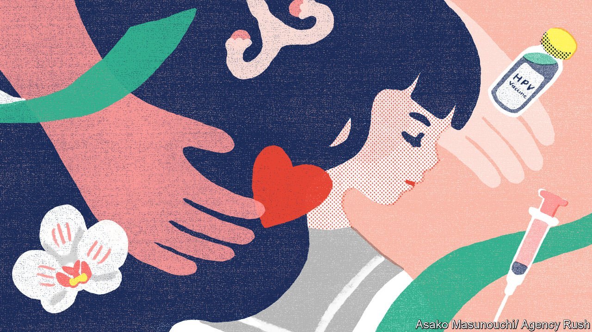

###### Side-effects

# Covid-19 jabs are making other inoculations less contentious 

##### Japan is dropping its resistance to the human papillomavirus vaccine 

 

> Mar 17th 2022 

NATSUME AKI had a promising career as a J-pop star. By the time she turned 23, in 2014, she had become the poster girl of a trendy new anime. Yet as her fame grew, so did a tumour inside her womb. A cervical-cancer diagnosis knocked her off stage and plunged her into despair. She lost her fertility. “It’s not like I was already thinking of having kids at the time, but the fact that I no longer had a choice crushed me,” Ms Natsume says.

Similar misfortune befalls many Japanese women, mostly in their late 20s to 30s. Every year some 10,000 contract cervical cancer, and 3,000 die from it. Many survivors suffer infertility and other complications, such as early menopause. Yet all of this is avoidable. The human papillomavirus (HPV) vaccine, first approved by America’s Food and Drug Administration in 2006, makes cervical cancer preventable. It is widely used in the rich world. Australia, where inoculation rates are 80%, may eliminate the disease as a public-health burden by 2035.


In Japan, however, few women have had the jab. The government approved the vaccine in 2009. In 2013 it included it in its routine immunisation programme, making it free for girls aged 12-16. But just a few months after that, spurious allegations of side-effects such as paralysis and seizures led the government to drop its recommendation. Vaccination rates plummeted from some 70% of the target age-group to less than 1%. A study by Hokkaido University reckons this will cause 5,000 additional deaths among women born between 1994 and 2007. “It’s a public-health tragedy,” says Michael Reich of Harvard University.

Ms Natsume became a vocal proponent of vaccination. In 2019 she decided to enter politics herself as an assemblywoman in Arakawa, a district in Tokyo. Mihara Junko, a former deputy health minister who became a politician in 2010 after surviving cervical cancer and a hysterectomy, served as a role model. Arakawa’s local government sent out brochures about the vaccine and held seminars and events. Such efforts helped: a survey suggested uptake of the vaccine rose from under 2% of eligible girls in 2018 to over 25% two years later. Ms Mihara persuaded more local authorities to inform residents about the vaccine. Some 60% of municipalities sent out notices.

Yet the national government still refrained from recommending the vaccine. Japan has among the highest rates of vaccine scepticism in the world. Surveys from 2015-19 reported by the Lancet, a medical journal, found that only 9% of Japanese believed vaccines were safe, and just 15% thought them effective. But, confounding the fears of many public-health experts, Japan has embraced the covid-19 jab: 80% of the adult population is fully vaccinated.

As inoculations became routine, resistance to the HPV vaccine also weakened. That has nudged the national government to change its stance. Lawmakers could “no longer uphold their claim” about the vaccine’s dangers, says Jimi Hanako, an upper-house member from the ruling Liberal Democratic Party, who has pushed for the health ministry to resume recommending the vaccine. It will do so from April.

The policy reversal highlights an awkward truth. “It was always about politics, not science,” says Shibuya Kenji, an epidemiologist at the Tokyo Foundation for Policy Research, a think-tank. Sensational media reports focused on teenage girls’ suffering. Patriarchal attitudes warped discussion. Since HPV is transmitted sexually, conservative politicians said protection was unnecessary—women should be reserving themselves for marriage. A handful of political heavyweights sided with the vaccine’s alleged victims, so policymakers shied away from the topic.

All municipalities will now have to send out notices to target households. Older women who missed out during the period when the vaccine was not officially recommended will get free jabs. Yet advocates reckon that a more forceful public-information campaign is needed to restore inoculation levels to what they were. Vaccination requires parental consent in Japan, and a survey in 2021 revealed that only 13% of parents are willing to get their daughters inoculated. Many hurdles remain, but, as Ms Natsume puts it, “All we can do is continue raising our voices.” ■

Dig deeper

All our stories relating to the pandemic can be found on our . You can also find trackers showing ,  and the virus’s spread across .

