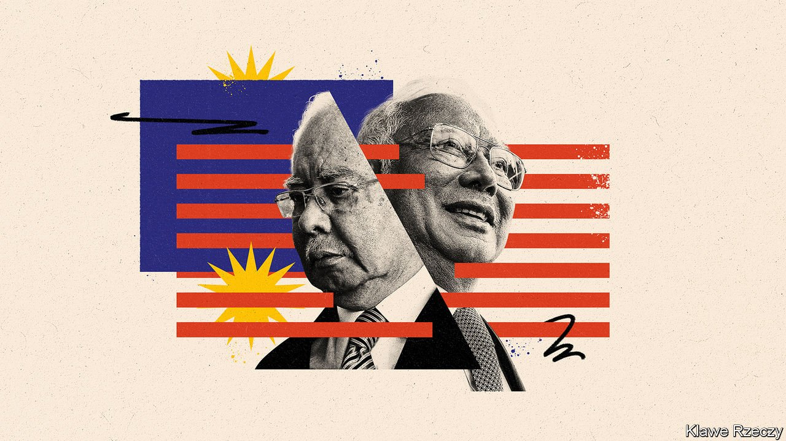

###### Mr $700m is back

# Malaysia’s disgraced former prime minister is popular again 

##### A judge called Najib Razak a “national embarrassment”. Voters seem not to mind 

 

> Mar 19th 2022 

NAJIB RAZAK smiled beatifically as he strode through a crowd of adoring fans. It was the evening of March 12th, soon after polls closed in a snap election in Johor, a state at the tip of the Malaysian peninsula. Supporters of Mr Najib and his party, the United Malays National Organisation (UMNO), had massed at its office in the state capital, Johor Bahru. The air was electric with the promise of victory.

Mr Najib, a disgraced former prime minister, had thrown himself into the campaign, spending weeks on the ground stumping for local candidates and whipping up enormous crowds. Many prominent national politicians might not bother to campaign so assiduously in a state election, but for him the stakes were high. If UMNO lost it would damage his political career, perhaps fatally. If it won, it could pave the way for a spectacular comeback.


Lucky for Mr Najib, then, that his efforts paid off. Barisan Nasional (BN), a coalition of parties of which UMNO is the biggest, won 40 out of 56 seats in the state legislature. Johor is a bellwether for peninsular Malaysia, the seat of UMNO’s power. Victory there bodes well for the party’s chances at the national level. At an event held by the party leadership that night, acolytes chanted “Bossku!” (“My boss!”), their nickname for Mr Najib. As James Chin of the University of Tasmania puts it, the biggest winner of the night was Mr Najib—and he wasn’t even a candidate.

It is a dizzying reversal of fortunes. On Mr Najib’s watch UMNO’s  alliance was voted out of government in 2018 for the first time since Malaysia won independence more than 60 years before. That was in large part because Mr Najib was embroiled in a corruption scandal of epic proportions. Some $700m appeared in his bank account shortly after $4.5bn had been looted from 1MDB, a state investment fund.

Mr Najib maintains the money was a gift and was intended for UMNO, rather than his personal use. Authorities in America, among others, concluded otherwise. It was difficult to ignore the extra ordinary collection of tiaras and Hermes handbags amassed by Mr Najib’s wife, to say nothing of his own many flashy sports cars. Last year, in the first of five trials, he was convicted of several charges of abuse of power and money-laundering and sentenced to 12 years in prison. A judge who dismissed Mr Najib’s appeal in December called him a “national embarrassment”.

Such scandal should have been enough to end his career. Yet Mr Najib, who remains out on bail while his appeal is heard by a higher court, has a talent for resurrection. He remains the most influential member of his party thanks to a combination of political nous, oratorical skills and the loyalty of party cadres whom he has spent decades cultivating.

Mr Najib’s talents as a political operator were on full display in August, when he helped engineer the fall of a tottering national government led by a rival party. As a result UMNO joined the ruling coalition and appointed its own man, a grey apparatchik named Ismail Sabri Yaakob, to serve as prime minister.

Having flexed his muscle in parliament, Mr Najib then proved that there are reservoirs of support for him among the public. UMNO’s victory in a state election in Melaka in November was credited to Mr Najib, who was the face of the campaign. This month he repeated the trick in Johor, drawing such adulation that it bordered on “cultlike”, in the words of Serina Abdul Rahman, a researcher at the ISEAS Yusof-Ishak Institute, a think-tank in Singapore.

The string of victories at the provincial level—a BN ally won an election in the state of Sarawak in December—will pile pressure on the prime minister to call an early general election to capitalise on the momentum. If the party wins a strong majority, Mr Najib may yet weasel his way out of his prison sentence, perhaps by securing a pardon from the Yang di-Pertuan Agong, the head of state, or by convincing the attorney-general to drop the remaining charges against him, or both.

Mr Najib now styles himself a man of the people, claiming that he has donated his wealth to the party. It is true that the stench of corruption still clings to his person. Yet many Malaysians did not mind the smell in the first place. In power, he rewarded supporters with cash handouts and aid. Later governments were not as generous. Politicians “are all corrupt anyway but at least during Najib’s time, we got aid, we got help,” says Ms Serina, summing up the attitude of many voters. Mr Najib is still the country’s “biggest patron”, says Bridget Welsh of the University of Nottingham Malaysia.

Many voters look back on his premiership with nostalgia, as a time of stability and prosperity (and not just for Mr Najib). Since 2018 Malaysia has been roiled by the pandemic and interminable political crises, with three governments in four years. Johorians especially are worried about the economy; many commuted to next-door Singapore for work. The closure of the border for nearly two years has hurt.

Moreover, Malaysian politicians routinely stoke the grievances of the Malay majority against ethnic minorities. Mr Najib, who is not above such tactics, is regarded as the protector of Malay tradition. Many voters thus seem inclined to forgive him. His conviction does bother Mansur Sapari, a 33-year-old doctor in Johor who voted for BN in this week’s election. But, he adds, “nobody’s perfect.”

As Mr Najib basked in his victory in Johor, supporters at UMNO headquarters roared, “Dissolve parliament.” That may not happen any time soon. Mr Ismail Sabri is in no hurry to call elections. He lacks a strong base within UMNO and knows he is likely to lose his job as prime minister in a new parliament. But it will be increasingly difficult for him to resist the pressure mounting within the party.

Yet UMNO’s performance in Johor was not as strong as the headlines suggest. Politicians failed to fire up voters: turnout, at 55%, was low. Many Johorians have tired of politics, according to Ms Serina. And Perikatan Nasional (PN), a newish coalition of Malay parties which flailed during its short spell in government in 2020-21, has surprisingly emerged as a serious rival. Though it won just three seats in the legislature, it received 24% of the vote. The Malay voters whom UMNO lost in 2018 have switched their allegiance to PN, reckons Hamidin Abd Hamid of Universiti Malaya in Kuala Lumpur, the capital.

Still, UMNO’s successes at the state level suggest the country may be “returning to old-style politics”, says Mr Chin, where one party clings onto power by amplifying tensions between Malays and minorities, and rewards supporters with cash, further entrenching patronage in the political system. That would be good news for Mr Najib and bad news for Malaysia—nobody does the old style better than Bossku. ■

