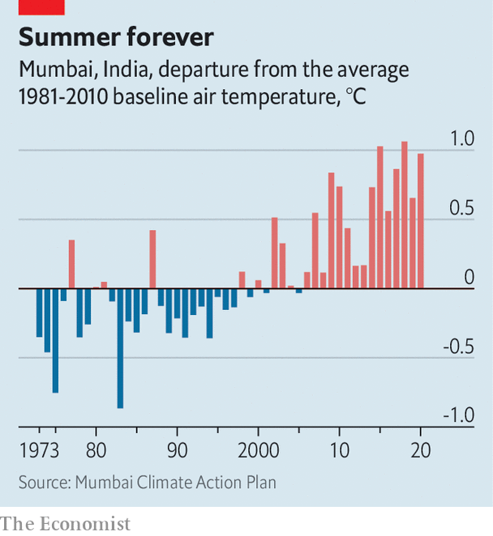

###### Heat island

# Mumbai plans for net-zero 20 years before the rest of India 

##### The megalopolis has released an ambitious “climate action plan” 

 

> Mar 17th 2022 

ON MARCH 13TH, as commuters stream ed out of Chhatrapati Shivaji Terminus, a gothic revival masterpiece in Mumbai, India’s commercial capital, they were confronted with temperatures approaching 40°C, nearly 7°C above normal for the time of year. The city is in the midst of a debilitating heatwave, its 13th in the past five decades, nearly half of which occurred in the past 15 years. Mumbai’s average temperature has increased by over 1°C in that period (see chart).

Had those commuters crossed the street from the station and entered the city’s (equally grand) municipal headquarters that day, they might have found cause for optimism. That afternoon bigwigs from the municipality and the state of Maharashtra, of which Mumbai is the capital, had gathered to unveil a “climate action plan”. The city aims to reach net-zero emissions by 2050, two decades earlier than the target set by the national government.


Mumbai is extremely vulnerable to climate change. A narrow and densely populated island, made up mostly of reclaimed land and surrounded on three sides by the Arabian Sea, it is battered by monsoon rains for four months a year and routinely subject to biblical flooding, especially during high tide. That is bad enough for the city’s apartment-dwellers. But it is even worse for the 42% of the population who live in slums, which are liable to be washed away or buried by landslides.

 


The backbone of the plan is a proposal to decarbonise Mumbai’s energy. Generating the city’s electricity, which produces nearly two-thirds of the city’s emissions, relies mostly on burning fossil fuels, particularly coal. The city wants to increase the share of renewables. It is looking, for instance, into installing solar panels on rooftops. Another priority is to improve the quality and efficiency of the city’s buildings. Slums, especially, are heat islands. Made of whatever materials are at hand or cheaply available, including tarpaulin and tin, they are five or six degrees hotter than pukka structures, making them, as the report puts it, “uninhabitable” on hot days. Moreover, the heat, damp and cramped conditions make slum residents more vulnerable to disease—a less obvious risk of climate change.

The plan is, alas, skimpy on details of how to achieve its ambitions. Still, in publishing one at all Mumbai has led the way among South Asian metropolises. Other cities are keen to follow suit, says Shruti Narayan of C40, a club of megacities, who helped with the report. Chennai and Bangalore in the south have started work on their plans. Others, including Delhi and Kolkata in India, Dhaka in Bangladesh and Karachi in Pakistan have expressed interest in doing something similar.

There is plenty in Mumbai’s 240-page document to inspire them. One is the fact that it does not rely on using technologies that do not yet exist, a criticism levelled at many countries’ national proposals. Another is the attention given to adaptation (coping with all the bad things already happening) and not just mitigation (reducing future emissions).

Specifics may anyway be beside the point. The real value of Mumbai’s plan is as a signalling device that “focuses the attention of policymakers”, reckons Abhas Jha, a climate specialist at the World Bank. The Paris Agreement, which committed the world to the goal of keeping the rise in temperatures to less than 2°C above pre-industrial levels, worked in much the same way, leaving countries to hash out details later. Time, though, is getting ever shorter. ■

For more coverage of climate change, register for , our fortnightly newsletter, or visit our 

