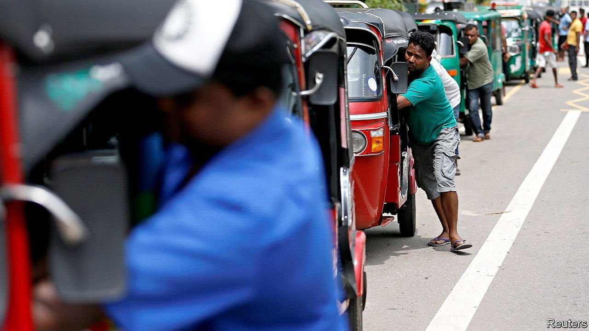
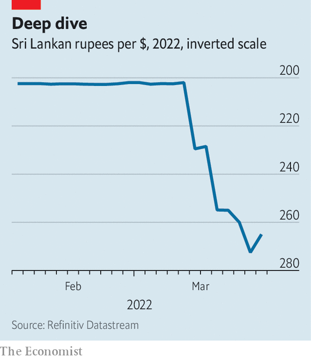

###### Into the ground

# Sri Lanka’s government is stoking inflation and indignation 

##### Mismanagement has compounded the harm done by covid and commodity prices 

 

> Mar 19th 2022 

WHEN GOTABAYA RAJAPAKSA became president of Sri Lanka in 2019, he inherited an economy in bad shape. Terrorist attacks and political crises had hit the country hard. Growth was at its lowest since 2001. Tourist arrivals—a big source of foreign currency—were down by nearly a fifth after steadily rising for a decade.

The new president quickly got to work. He and his ministers—the most influential ones are his brothers and nephews—cut taxes and started printing money. Inflation duly rose, tax collections plummeted and the budget deficit widened.


In the meantime tourism was hit by an even bigger shock than terrorism, in the form of covid-19. Even as foreign-currency receipts plunged, import bills were climbing, thanks to the global rise in commodity prices. A man of action, Mr Rajapaksa responded forcefully, albeit quixotically, prohibiting the import of motor vehicles in 2020. Last year he banned (imported) chemical fertilisers, ostensibly for public-health reasons, before the impending collapse of farming forced a reversal.

 


With inflation already high and the government’s prestige on the line, the central bank resisted a devaluation, instead burning through its foreign-exchange reserves. Dollars became hard to come by, impeding imports. That, in turn, led to shortages of diesel and cooking gas. The lack of fuel also crippled electricity generation which, because of a drought that has diminished output from hydropower plants, is increasingly dependent on oil and coal. The electricity board initiated rolling blackouts in February of up to seven-and-a-half hours a day. Many small businesses stopped work, unable to cope with gas shortages, power cuts and rising prices.

On March 7th the central bank gave up: having maintained a rate of 200 rupees to the dollar for five months, it devalued by 15%. A few days later it allowed the rupee to float. The currency slumped by a further 15%, to 265 rupees to the dollar.

By raising the cost of imports, the devaluation will exacerbate the main way in which this fiasco impinges on the lives of ordinary Sri Lankans: inflation. As it was, prices rose by more than 15% year-on-year in February, a 13-year high. Food prices leapt by more than 25%, double the rate six months earlier.

The cost of everything has shot up, including basics such as lentils, milk powder, sugar and wheat flour. Fares on planes, trains, buses and even autorickshaws have surged. State-mandated prices of dozens of medicines, including paracetamol, have been raised by 29%. The most shocking increases are for fuel. On March 12th the state-run oil-and-gas body pushed up the price of petrol by 43.5% and that of diesel by 45.5%. “I don’t blame the rulers. I blame the people who voted for them,” says Gayan Prasad, who works as a driver.

Further upheaval is inevitable. Sri Lanka’s dollar reserves shrank to just $734m at the end of February. Yet it is supposed to come up with $6.6bn, mostly denominated in dollars, in debt and interest payments this year. Multiple credit-rating downgrades have left it unable to borrow. After months of resistance, the government is seeking the IMF’s help. A debt restructuring looms.

Anger is mounting. Candlelit vigils demanding “Gota go home” have taken place in several towns. “How come we are the only country in South Asia to show negative growth?” asks Sahan Wiratunga, a social worker who organised one of them. “It is because of economic mismanagement and corruption.” On March 15th thousands attended a protest rally in Colombo. On social media people are railing at Mr Rajapaksa and his government in all three of the country’s languages.

Many Sri Lankans are trying to leave. Perched outside the immigration and emigration department, M. Perera, a 57-year-old mason, waited for his wife to return with her new passport. She will go to Saudi Arabia to toil as a domestic worker because it is “impossible to survive on our earnings”. He voted for “Gota”, he says, then shrugs. “What to say now?” ■

