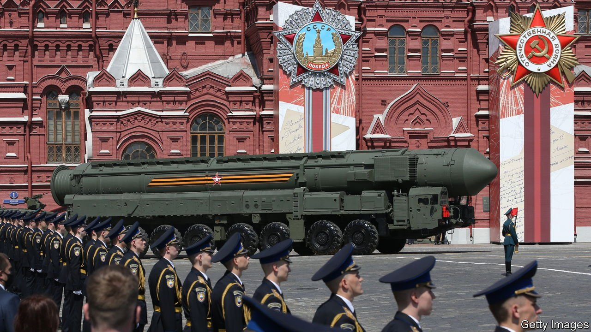

###### What’s the worst that can happen

# The risk that the war in Ukraine escalates past the nuclear threshold 

##### Disaster does not seem imminent but it does seem disturbingly possible 

 

> Mar 19th 2022 

TO A 16TH-CENTURY siege warrior, the art of the escalade lay in climbing up a city’s fortifications without encountering something unpleasantly hot or sharp. To the men who rewrote the rules of strategy for the nuclear age, the art of escalation was the process which, bit by bit, moved a limited war towards an unlimited one. As in sieges of old, the key was a ladder: a conceptual one where each rung both increased the level of the conflict and sent a signal to the other side.

Herman Kahn, one of several inspirations for the title character of Stanley Kubrick’s unmatched treatise on deterrence, “Dr Strangelove”, devised a 44-rung escalation ladder with which to study and analyse the phenomenon. The step from rung nine (“Dramatic military confrontations”) to ten (“Provocative Breaking Off of Diplomatic Relations”), he noted, was the one which marked the point at which nuclear war ceased to be unthinkable.


“Dr Strangelove” is a comedy because Kubrick found the absurdities of such eschatological accountancy and its affectless theorising impossible to put on screen in any other form. That does not mean the concepts the ladder systemised have no meaning. The invasion of Ukraine (rung 12: “Large Conventional War”) has undoubtedly moved the world past the threshold where nuclear war stops being unthinkable; in the words of António Guterres, the secretary-general of the UN, such horrors are “back within the realm of possibility”. The chances of a conflict escalating into a nuclear war are greater than they have been for more than half a century.

As it stands, only one side in the war has nuclear weapons; although Ukraine had Soviet ones stationed on its territory until a few years after it became independent in 1991, but they were never under its political control. Nor, Russian propaganda to the contrary, has it any route to acquiring them. But an adversary without nuclear weapons does not guarantee nuclear restraint. And NATO, which is both supplying Ukraine with weapons and building up its forces in the area, has nukes aplenty.

Vladimir Putin, Russia’s president, has been keen to remind his adversaries of the nuclear risks. In a televised speech at the beginning of the Russian invasion he warned foreign powers who might try to hinder the advance of “consequences that you have never encountered in your history”. On February 27th, after the imposition of unprecedented banking sanctions by Western countries (rung 20: “‘Peaceful’ World-Wide Embargo or Blockade”), Mr Putin gave an order that the country’s “deterrence forces” be transferred to a “special mode of combat duty”.

Fasten all the triggers

The simplest nuclear scenario sees Mr Putin, if faced with outright defeat in Ukraine, trying to turn the tide by letting off a nuke (rung 18: “Spectacular Show or Demonstration of Force”). Christopher Chivvis, who served as America’s top intelligence official for Europe between 2018 and 2021, says that in various war games held after Russia’s annexation of Crimea in 2014 the Western experts and military officers playing Russia sometimes chose to conduct nuclear tests or a high-altitude detonation of the sort which interferes with communications over a wide area—“Think of an explosion that makes the lights go out over Oslo.”

A wrinkle on this would be for Russia to use a small nuclear weapon in Ukraine and either justify it as a pre-emptive attack on non-existent Ukrainian weapons of mass destruction or claim Ukraine had done it. That would be followed by demands for an unconditional surrender backed by threats of more of the same.

A small nuclear explosion might seem like a contradiction in terms. But Russia and NATO both field “non-strategic” or “tactical” nuclear weapons which do much less damage than the city-destroying ones mounted on intercontinental ballistic missiles. Those strategic nuclear weapons typically have yields measured in the hundreds of kilotons: their blasts are equivalent to letting off hundreds of thousands of tonnes of high explosive. Tactical nuclear weapons can weigh in at a few kilotons, or less. The yield of a B61, an American weapon with a variable yield, can be “dialled down” as low as 0.3 kilotons if it is to be used as a tactical weapon. The explosion of a few thousand tonnes of badly stored ammonium nitrate in Beirut in August 2020 showed how terrible such blasts can be. But they are far less devastating than those of the weapons used in all-out wars.

Russia is thought to have thousands of non-strategic nuclear weapons; it views them as a way of compensating for NATO’s strength in advanced conventional materials such as precision-guided weapons. There are 100-200 B61s at NATO airbases in Belgium, Germany, Italy, the Netherlands and Turkey, despite America's armed forces generally thinking such things of little value on the battlefield. Their presence is held to give those European allies a direct stake in America's nuclear umbrella, thus making it more credible.

The availability of these weapons is part of what makes the second, indirect, route to the use of nuclear arms frightening. This involves Mr Putin broadening the conflict into one in which NATO forces are directly involved in a way that they have so far resisted—not least because of the nuclear risk inherent in such a confrontation.

One fear is that Russia might directly attack arms depots or shipments on the soil of a NATO member state, such as Romania or Poland. Russian spies have covertly attacked such depots in Bulgaria and the Czech Republic in recent years. On March 12th Sergei Ryabkov, Russia’s deputy foreign minister, said arms convoys were “legitimate targets”. If the country thus attacked called on its allies  to treat the aggression as a trigger for Article Five, the alliance’s mutual-defence clause, NATO might decide to respond with reprisals against Russian forces in Ukraine, if not against forces in Russia itself.

The worst fear

Another possibility is that Western countries may act on internal pressure to try to stop the bloodshed, especially if the war in Ukraine escalates—for example with the use of chemical weapons. Spurious Russian allegations that Ukraine has such weapons might set the stage for a false-flag operation that Russia uses to justify yet more harsh retaliation. Such tactics would spread terror among Ukrainian civilians and signal to NATO that Russia intends to stop at nothing. At the same time it would put “immense pressure on NATO to compel Russia by use of force to stop such attacks,” says Oliver Meier of the Institute for Peace Research and Security Policy in Hamburg.

Mr Meier sees “uncontrolled escalation as a result of mishaps, false flags or misunderstood signalling” as the most likely routes to disaster. Mishaps are, after all, a fact of life, and people at or on the edge of a war get nervous. On March 9th, as if to provide a worked example, a mistake during routine maintenance saw a nuclear-capable (but in this case unarmed) Indian missile fired into Pakistan, its nuclear-armed neighbour. India’s sheepish apology on the 11th would have been too little too late if tensions had been high.

Whatever chain of events might bring it about, the irradiation of even a sliver of Ukraine would be a shocking moment for Europe and the world. Western governments would face enormous pressure to respond. Yet to attack Russia in kind (rung 27: “Exemplary Attack on Military”) would be to invite further nuclear use against American and European cities (rung 29: “Exemplary Attacks on Population”). Khan had 15 further rungs in which the adversaries traded forces and cities with ever more abandon. The doctrine of mutually assured destruction suggests that, once cities are being lost, things will quickly get up close to rung 44: “Spasm or Insensate War”.

The alternative of attempting to bring Mr Putin down using only conventional weapons, though, would not necessarily see him abide by the same constraint, especially if the attempt to dislodge him seemed close to success: back to those topmost rungs. But to do nothing might well prove intolerable; the need to show that nuclear weapons did not allow impunity could prove overwhelming.

A series of war games which took place during the Obama administration hint at the range of possible responses. In “The Bomb: Presidents, Generals, and the Secret History of Nuclear War”, Fred Kaplan, a journalist, describes the war gamers’ response to a scenario in which Russia invaded a Baltic state and fired a tactical nuclear weapon at a German base to halt the NATO fightback.

By the pale afternoon

When one group of generals and senior advisers played out this scenario Colin Kahl, then Vice-President Joe Biden’s national security adviser, argued that it was better to keep fighting conventionally and isolate Russia diplomatically. His advice was taken. When cabinet secretaries and military chiefs played the same game a month later they decided to nuke Belarus, even though it had no involvement in the war.

In all this, it is important to distinguish relative risk from absolute risk. The chances of an escalating confrontation leading to the use of nuclear weapons in Europe are higher than at any time since 1962. That does not mean such a development is likely. For Mr Putin to escalate the war in a way which brings in NATO would be to invite a decisive defeat in Ukraine; to plan on staving off that defeat by nuclear means would be to risk massive retaliation.

But the stakes are higher—perhaps existential—for Mr Putin than for his Western opponents. “Direct confrontation between NATO and Russia is world war three,” warned Joe Biden, America’s president, on March 11th. That made it “something we must strive to prevent”. Mr Putin might think there are rewards to be gained by looking less committed to that prevention.

, an economist and nuclear strategist, once observed that deterrent threats were “a matter of resolve, impetuosity, plain obstinacy”. These were not easy qualities to fake, he noted: “It is not easy to change our character; and becoming fanatic or impetuous would be a high price to pay for making our threats convincing.” A man who invades Ukraine without telling most of his ministers or his troops that he is about to do so has already established his character.

For some Western officials, this asymmetry in character and reward underscores the need for a swift settlement even if it favours the Kremlin. Others note that just saying such things gives Mr Putin an advantage that he will press until he is firmly pressed back against. “NATO’s fear of a nuclear exchange as the inevitable [end of the line]…has been ruthlessly leveraged by Putin,” laments John Raine, a former British diplomat. “He has used it to create a very large space in which he can wage conventional war in Europe without a military response from NATO.” The danger is that Mr Putin tries to enlarge that space further—or misjudges its bounds. ■

Read more of our recent coverage of the 

