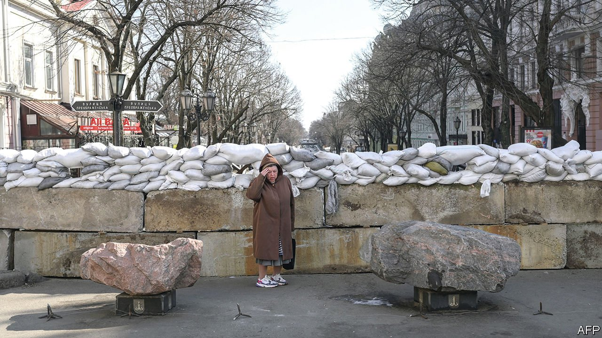
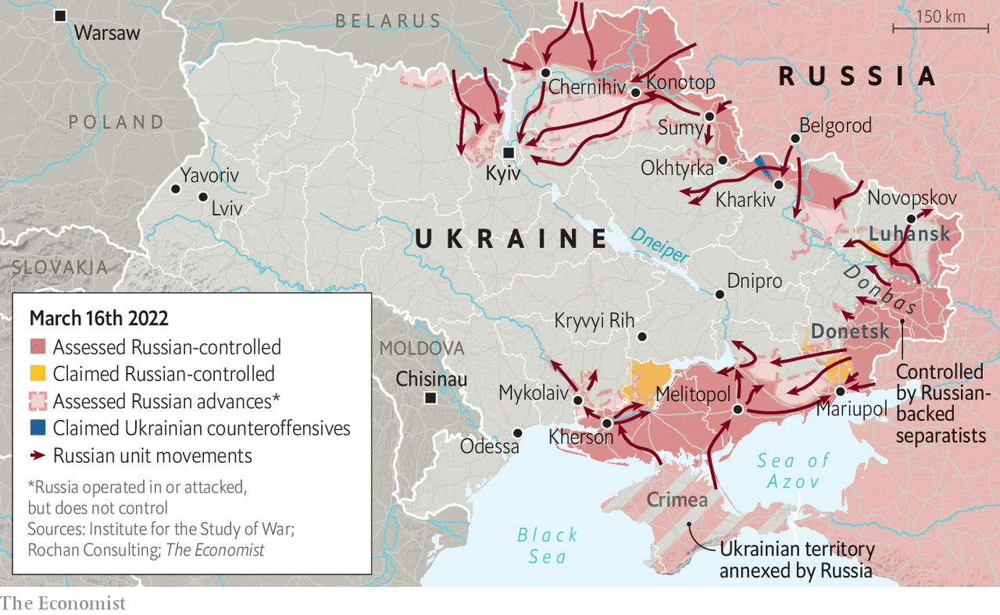

###### Russia’s war

# Ukraine fights on 

##### Despite negotiations, there seems to be no end in sight 

 

> Mar 19th 2022 

“REMEMBER PEARL HARBOR,” Volodymyr Zelensky, Ukraine’s president, entreated America’s Congress. “Remember September 11th…Every night for three weeks, in various Ukrainian cities, Russia has turned the Ukrainian sky into a source of death.” Mr Zelensky was not asking for pity. He was asking for a no-fly zone or, failing that, for arms. “I have a dream. I have a need. I need to protect our skies,” he pleaded—surely the first man to invoke Martin Luther King Jr in pursuit of surface-to-air missiles.

Shortly before Mr Zelensky began his speech on March 16th, Russian television broadcast an address given by Vladimir Putin, his counterpart. Where Mr Zelensky appealed to his listeners in the name of all Ukrainians, Mr Putin set Russian against Russian. “Fifth columnists and traitors,” he snarled, would be spat out “like midges that flew into [the Russian people’s] mouth”. The need for cleansing Russia of such “scum” was evoked with disconcertingly familiar fascist rhetoric. “I am convinced that such natural and necessary self-purification of our society will only strengthen our country [and] cohesion.”


The war, the dictator insisted, was “going to plan”. If that is his opinion then his minions are keeping him from the truth. According to American defence sources, 10% of Russia’s invasion force has been lost, presumably either killed or wounded. It is shy at least 233 tanks, 32 surface-to-air missile launchers and 41 planes, drones and helicopters, according to Oryx, a blog which tracks such weapons using pictures made public on the internet. On top of that which has been destroyed, a fair bit of workable Russian kit has been captured—much of it towed away gleefully, and on video, by farmers with tractors.

 


These are severe losses of men and materiel. What is more, they seem to have fallen disproportionately on elite units such as the VDV airborne forces, Spetsnaz special forces and the First Guards Tank Army, an armoured force purportedly both well trained and equipped. British defence intelligence says that these losses are so severe that they have left Russia “struggling to conduct offensive operations”. It has been forced to redeploy forces from its eastern military district (which stretches to Vladivostok), from its Pacific fleet and from Armenia; it is also recruiting Russian and Syrian mercenaries.

This is a high price for what are, as yet, relatively scant gains. In the east, Russia is stuck at the outskirts of Kharkiv, a city it tried and failed to take on the war’s first day. In Sumy, north-west of Kharkiv, Russian tanks have been spotted lodged in the mud—a problem that will only grow as Ukraine’s spring thaw gets going.

Russian forces are firmly positioned 15-20km to the north-west of the centre of Kyiv and 20-30km to the east of it, and other suburbs around the capital are being laid waste. More and more rockets and missiles have been hitting the city.

But that fire has been returned. Ukrainian artillery is being dug in around the city and mobile missile-launchers deployed. Supermarket shelves are far from full but food has not run out. The water, electricity and gas utilities are still working. Morale remains high. “I have never so much as killed a chicken,” says Vladislav, a 52-year-old electrician who was watching television when missiles hit the district in which he lives on March 14th. “But now I’d kill that Putin bastard.” Ukrainian control over corridors to the south of the city keep it connected to the rest of the country, and thus the world—witness the visit there by the Czech, Polish and Slovenian prime ministers on March 15th.

Such connections are not just symbolic. They can bring supplies. Perhaps Ukraine’s second-biggest advantage is that Western arms are still pouring into the country. On March 15th the , a British-led ten-nation bloc of northern European states, agreed to “co-ordinate, fund and supply” more weaponry. On March 16th America announced $800m in new security assistance to Ukraine. The package includes 800 Stinger anti-aircraft systems and 2,000 Javelin anti-tank missiles. It also contains 100 unspecified drones which are thought to be Switchblades, loitering munitions that can strike tanks from up to 40km away. On a forthcoming trip to Slovakia and Bulgaria, Lloyd Austin, America’s defence secretary, is expected to ask both allies to provide Ukraine with longer-range Russian-made air-defence systems from their arsenals, such as the S-300.

The only thing which may be more important to Ukraine’s defence than these supplies is the morale they help keep up. Ukrainian troops are defiant, confident and buoyed—not to say surprised—by their success not just in holding out for three weeks when many Western experts thought the war would be over in days, but in imposing serious losses on enemy forces which have, in some places, come close to a standstill.

There ain’t no easy way out

Russian forces advancing north out of Crimea have, by and large, made more progress than those coming south from Belarus and Russia. But there, too, some assaults have become bogged down. In the south-west, Russian forces appear to be stuck at Mykolaiv, a port which guards the road to Odessa. They have been unable to assault it, capture it from the sea or bypass it. Their response, as is often the case with Russia’s army, has been to shell it. Rockets have landed in the city’s zoo on at least three occasions. The tail of one Smerch rocket is stuck inside the bird enclosure; the peacocks have not been the same since, say staff. “After three weeks of this idiot’s genocidal war,” says a deputy zookeeper, “It really would be the icing on the cake; to see lions, tigers and leopards free to roam.”

But Russia’s military dysfunction and Ukraine’s thumping victory in the information war may have obscured some of the country’s vulnerabilities, especially those which are some way away from the besieged, battered but defiant cities. Stymied though Russia may be at Mykolaiv, it has been advancing quite quickly towards Kryvyi Rih, a city around 150km (90 miles) to the north-east. If that manoeuvre pans out, it would weaken Ukraine’s hold on Dnipro, a larger city which controls vital crossing points over the Dnieper river.

Should Russian forces also manage to break out past Kharkiv and move south, a pincer movement formed by the two advances could isolate the Ukrainian forces facing the Russian separatists in the east of the country. The Ukrainian forces in this area, known as the Joint Forces Operation, are thought to comprise a sizeable fraction of the regular army. In a letter sent to his officers on March 9th, General Thierry Burkhard, France’s chief of defence staff, warned that Ukraine, “faced with the difficulty of holding a stretched position, without any operational reserve, could experience a sudden collapse”. In the long run, losing its army in the field would bode ill for Ukraine’s chances.

Perhaps mindful of their respective weaknesses and losses—the civilian toll in Ukraine has been hard, especially in Mariupol—Russia and Ukraine seem to have become more seriously engaged in negotiations that could bring about a ceasefire or end the war. Mr Zelensky, who in recent days has acknowledged that Ukraine “will not enter” NATO, insisted that the Russians were sounding “more realistic” about a settlement. Russia’s foreign minister, Sergei Lavrov, said on March 16th that the two sides were “close to agreeing” a deal that would involve a neutral Ukraine receiving guarantees about its security. That said, Jean-Yves Le Drian, France’s foreign minister, has been quoted as saying the Russians are only pretending to negotiate.

Likely sticking-points are not limited to the territory at stake (Russia will want to keep its gains in Donbas, including Mariupol, should it succeed in taking the city). What sort of security guarantees are offered, and by whom, will matter as much or more. Mykhailo Podolyak, one of Ukraine’s negotiators, told The Economist that the only acceptable deal would be one with “specific and legally binding guarantees” under which Ukrainian allies such as America, Britain and Turkey “would be able to actively intervene in case of any aggression”. Andriy Yermak, Mr Zelensky’s chief of staff, says that the guarantors would have to include not just countries friendly to Ukraine but also all five permanent members of the UN security council.

Mr Yermak also says that, although the two teams of negotiators can prepare the ground, any agreement will ultimately have to be hammered out by the two presidents. How strong their hands are will depend on the fortunes of war between now and then; the negotiations may not reach their level until there is desperation on the part of one or both of them.

Come what may, though, the broadcasts of March 16th showed that Mr Zelensky will bring the goodwill of the world and the fervent expectations of his people to the table: “I would tell him ‘Fight until victory!’” says Vladislav, the electrician in Kyiv. Mr Putin’s position, meanwhile, will be shaped by a domestic situation, and an attitude to it, which are both far darker. ■

Read more of our recent coverage of the 

