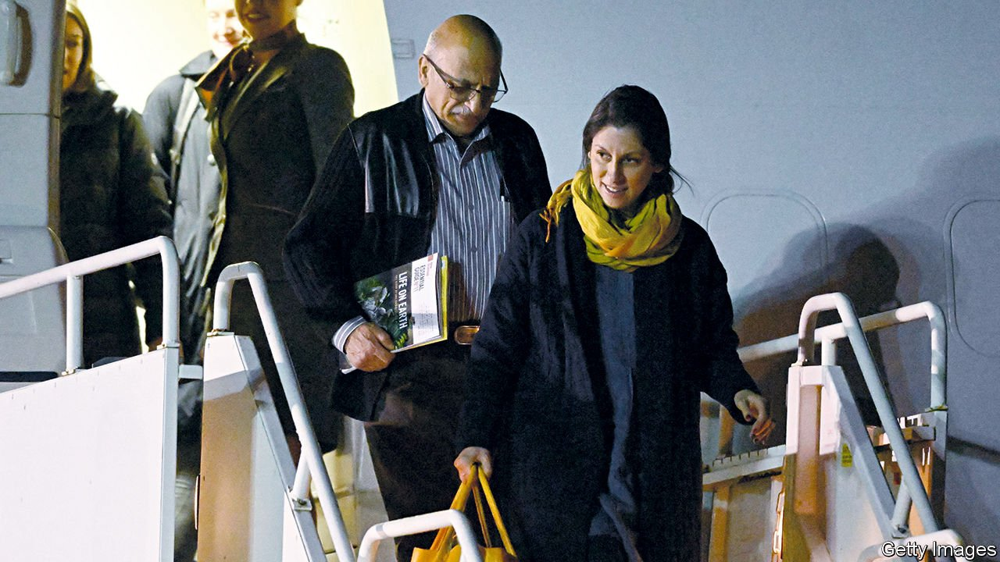

###### A high price

# After years in jail, Nazanin Zaghari-Ratcliffe returns to Britain 

##### A debt is settled, and prisoners of Iran are released 

 

> Mar 17th 2022 

ON MARCH 16TH Nazanin Zaghari-Ratcliffe left Tehran in a jet of the Royal Air Force of Oman, and after a changeover in Muscat, landed at RAF Brize Norton, an air base in Oxfordshire, shortly after midnight. Waiting for her were her husband Richard and seven-year-old daughter Gabriella. The first thing she would want was for him to make her a cup of tea, he told reporters; the house would need tidying, too.

A dual Iranian-British national, she had been arrested in 2016 when visiting her parents in Iran. She spent four years in prison, and more time under house arrest, accused of plotting to overthrow the Iranian regime, a claim she denied. Solitary confinement and blind fold interrogations took a toll on her mental health. Returning to Britain with her was Anoosheh Ashoori (the pair are pictured landing at Brize Norton), a fellow dual national arrested in 2017 and accused by the regime of being an Israeli spy. A third prisoner, Morad Tahbaz, a British-American-Iranian conservationist, was released from prison on furlough to his home in Tehran.


Their release is another victory for Iran’s record of abducting dual nationals to extract concessions from the West. The British had negotiated for them alongside the settling of a five-decade-old debt of £394m ($518m). In 1971 the shah of Iran paid for 1,500 British tanks and other bits of kit, which went undelivered after the Islamic revolution of 1979. The debt had been upheld by the International Court of Arbitration, but years were spent wrangling over the amount, and how to navigate international sanctions. The terms are confidential, but the British government says the deal complies with sanctions and anti-money-laundering rules, and the proceeds can be spent only on humanitarian aid. “I suspect the Revolutionary Guards will say to themselves, we got our money after 50 years by being tough with these bastards,” says a former diplomat.

The release was met with jubilation in Parliament. Opposition MPS queued to congratulate Liz Truss, the foreign secretary. A former trade secretary who prides herself as a dealmaker, she had made securing the prisoners’ release a priority upon taking office in September 2021. Soon afterwards she raised the issue with her Iranian counterpart, Hossein Amirabdollahian, in New York. Negotiations between British and Iranian officials began in Tehran, and concluded in Oman in February. Tulip Siddiq, a Labour MP who counts Ms Zaghari-Ratcliffe as a constituent, said Ms Truss was the first foreign secretary to acknowledge a link between the imprisonment and the debt. Britain wanted to work with Canada and other G7 nations, said Ms Truss, to stop “arbitrary detention being used by countries to get their own way”.

The affair had become an acute embarrassment for the government, thanks to Mr Ratcliffe’s dogged campaigning. Last autumn he held a three-week hunger strike outside the Foreign Office. Boris Johnson, the prime minister, was accused of handing the regime a pretext to prolong her detention when he declared in 2017, as foreign secretary, that she was “simply teaching people journalism”—which she and her employer, the Thomson Reuters Foundation, a charitable organisation independent of the news-media group, denied.

Ms Truss credited the breakthrough to the formation of a new Iranian government under Ebrahim Raisi last year. That allowed a “reset”, in which the two sides declared their resolve to fix outstanding problems. Diplomats think the settlement is an encouraging sign for talks on reviving the deal on Iran’s nuclear programme. It is unlikely the American government would have endorsed such a large payment unless the big issues with Iran had been settled, says Esfandyar Batmanghelidj, a visiting fellow at the European Council on Foreign Relations, a think-tank. “It is a positive signal. It is one of the ways that Iran is able to demonstrate that it wants to turn the page after several years of very significant tension with the West.” ■

