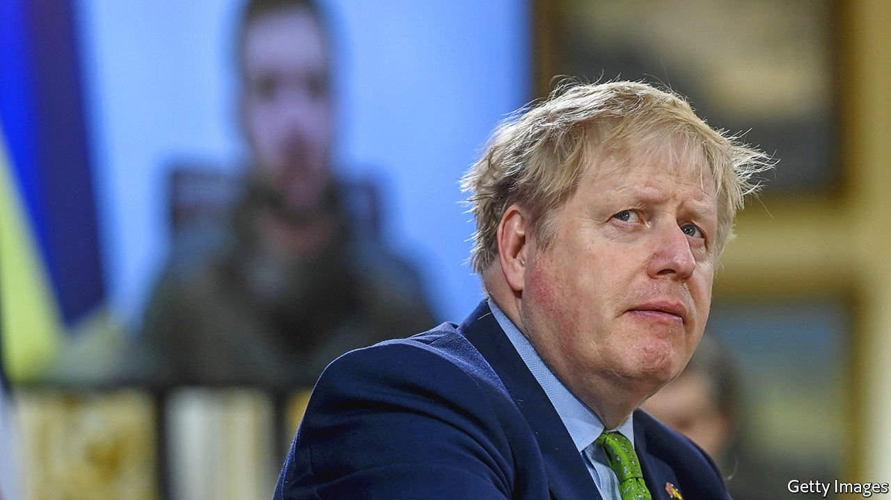
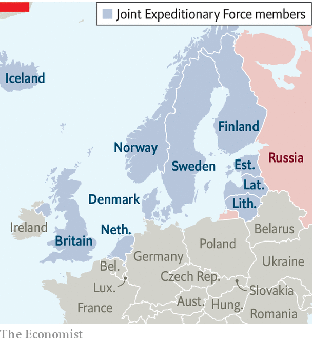
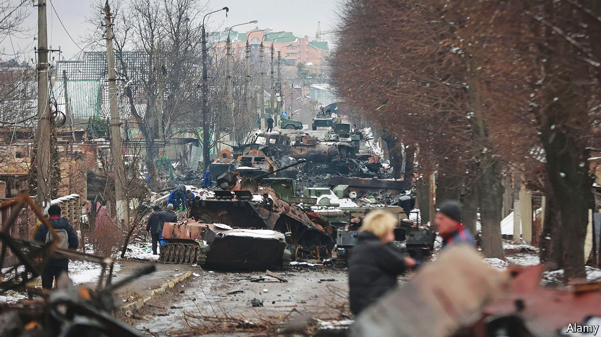

###### NATO-lite

# Boris Johnson tells The Economist about his anti-Russia coalition 

##### The British-led Joint Expeditionary Force is moving quickly against Russia 

 

> Mar 19th 2022 

ON THE NIGHT of March 14th, while Russian forces were pounding Ukrainian cities, six leaders and other representatives of the Joint Expeditionary Force (JEF), a British-led coalition of ten northern European countries, gathered for the first time at Chequers, the country house of Britain’s prime minister. They put their phones away for security, sat down to dinner and set to work. “We agreed that Putin must not succeed in this venture,” Boris Johnson told The Economist the next day. They agreed to “co-ordinate, supply and fund”  requested by Ukraine. And they declared that JEF, through exercises and “forward defence”, would seek to deter further Russian aggression—including provocations outside Ukraine that might stymie  or fall under its threshold.

JEF, largely unknown outside defence circles, was established a decade ago as a high-readiness force focused on the High North, North Atlantic and Baltic Sea regions (see map for its members). Unlike NATO, it does not need internal consensus to deploy troops in a crisis: Britain, the “framework” nation, could launch operations with one or more partners. As one British officer puts it: “The JEF can act while NATO is thinking.”


 


That makes it especially useful in murky circumstances. “It’s there to respond flexibly to all sorts of contingencies, maybe [those] that fall short of an Article Five threshold,” says Mr Johnson, referring to NATO’s collective-defence clause. JEF matters because, although Article Five covers “armed attack”, it is unclear whether lower-level or ambiguous provocations, such as the unmarked Russian soldiers who seized Crimea from Ukraine in 2014, would meet the threshold. JEF is therefore a “valuable complement” to NATO, says Martin Hurt of ICDS, a defence think-tank in Estonia. In the case of an attack in northern Europe, he says, JEF, alongside American forces, has the potential to become a first responder.

JEF has also become an important diplomatic and military instrument in responding to Russia’s war in Ukraine. British officials say that only a few weeks ago a London summit built around the force would have been unthinkable. JEF “consists of the countries that were fastest off the blocks, with us, in sending direct military assistance to Ukraine,” Mr Johnson points out. Nine out of ten members are now supplying weapons (Iceland, which lacks a standing army, is the exception). “What we agreed today was to make sure that we're not all supplying the same thing,” says Mr Johnson.

All for one

JEF’s growing prominence reflects wider trends in European security. Instead of relying on NATO, countries are hedging their bets and diversifying with a dizzying array of coalitions, blocs and groupings, from the French-led European Intervention Initiative to the European Union’s Permanent Structured Co-operation, or PESCO. In September France signed a defence pact with Greece. Britain, Poland and Ukraine agreed on a trilateral security pact in February. JEF’s composition is noteworthy because it includes three countries that are members of NATO but not the EU (Britain, Iceland and Norway) and two that are members of the EU but not NATO (Finland and Sweden).

For Europeans, much of this is about —in part an effort to insulate their defence from the vagaries of American politics. But for Britain, this defence diplomacy is more about re-establishing its long-standing role as a military power on NATO’s northern flank, at the same time as creating post-Brexit ties with natural allies in Europe. “Most JEF countries are smaller nations who have traditionally been very close to the UK, strongly regretted Brexit for that reason, and have been anxious to ensure its continued commitment to their security,” says Malcolm Chalmers of the Royal United Services Institute, a think-tank.

Russia’s invasion has made that commitment more important. “We all agreed that this had been a turning-point in…our collective security, and all our worst fears about Putin had come true,” says Mr Johnson. “All our illusions had been dispelled.” On a visit to Kyiv weeks before Russia’s invasion, Mr Johnson told Melinda Simmons, Britain’s ambassador in Ukraine, that he thought Mr Putin would be “crazy” to attack; that “he’s got to be bluffing”.

Mr Putin’s long essay on Russia and Ukraine last summer—“that 5,000-word turg-athon”, as Mr Johnson describes it—suggests that he grossly miscalculated Ukraine’s sense of nationhood and its will to resist. Mr Johnson remembers being struck that “these people are definitely going to fight”, as he weighed up the Kremlin’s calculus, recalling an earlier trip to Kyiv when he visited a bar studded with machine guns, and pictures of martyrs at Maidan Nezalezhnosti, or Independence Square, the focal point of the country’s revolution against a pro-Russian president in 2014. In invading, Mr Putin has made “an absolutely catastrophic mistake…worse than a crime,” says Mr Johnson. “We haven't seen anything like this in our continent for 80 years.”

Despite initially doubting that Mr Putin would take such a calamitous step, Mr Johnson’s government moved quickly to arm Ukraine, long before other major European powers were doing so. On January 17th, even as French officials warned of Anglo-American “alarmism”, Britain began rushing thousands of NLAW guided missiles to Ukraine (the acronym stands for Next Generation Light Anti-tank Weapons). Around 4,000 have been delivered so far, at a total cost of £120m ($156m), according to the Sunday Times. Britain’s early deliveries inspired other European nations to do the same, argues Mr Hurt. In the region, “ UK credibility has improved hugely,” he says. Britons are supportive: some 78% of voters approve of sending arms and rations to Ukraine, and would back sending Western troops to aid its defence by 43% to 40%, according to Opinium, a pollster.

Ukrainians offer even more resounding endorsement. If you travel through their country, NLAWs—and their handiwork, in the form of mangled Russian armour—are ubiquitous. Ukrainian soldiers praise their effectiveness and ease of use, saying that they, along with American-supplied Javelin missiles, might have made the difference between survival and defeat in the war’s first weeks. “We hit it thanks to the gifts from Her Majesty The Queen,” beams one Ukrainian soldier, standing proudly in front of the carcass of a Russian tank, its turret blown off the hull by an NLAW. At a wedding of two soldiers on March 6th, north-east of Kyiv, a guest, Denys Demchenko, a 47-year-old actor, clutched an NLAW as he watched the proceedings. “They are one of the best and most important weapons we have,” he explained.

The aim of this flow of arms is to drive Mr Putin out of Ukraine. “We need to do everything we can to ensure that he fails in a catastrophic venture, does not succeed in subjugating the people of Ukraine and that he withdraws as fast as possible—permanently,” says Mr Johnson. He plays down talk of “off-ramps, deals, ways out” for the Russian president. “If you’re going to completely abrogate all the rules of civilised behaviour…then you’ve got to find your own way out of that.” British officials say that they are also sending additional Javelins and Starstreak anti-aircraft missiles, which can shoot down planes 7km away.

 


Britain’s response to the crisis has not been uniformly smooth, however. The Home Office’s initially  to deal with refugees bears the same hallmarks of poor administration, weak ministerial leadership and bad planning as the Foreign Office’s botched response to the fall of Kabul. The British sanctions regime has improved after a ropey start. On March 15th the government said it would place sanctions on 370 more Russian individuals, including more than 50 oligarchs and their families with a combined net worth of £100bn. That brings the number of individuals or entities put under sanctions since Russia’s invasion to more than 1,000. Yet a key test will be how well these are enforced. One expert says there have been barely any sanctions-related prosecutions in the past decade and at most half a dozen fines, averaging a paltry £3m each.

As Russia intensifies its war, Britain and its allies face difficult decisions over how far to go. Though Joe Biden, America’s president, opposed a Polish bid to provide old MiG jets to Ukraine, Western allies are discussing the prospect of heavier and more powerful arms, including bigger surface-to-air missiles. Nuclear threats are “fundamentally a distraction”, insists Mr Johnson. But asked whether he is willing to intervene directly in Ukraine if Mr Putin uses , Mr Johnson is more cautious. “It's very important that we don't get locked into any kind of logic of direct conflict between the West and Russia because that’s how Putin wants to portray it…as a fight between him and NATO. It isn't. This is about the Ukrainian people and their right to defend themselves.”

Mr Johnson concedes that Mr Putin may have a greater stomach for risk than the West. “In any situation like this, typically, the most ruthless person wins,” he says. “I don't think this is going to be such a situation, because I think that he's fatally underestimated the resolve of the Ukrainians and he's underestimated the resolve and unity of the West.” On March 24th both the EU and NATO will hold summits in Brussels; those meetings are likely to heap yet more economic and diplomatic pressure on the Russian president.

Whatever happens on the battlefield in the coming weeks, “there's a sense in which Putin has already failed,” says Mr Johnson. Russia might “lay the urban centres of Ukraine to waste and claim some sort of Pyrrhic victory”. But “everybody can see that whatever he does to the infrastructure or the buildings or the kindergartens or the hospitals of Ukraine, he will never conquer the hearts of Ukrainian people.” ■

Correction (March 16th 2022): The original version of this article suggested that JEF had two members in NATO but not in the EU. In fact it has three.

Our recent coverage of the Ukraine crisis can be found .

