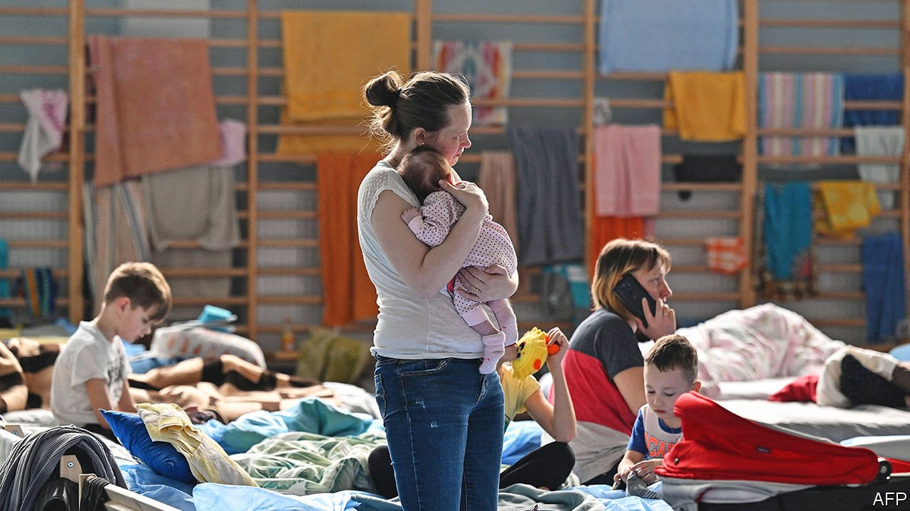

###### Homes for refugees

# Britain finally comes up with a scheme to help Ukrainian refugees 

##### Linking refugees with hosts helps them find their feet 

 

> Mar 19th 2022 

IN 1939 MILLIONS of British children were evacuated from cities and towns that might be bombed and sent to live with rural families. It was a wrenching experience. Not only were they separated from their parents; their hosts were often reluctant and unfeeling. One evacuee, John McGuirk, remembered being dumped with other children in a churchyard: “People came around and picked you like they were picking dogs out of pet shops.”

So the response to a new government scheme that will allow Britons to accommodate Ukrainian refugees is a delightful surprise. On March 14th the government asked households to register as potential hosts; by the end of the following day more than 100,000 had signed up. It is not as immediately helpful as simply dropping visa requirements, as other European countries have done. But past experience suggests that inviting ordinary people to help settle refugees works well.


At first, Britain’s scheme will rely on personal connections. People wishing to offer shelter must name specific Ukrainians and enter their details on an application form. After basic security checks on both parties, the refugees will be allowed to enter Britain for three years. They will be able to work and receive welfare, and their hosts will be paid £350 ($455) a month, tax-free. In time the government expects charities to match Ukrainians with hosts who do not know them.

Canada has allowed communities to sponsor refugees since 1978. More than 300,000 people have arrived under the programme, which seems to help them find their feet quickly. A study by three academics at Canadian universities, Lisa Kaida, Feng Hou and Max Stick, estimated that 90% of male and 71% of female privately sponsored refugees found jobs within a year—17 and 24 percentage points higher than the shares among refugees settled by the government. The privately sponsored refugees were better educated, which explains some of the difference, but not all.

In 2016 Britain started to send Syrian refugees to communities willing to host them. That scheme is small, with almost 700 people settled so far, and is much more ponderous and finicky than the new Homes for Ukraine scheme. Communities cannot request particular refugees. The thinking is that the Syrians who most need help are not the ones with contacts in Britain, says Monika Kruesmann of Reset, a charity that assists hosts and refugees. Hosts must provide separate accommodation, not just spare rooms, and are rigorously inspected.

Jenny Phillimore of Birmingham University assessed the scheme and found some problems. Some Syrians became isolated after being settled in rural areas far from other Arabic speakers. Despite good intentions, the British volunteers could not help with everything: “They’re all quite middle-class; they didn’t understand the benefits system,” says Ms Phillimore. But they proved expert at hassling head teachers, doctors and officials, and the refugees were enormously grateful. She thinks the scheme works well overall.

Some fear the Homes for Ukraine scheme will endanger vulnerable, traumatised people and undermine the existing asylum system, in part by convincing Britons that helping refugees is their job rather than the government’s. The first worry is valid. The government has so far been vague about how carefully hosts will be checked. Unlike Syrian refugees, most of the Ukrainians are expected to be single women or mothers with children. The men have been conscripted.

Stranger things

The second worry is misplaced. Britain certainly has a dysfunctional asylum system: last June 70,000 people were still waiting for their cases to be heard. Asylum-seekers are usually banned from working, causing their skills to atrophy, and are often stuck in poor housing. The government has been trying to legislate to make the system harsher still. But all that was unfortunately true before Russia invaded Ukraine. The Homes for Ukraine scheme is a point of light that illuminates the awfulness of the mainstream asylum system. It seems odd to complain about that. ■

Read more of our recent coverage of the 

