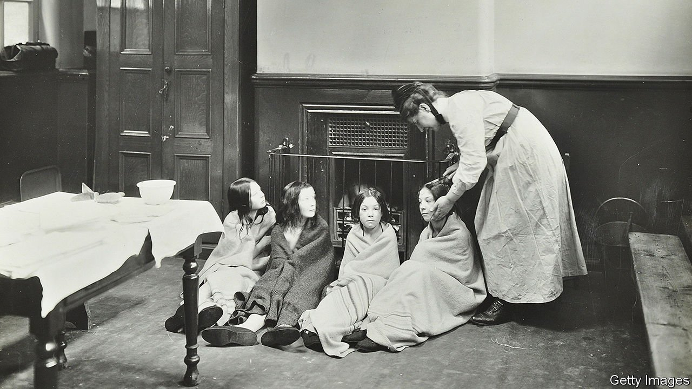

###### Life in a cold climate

# Chilly British homes are likely to get chillier 

##### The British climate is unpleasantly chilly. Coping with that is getting harder 

 

> Mar 17th 2022 

BRITAIN IS A damp, cold place and always has been. Two thousand years ago Strabo, a Greek geographer, cast his eye over the island and didn’t like what he saw. It rains, he wrote. And even when it doesn’t, it is so cloudy that “the sun is to be seen for only three or four hours round about midday”. Some have managed to be charmed by its climate; many more have not. It is, wrote Jonathan Swift, “bloody cold”.

Although the climate hasn’t improved, coping methods have. At the start of the 1970s only around a third of British houses had central heating, and the temperature of the average hallway was around 14°C. By 2010 almost all had heating and the average temperature was closer to 21°C. Where once British house plants were cool-loving cyclamen, today those wilt in the warmth while succulents and cacti flourish. We are “the most heated generation in history”, says Alexandra Harris, a writer and fellow at Birmingham University.


Now, however, the thermostat is likely to be turned down a notch. War in Ukraine, on top of earlier gas-supply problems, is likely to lead to a further 50% jump in the cost of heating. The fortuitous arrival of spring may blunt the immediate impact, but high fuel prices are probably here to stay. How will residents of a chilly country used to living in hothouses cope?

Most historians focus on derring-do rather than radiators and knitwear. Yet the burning desire for heat has transformed the landscape of northern Europe, as well as the clothes on its citizens’ backs and the air they breathe. It has altered the architecture of houses and to this day tilts geopolitics to meet its insatiable needs.

The rise of the Roman Empire is now remembered for chiselled Roman roads and chiselled Roman legionaries. But it should also be remembered for toastier toes and wood consumption on an unprecedented scale. It has been estimated that to keep a single, small, Roman bathhouse burning would have used about 23 acres of coppiced woodland a year. The sound of Roman soldiers in your land was followed by the sound of Roman tools attacking your trees: I came, I saw, I sawed.

Yet even Roman bathhouses didn’t make Roman Britain bearable. Soldiers’ letters expounded on the “foul” British weather. “I have sent you…socks,” reads one reply. By the 1600s Britain had felled so much woodland that its wood supply began to fail. “God knows where materials can be had,” despaired Samuel Pepys, hunting for wood for ships. Prices soared; soon the average Briton was spending a tenth of his income on wood. Pepys took to staying in bed till 11 o’clock, warming up.

Even as the cost of lighting has tumbled over the centuries, the cost of heating has remained high. William Nordhaus, a Nobel prize-winning economist, pointed out in 1998 that an hour’s work would buy about 350,000 times as much illumination as it would have in early Babylonia, in around 2,000BC. Yet much like people in Pepys’s England, Britons still spend up to a tenth of their income on energy, chiefly heating. Partly this is human idiocy: studies show that when houses are better insulated, people remove jumpers and turn up the thermostat rather than spending less on fuel. Partly it is the iron laws of thermodynamics: making things hotter is hard.

In the 19th century, central-heating systems using pressurised water became fashionable. Clothes became lighter. Cotton replaced wool; vests were jettisoned; hats and capes discarded. Moralists panicked. “If laces are unfastened, ties loosened, and buttons banished”, fretted an article in Tailor and Cutter magazine in 1931, society itself might “also fall to pieces”. It didn’t—but family life unravelled a little. Today, people worry that separate screens separate families, but families were divided earlier by central heating. Once, everyone had gathered around the focus of the fire (the word “focus” is Latin for “fireplace”). As houses got cosier, family members migrated on the warm air currents to their own rooms and individualism increased.

Not everyone was pleased. In the 20th century, a marked froideur towards warmth could be detected among English writers. Partly this was snobbery. Succumbing to the cold was, like saying “serviette”, a lower-class habit. Public schools were kept institutionally icy; aristocrats scraped ice from the inside of their windows. It is notable that one of the earliest central-heating systems installed in England, in 1832 for the governor of the Bank of England, was used to heat his greenhouse and his grapes, rather than himself. One of the poshest things you can do still, the Guardian, a left-wing newspaper, recently advised, is to “have a freezing bathroom”.

Partly, too, this was a fear that tinned, tepid air would lead to tinned, tepid minds. While the army of the upright heated themselves warmly and “business women…in Camden town” took warm baths, sniffed John Betjeman in “Business Girls”, published in 1954, puritans plunged into cold showers, eschewed central heating and exercised outside in the altogether. Poets and artists did the same—though they were usually poorer and drunker.

Bloody colder

Low temperatures, it was argued, had sharpened the quills and minds of English authors for centuries. “The Oxford Dictionary of Quotations” offers a mere 11 sayings for “hot” and 12 for “warm”, but a flurry of 48 for “cold”. Dickens delighted in it; Hardy hymned it; Shakespeare would surely not have compared his love to a summer’s day had he had central heating: he would have been lovely and temperate already. “Preserve me, above all, from central heating,” wrote W.H. Auden, frostily. It seems unlikely that today’s Britons will concur. The recent rise in heating bills is likely to be just the start of a long cold spell. ■

