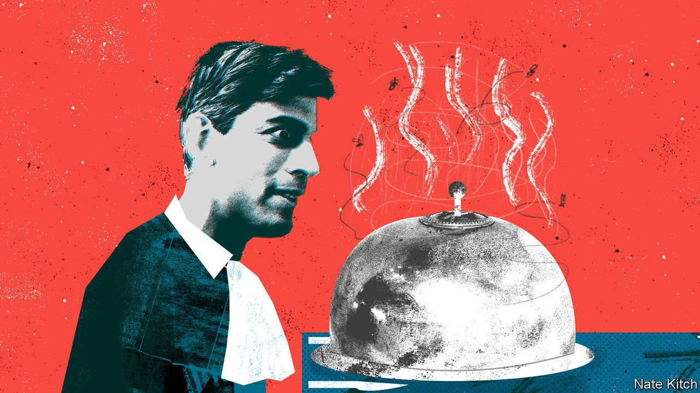

###### Bagehot

# Does Rishi Sunak have the stomach for what he must swallow? 

##### The golden boy of British politics faces an unappetising menu 

 

> Mar 19th 2022 

IN “THE WIRE”, a crime drama, a former mayor of Baltimore explains the realities of political office to his successor. “The first day I became mayor, they sit me down at the desk—big chair, dark wood, lots of beautiful things—I’m thinking: how much better can it get?” In walks a flunkie carrying a silver bowl. “‘What the hell is this?’ I said. ‘It looks like shit. What do you want me to do with it?’ He says, ‘Eat it.’” At that point more bowls arrive, a constant flow of immaculately presented excrement. “That’s what it is. You’re sitting eating shit all day long. Day after day, year after year.”

No British politician has a more revolting menu in front of him than Rishi Sunak, the chancellor. Ahead of a spring statement on March 23rd, silver platters are coming fast and their contents are foul. Inflation is near 6% and may hit 10% later this year. Energy bills are likely to cost British households £38bn ($45bn) extra over the next 12 months, or the equivalent of raising the marginal rate of income tax by six percentage points. A 2.5-percentage-point rise in national insurance, a payroll tax, split between employees and employers, will kick in from April. The price of diesel may reach £3 per litre by the end of 2022. Voters are already upset, yet worse is to come. Bowls are stacking up on the chancellor’s desk.


The experience is new to Mr Sunak, whose political rise has been smooth and speedy. After attending Winchester, a fancy private school, and then Oxford University, he embarked on a career in finance, in which he made pots of money (before marrying the daughter of a billionaire). When he entered politics in 2015, aged 34, he was given the constituency of Richmond in North Yorkshire, which contains two national parks, a direct train to London and the country’s biggest Conservative majority. He was appointed chancellor less than five years after becoming an MP, in February 2020, just before Britain’s first lockdown.

Compared with the current crisis, covid-19 was politically simple for the chancellor. Almost all economists argued that the government had to spend, and almost all politicians agreed. The temporary nature of a pandemic meant the Treasury could pump cash into the economy, with the state’s balance-sheet bearing the brunt, as during wartime. It was most voters’ first sight of Mr Sunak, who came across as a slick finance guy, even as the prime minister, Boris Johnson, resembled a clown delivering a eulogy. A quick way to make voters like you is to give them £400bn. And Mr Sunak duly became Britain’s most popular politician.

This time, his options are less palatable. Rocketing energy prices and inflation constitute a once-in-a-generation crisis hitting after a once-in-a-century crisis. The Treasury is jittery about whether the national balance-sheet can take more damage. There is no unanimity on what to do. Advice pours in, calling on Mr Sunak to delay tax rises or increase benefits or slash tax on fuel, or perhaps all of the above. Each would leave a nasty taste. Scrapping the rise in national insurance would make him look inconsistent and weak. Cutting fuel duty would be popular but difficult to reverse, slaughtering a government cash cow. It would also increase demand for oil, precisely when geopolitics requires the opposite. As for raising benefits, Conservatives dislike nothing so much.

Swallowing the inedible is easier if there is a reason. Those chancellors who reshaped Britain from 11 Downing Street all had a clear vision. When they did unappetising things, such as slashing spending in the case of George Osborne, or holding fast to inherited Conservative spending plans, as Gordon Brown did for New Labour, it was with a sense of purpose. In a recent lecture Mr Sunak offered a competent diagnosis of Britain’s economic ills: businesses invest too little, workers lack skills and new technologies should be more flexibly regulated. But he had less to say about how to fix these long-standing problems. It was a plea for fewer bowls, rather than a plan for disposing of them.

Grumbles about Mr Sunak’s political naivety are common among Conservative MPs and advisers. The issue, however, is not that the 41-year-old is relatively young for a chancellor. Mr Osborne was around the same age when he became chancellor in 2010, but he had been in politics for 16 years, working through the embers of Sir John Major’s government in the 1990s, New Labour hegemony in the 2000s and the financial crisis. Although fresh-faced, he was battle-scarred. By contrast, Mr Sunak was still a junior minister for local government in the summer of 2019.

Criticism of Mr Sunak’s political nous is overdone. Increasing national insurance, which is paid by people of working age, to fund health and social care, which are mainly required by the retired, is the closest a Conservative chancellor can come to taxing Labour voters for the benefit of Tory ones. (Labour won a plurality of working-age voters in the most recent general election; the Conservatives won a big majority of the over-60s and two-thirds of the over-70s.) Likewise, freezing income-tax allowances is about the most politically astute stealth tax imaginable. High inflation coupled with rigid allowances lets extra cash pour into government coffers, without budging the headline rate of tax. Betting markets still put Mr Sunak as favourite to succeed Mr Johnson as prime minister. For someone who is “crap at politics”, as one Labour aide puts it, he is remarkably successful.

You’ve never had it so bad

Yet the things that made Mr Sunak popular—in particular, spending lots of money—are the things that the chancellor professes to dislike. He has consistently called for lower taxes and a smaller state, even while raising taxes and spending more. Memories of the state’s largesse during the pandemic have faded. Instead, anger is growing at the government’s miserliness when it comes to the rocketing energy bills. For many Britons, Mr Sunak will become the face of economic misery. For Mr Johnson, an expert in allowing other people to take the blame, this is no bad thing. For Mr Sunak, it will be hard to swallow. ■

Read more from Bagehot, our columnist on British politics: (Mar 12th)

 (Mar 5th)

 (Feb 26th)

