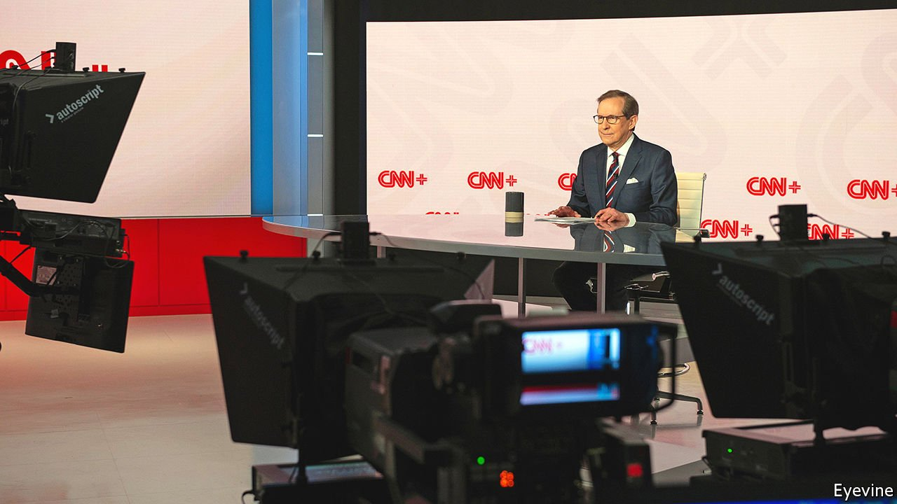

###### Good news and bad news

# CNN+ enters the streaming business at a newsy moment 

##### The war in Ukraine has got people glued to their screens 

 

> Mar 19th 2022 

“IT MAY NOT be good for America, but it’s damn good for CBS,” said Leslie Moonves, the TV network’s then boss, of Donald Trump’s presidential candidacy in 2016. Ratings soared under Mr Trump, and slumped when he left the stage. Now war has people tuning in again. Since Russia invaded Ukraine, cable-news channels’ audience share in America has nearly doubled, to 12%, reckons Inscape, a data firm—heights last recorded when the Capitol was stormed in January 2021.

America’s original Cable News Network hopes to sate this hunger with a new format. CNN+ will launch in America on March 29th, with an international roll-out to follow. For $5.99 a month viewers will enjoy live streams of on-demand news and documentaries, plus interactive features (like the chance to submit questions to interviewees).


The launch coincides with upheaval at the 42-year-old network, one of the biggest names in news. CNN’s boss, Jeff Zucker, quit in February over an undisclosed office romance; Chris Licht, an experienced producer, takes over next month. Meanwhile, the merger of CNN’s owner, WarnerMedia, with Discovery, a cable giant, is expected to close in April.

The new management prefers to highlight CNN’s hard-news expertise, on display in Ukraine, over the partisan commentary in which it indulged in the Trump years. A neutral brand suits Warner-Discovery’s strategy. Warner plans to bundle CNN+ with its entertainment platform, HBO Max, due to combine with Discovery’s. That bundle cannot afford to repel conservatives. (If it does, CNN’s new owners may sell it.)

Nor can CNN+ afford to undermine the cable business. Like all legacy media firms, Warner-Discovery is trying to launch a streaming lifeboat without sinking its cable mothership. So for now, CNN is keeping its main rolling-news channel exclusively on cable, with separate shows for CNN+ aimed at news junkies and documentary fans.

Sceptics wonder about the size of the new market. As for cable, it is in decline. Just over half of American homes have it, down from nearly nine out of ten a decade ago. Sport, which along with news is the last reason not to cut the cord, is slowly shifting to streaming. Amazon and Apple, with no cable interests to protect, have begun buying the rights to big matches.

Historically less-cabled international markets may provide a glimpse of what comes next. CNN+ customers in Latin America are likely to get the CNN en Español linear channel, for instance, while some European subscribers are expected to get CNN International. CNN+ is a side-bet for the time being. It is also the network’s most likely future home when American cable is severed for good.


