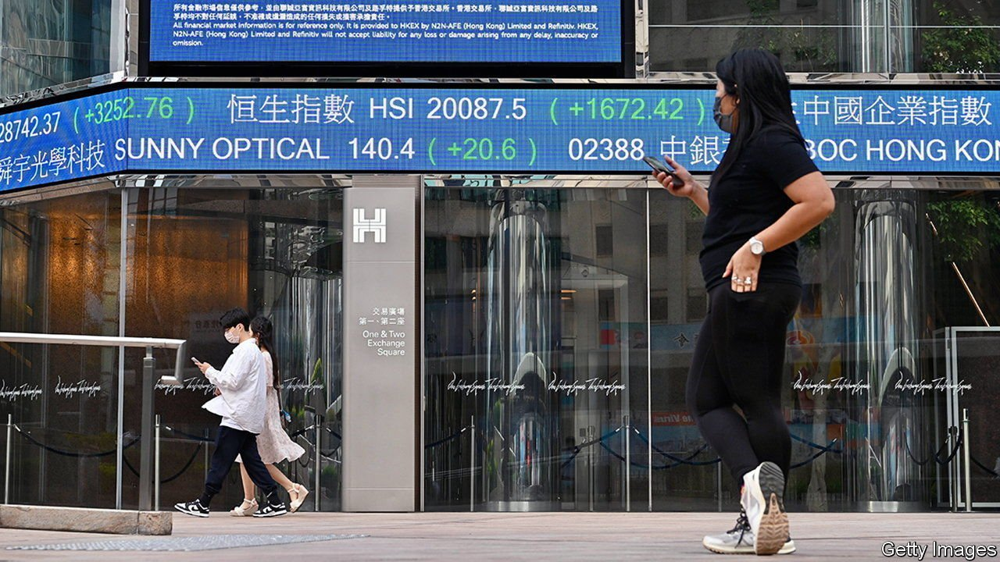
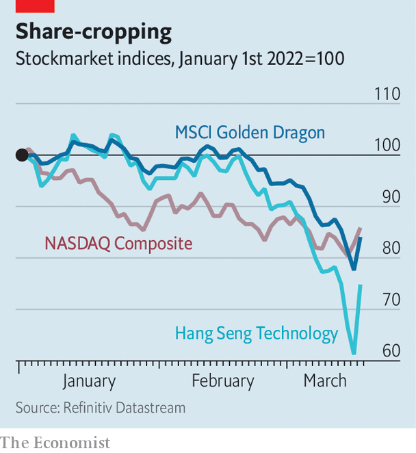

###### Tonal language

# Is this the beginning of the end of China’s techlash? 

##### The Communist Party softens its fiery rhetoric towards the tech industry 

 

> Mar 19th 2022 

THE CHINESE COMMUNIST PARTY has exhibited a high tolerance for the excruciating pain felt by investors in China’s biggest technology companies. The firms’ sins ranged from throttling smaller competitors and mistreating workers to hooking young minds on video games. After forcing Didi Global to delist from New York, earlier this month regulators in effect scotched the ride-hailing giant’s relisting plans in Hong Kong. On March 14th the Wall Street Journal reported that they are preparing to slap a record fine on Tencent, an internet Goliath, for alleged anti-money-laundering violations. The next day the Cyberspace Administration of China (CAC), the main internet watchdog, accused Douban, a social-media platform with 200m users, of creating “severe online chaos”, marking it as a target for stricter censorship. This, combined with uncertainty over Russia’s invasion of Ukraine and a rash of , shaved a third from the indices of Chinese tech stocks in the first two weeks of March, while America’s tech-heavy NASDAQ index remained flat (see chart).

Yet the pain of the spiralling tech sell-off, which at its deepest wiped out more than $2trn in overall market value, may be becoming too much to bear even for desensitised party bosses. On March 16th Xinhua, a state news agency, published a report from a meeting of the central government chaired by Liu He, China’s top economic adviser. The agency declared that the “rectification” of large Chinese technology companies would soon come to a close. New regulations should be transparent, Mr Liu was supposed to have urged, and policymakers must be cautious when implementing rules that might hurt the market, according to Xinhua. Moreover, state media reassured readers, the Chinese leadership would stabilise stockmarkets. It may even support foreign listings of Chinese companies, which it has discouraged or, as in Didi’s case, opposed.


 


Mr Liu’s statements are the strongest signal so far that the tech crackdown initiated by President Xi Jinping in late 2020 is coming to an end, says Larry Hu of Macquarie, an investment bank. Markets certainly seem to think so. Hong Kong’s Hang Seng Tech Index soared by 22% on March 16th, a daily record—and was up again the next day. The Golden Dragon index, which tracks American-listed Chinese technology firms, jumped by a third. Having lost tens of billions of dollars of market value just days earlier, put-upon tech titans such as Tencent and Alibaba, China’s biggest e-emporium, added a lot of them back in barely a few hours of trading.

The government’s increased sensitivity to market sentiment comes as a relief to many investors, who have watched with unease as leaders in Beijing have become increasingly indifferent to how China and its markets are viewed by the outside world. The latest policy whipsaw nevertheless raises nagging questions about conflicting interests within the party and about the lack of co-ordination between regulators. It is unclear, for example, if Mr Liu’s conciliatory message was intended to signal displeasure with the CAC’s recent heavy-handedness, or instead to praise the agency for having done a good job.

Regardless of the government’s true motive, its pronouncements may stem the colossal value destruction of the past 18 months or so. Whether they will be enough to reverse it is another matter. Chinese tech stocks remain depressed. Tencent’s market capitalisation swelled by $112bn in the two days following Xinhua’s report. But that brought it back to where it was a week earlier, which is still down by around half from its peak of nearly $1trn in January 2021. Alibaba’s stockmarket value of $250bn is one-third of what it was a year ago. If the Communist Party’s objective was to take Chinese tech down a peg and neutralise a perceived rival power centre, it has succeeded in spades. ■

