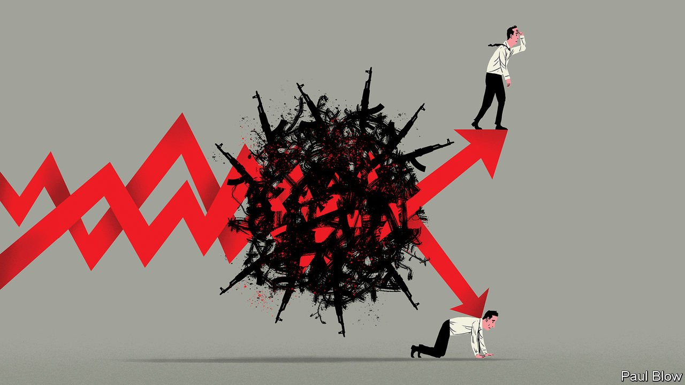
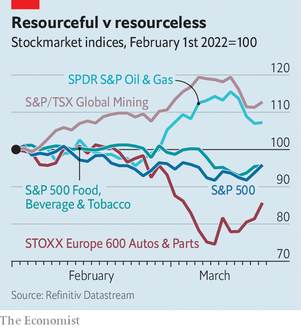

###### Value-chain reaction

# Russia’s war is creating corporate winners and losers 

##### As well as enormous volatility 

 

> Mar 19th 2022 

MOST MULTINATIONAL companies can live without Russian customers. Living without Russian commodities would be much harder. On March 15th the European Commission announced new economic constraints on Russia, including a ban on exports of European luxury items and cars—the definition of an essential good is, after all, in the eye of the oligarch. But the announcement also included a ban on steel products from Russia. More such restrictions on Russian exports may come.

Companies are struggling to contain the fallout of Russia’s brutal war in Ukraine. The first response of those with business in Russia was to r. About 400 have announced their withdrawal from Russia, according to one tally, cowed by legal and reputational risks. Executives now face a different, bigger challenge. This concerns not their business within Russia but supply chains that extend beyond it, and other knock-on effects. As the war continues, it is creating corporate winners and losers, as well as an awful lot of volatility.


There are two factors that make the shock to supply chains particularly difficult for firms to manage. The first is the breadth of . The two countries together supply 26% of the world’s exports of wheat, 16% of corn, 30% of barley and about 80% of sunflower oil and sunflower-seed meal. Ukraine provides about half the world’s neon, used to etch microchips. Russia is the world’s third-largest , second-largest producer of gas and top exporter of nickel, used in car batteries, and palladium, used in car-exhaust systems, not to mention a large exporter of aluminium and iron. Even without formal sanctions on most of Russia’s commodities, Western traders are , wary of legal risks.

The second complicating factor is the market’s extraordinary swings. The price of Brent crude surged to $128 a barrel on March 8th, then dipped below $100 a week later as China announced new covid-19 restrictions and investors anticipated the interest-rate increase by America’s Federal Reserve on March 16th. The London Metal Exchange halted trading of nickel on March 8th after its price shot past a record $100,000 a tonne. When trading resumed on March 16th, a technical issue prompted the exchange to suspend trading once more (see Finance &amp; economics section).

 


The overall American stockmarket is back roughly to where it was before the invasion. But a few industries benefit from the turmoil, from  to cable news and the lawyers who . The biggest winners are commodities firms, especially outside Russia (see chart).

A stockmarket index of American frackers, which benefit from high oil prices and European demand for liquefied natural gas, climbed by a fifth between February 23rd and March 10th. It remains 9% above its pre-invasion level, despite the decline in oil prices. Mining firms are, as a group, likewise performing well, buoyed by higher metals prices, as are steelmakers (except Russian ones). The share prices of US Steel and Tata Steel, with headquarters in Pittsburgh and Mumbai, respectively, have climbed by 38% and 11% since the eve of the invasion. Bunge and ADM, two big listed traders that specialise in rerouting flows of grain, have outperformed the market, too.

The war does not affect all commodities firms equally. Rio Tinto, a big miner, announced on March 10th that it would abandon a joint venture with Rusal, a giant Russian aluminium producer. Rocketing electricity costs resulting from the soaring price of natural gas, 40% of which Europe gets from Russia, have forced some Spanish steelmakers to cut output.

Pricey inputs are a more widespread problem for sectors further up the value chain. Just as they were preparing to lift off as pandemic travel restrictions are relaxed, airlines got slapped with rising fuel costs. Yara International, a Norwegian fertiliser-maker, said on March 9th that the cost of natural gas had prompted it to cut production at two European factories.

Carmakers, which have not yet recovered from the pandemic’s disruptions to supply chains, face fresh problems. Volkswagen and BMW, two German giants, have cut production in Europe as they seek out new manufacturers of the harnesses that bundle miles of electrical wires in their cars to replace out-of-action Ukrainian suppliers. Morgan Stanley, a bank, reckons that the 67% jump in nickel prices before trading stopped represented an increase of about $1,000 to the input costs of the average American electric vehicle.

Gabriel Adler of Citigroup, another bank, notes that carmakers have so far been successful in passing their costs on to consumers. Tesla, America’s electric-car superstar, this month raised prices; Elon Musk, its boss, complained in a tweet about “significant recent inflation pressure in raw materials &amp; logistics”. Such pricing power is enviable. But it has its limits. At some point people will not be willing to absorb any further increases.

In certain cases, consumers are beginning to balk. American food firms have been raising prices for months to offset higher costs of energy, transport and ingredients. However, they have been unable to raise them quickly enough to protect margins. The need to negotiate prices with grocers limits their ability to demand higher ones whenever they desire. And grocers, in turn, are under pressure from shoppers. Robert Moskow of Credit Suisse, one more bank, notes that consumers have in the past year been willing to stomach pricier food. But the war’s impact on commodities prices comes at a moment when their patience is wearing thin, especially in America, where inflation has hit a 40-year high.

“Every food company must be getting a little nervous that they are pushing the consumer too far,” says Mr Moskow. As the costs of inputs continue to climb, it looks increasingly likely that companies will be forced to choose between compressing profits and depressing demand. ■

Our recent coverage of the Ukraine crisis can be found 

