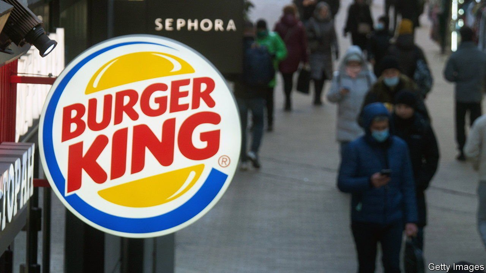
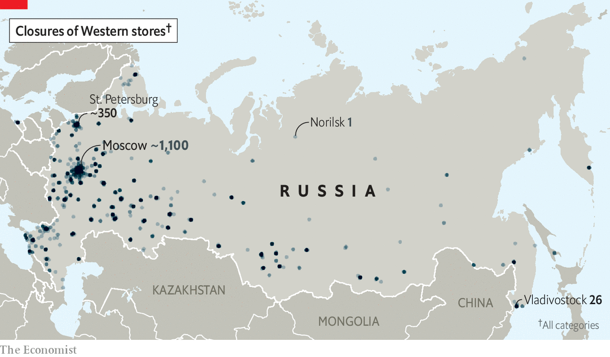
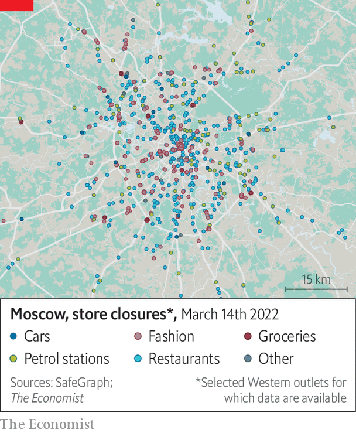

###### Should I stay or should I go?

# Western firms’ thorny Russian dilemmas 

##### The cost of the moral high ground 

 

> Mar 19th 2022 

“ONE SHOULD not condemn companies that decide to stay in Russia as financiers of Putin’s war,” says Michael Harms, head of Germany’s Eastern Business Association, a lobby group. As long as they don’t violate Western sanctions it should be up to them whether they stay in Russia or leave. Metro and Globus, two big German supermarkets, have so far opted to stick around. They say they do not want to let down their staff or innocent Russian shoppers, who need their groceries. Henkel has frozen new investments in Russia but not its sales of laundry detergent and other essentials. Bayer, another German giant, will keep selling both its medicines and, for now, its seeds. Procter &amp; Gamble, an American consumer-goods behemoth, has stopped advertising in Russia but many of its brands remain available there.

Western companies in Russia can be divided into four categories. First are firms whose business is subject to Western measures. These comprise the makers of some microchips or any type of dual-use technology (including things like artificial intelligence or cryptography). They have no choice but to pull out. The second group encompasses companies such as Volkswagen, Europe’s biggest carmaker, which stopped production in Russia because the war, and the West’s response to it, disrupted its supply chains. Next are firms such as Coca-Cola and Pepsi, two makers of soft drinks, and McDonald’s, a fast-food chain, which have suspended operations in Russia to signal their horror at the invasion. The last lot are the remainers.


Nearly 400 Western firms have announced plans to suspend or scale back their operations in Russia since Mr Putin attacked Ukraine, according to a tally by Jeffrey Sonnenfeld of the Yale School of Management. Some of them, such as BP, a British energy giant and Russia’s biggest foreign investor, pulled out early and with seemingly little hesitation. Others did so more reluctantly. Citigroup, an American bank with nearly $10bn of exposure to Russia, had previously said that it was assessing its operations in the country, including its consumer business. But on March 14th the bank, which has been in the country since 1992, said it would “expand the scope” of its withdrawal and stop seeking new business or clients.

Russians living in big cities, where the bulk of Western firms’ retail operations are located, will suffer the most from such closures. But the pain will be felt throughout Russia’s vast landmass. An analysis by The Economist of data provided by SafeGraph, a geolocation-information firm, shows that the shutdown of Western businesses will affect at least 3,500 retail outlets in 480 cities across the country. This includes 1,200 restaurants and cafés, 700 clothing stores, 500 shoe shops and 400 petrol stations. Muscovites will suffer around 1,000 shop closures; residents of St Petersburg will face more than 300 (see maps).

 


Critics of Western firms’ voluntary withdrawals say that these could radicalise the middle class and anger traditionally pro-Western young Russians. That could solidify Mr Putin’s regime rather than topple it, they argue. Mr Harms, who used to live in Moscow, disagrees. The middle class understands that the exodus is aimed at the regime rather than the population at large, he thinks.

Moreover, Western-style consumer goods will remain available in Russia. SafeGraph’s data show that Russians shopping for Nike trainers won’t have far to go to find an alternative pair at one of Reebok’s stores, which are operating as normal. The median distance between the rival American sportswear brands’ outlets is 0.8km. If Big Mac lovers are prepared to accept the Whopper as a substitute, they can typically find an open Burger King within 0.6km of a closed McDonald’s. Burger King’s owner, Restaurant Brands International, has suspended support for its Russian franchisees but many of their outlets remain open. The same goes for some other Western brands.

 


The big question is what will happen to the firms that have pulled back from Russia. Russian prosecutors have reportedly been threatening to arrest corporate executives who criticise the government and to seize the assets of companies that withdraw from the country. A senior member of Mr Putin’s United Russia party mooted a plan to nationalise the operations of departing Western companies, arguing it would help prevent job losses and maintain Russia’s domestic productive capacity. Mr Putin has endorsed the plan.

Some companies that are staying put are, by contrast, apparently being courted by Russian officials. They must weigh those inducements against accusations of war-profiteering, which have sprouted all over Western social media. Olga Podorozhna, a Metro employee in Ukraine, fiercely criticised her employer’s decision to stay in Russia in an emotional post on Linked In, a social network. Metro reacted with its own LinkedIn post condemning the war. But it has not reversed its decision to keep its Russian shops open.

That is unsurprising. Around 10% of Metro’s total sales of €25bn ($28bn) are generated by its 93 supermarkets and 10,000 or so employees in Russia. The 19 Globus hypermarkets with 9,900 Russian employees accounted for 14% of the group’s sales last year. They were doing so well that the company has invested more than €110m in the Russian market in the past couple of years. For firms like these, virtue-signalling is much harder than it is for a company such as Coca-Cola, which derived less than 2% of last year’s revenue from Russia. But the pressure to head for the exit mounts with every indiscriminate Russian assault on Ukraine and its besieged citizens. Even for the remainers, the reputational cost of staying may soon become too high to ignore. ■

For more expert analysis of the biggest stories in economics, business and markets, , our weekly newsletter.

Our recent coverage of the Ukraine crisis can be found 

