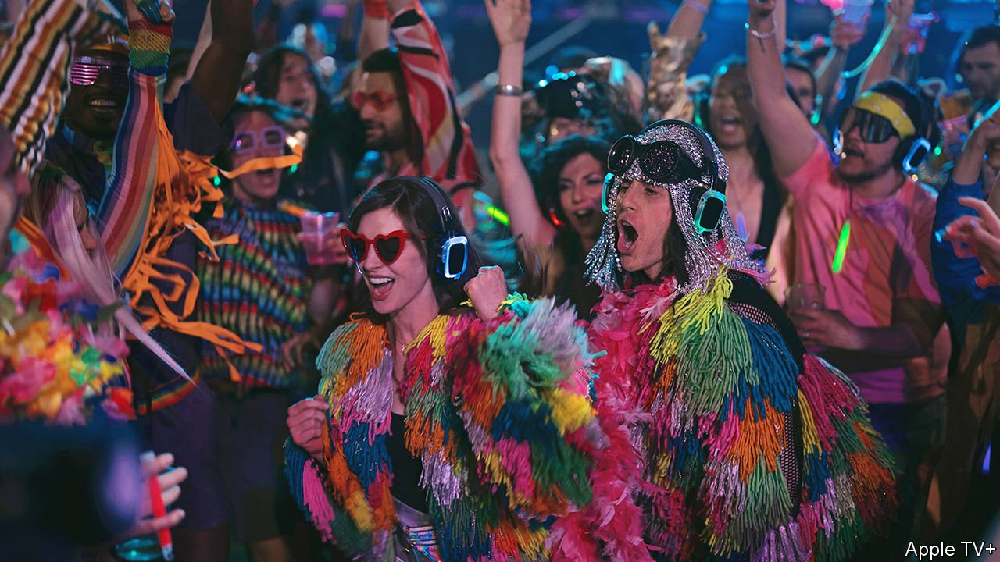

###### WeBinged

# Why the WeWork fiasco makes for compelling TV 

##### “WeCrashed” turns a corporate tale into a popcultural event 

 

> Mar 19th 2022 

SURFING BETWEEN team-building exercises. Tequila shots in meetings and pot on private jets. Barefoot strolls around New York. Adam Neumann’s quirks have been familiar to readers of newspapers’ business pages since 2019, when WeWork, the workspace provider with tech aspirations that he co-founded, reached a private valuation of $47bn, only to crumble after an abortive initial public offering (IPO). The story of WeWork and its flamboyant boss have now reached a wider audience thanks to “WeCrashed”, a new series which will stream on Apple TV+ from March 18th.

Popular culture, whose creators lean left, revels in skewering the perceived greed of capitalism, also through the prism of real-life business figures. The villains change with the times. In the 1990s it was the buy-out barons (“Barbarians at the Gate”). After the financial crisis of 2007-09 it was the investment bankers (notably on stage with “The Lehman Trilogy”) and other financiers (on the silver screen with “The Big Short”). As big tech grew too big for some tastes, the spotlight turned to its misanthropic billionaire bosses (“Steve Jobs”, “The Social Network”).


The latest cohort of capitalist anti heroes and -heroines to receive popcultural treatment includes the darlings of Silicon Valley’s startup scene. “The Dropout”, a series streaming on Hulu and Disney+, recounts the rise and fall of Elizabeth Holmes and her fraudulent blood-testing firm. Showtime’s “Super Pumped” dissects the life of Travis Kalanick, Uber’s brilliant but abrasive co-founder. “WeCrashed” belongs to this genre.

Mr Neumann and his new-agey wife, Rebekah (“fear is a choice”), are made for TV. Most chief executives have big egos but few can match the sheer scale of the couple’s narcissism (or good looks). Mr Neumann, who grew up in an Israeli kibbutz, once claimed that the elusive Middle East peace treaty would be signed at a WeWork venue. His company’s IPO prospectus promised not merely to offer convenient co-working space but, apparently without irony, to “elevate the world’s consciousness”. Portrayed masterfully by Jared Leto and Anne Hathaway, the on-screen Neumanns are, like many startup founders only more so, both intoxicating and painful to watch. It is suddenly easy to understand why so many investors felt at once besotted and uncomfortable around them.

Mr Neumann’s knack for distorting reality—most notably by dressing up a lossmaking office-rental firm as a successful tech giant—is a trait common to many successful founders. It is not the whole story, however. “WeCrashed” also depicts how the reality of Silicon Valley distorted him and his firm. In one scene Son Masayoshi, the messianic boss of SoftBank, a free-spending Japanese tech-investment group that poured billions into WeWork, tells Mr Neumann, “You’re not crazy enough.” A string of other prominent venture capitalists likewise encouraged the company to aim for the stars. So it did.

Colourful characters aside, WeWork’s rise and fall makes for compelling TV because it follows the dramatic arc of a Greek tragedy: a protagonist grossly overestimates his abilities; his hubris is punished; order is restored. Except in this case, the punishment is meted out not by mercurial gods but by Mr Neumann’s increasingly impatient VC backers and the public markets, whose scrutiny of his firm’s value-torching business model undid the IPO. As such, “WeCrashed” also traces the arc of capitalism’s capacity for self-correction. ■


