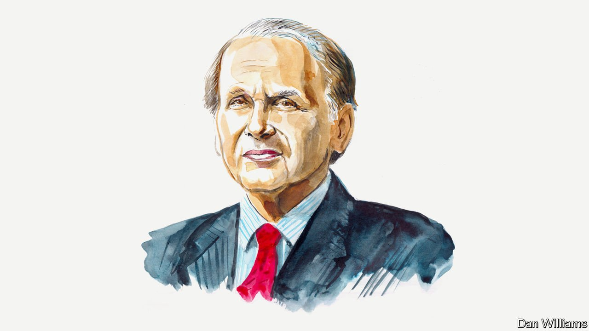

###### Russia and Ukraine

# Daniel Yergin on Russia losing its status as an “energy superpower” 

##### The energy analyst and award-winning author of “The Prize” and “The New Map” says Vladimir Putin is destroying the foundation of his country’s economic power 

 

> Mar 19th 2022 

VLADIMIR PUTIN once said that he did not like hearing Russia described as an “energy superpower”. It reminded him, he said, too much of the cold war. But he has revelled in what his country’s energy resources have brought him–global political clout and massive revenues. But the consequences of the Ukraine war will turn Russia into a “reduced energy power”.

This marks the end of an era that began three decades ago with the collapse of the Soviet Union. In the years afterwards, for the first time since the Bolshevik revolution, the Russian oil industry rebounded and largely integrated with the global industry. Today Russia is one of the top three oil producers in the world (after America and roughly equal with Saudi Arabia) and is also the world’s largest natural-gas exporter and second-largest producer, again after America.


In just a few weeks, Mr Putin has destroyed the internationalised economy he has been building for more than 20 years, as well as the reputation Russia has cultivated as a reliable supplier. It is now seen as an unreliable and largely unwanted energy source for Europe. In 2021 it supplied 29% of Europe’s total gas supplies and 35% of its oil. Although it remains a necessary supplier for now, its role is certain to diminish.

Unplugging Russia from the world economy with massive sanctions turns out to be a challenge. As an exporter, it is mainly a supplier of commodities and raw materials, none of them easily replaceable in an inflationary time. Oil and gas rank at the top of the list, accounting for half of total export earnings and, in some years, over 40% of Russia’s total budget.

Europe’s immediate need, now that winter is ending, is to ensure enough natural gas in storage for next winter, and for that it will need Russian supplies. Overall, however, Russia’s gas sales to Europe will shrink dramatically over the next five years. Europe will step up its push towards renewables, now for reasons of security as well as climate change. France has announced new nuclear power plants, and Europe is searching the world for more liquefied natural gas (LNG).

That market is tight, but America will be bringing on more capacity this year, making it the world’s largest LNG exporter. Europe will promote energy efficiency but also burn more coal, at least temporarily. The roll-out of electric vehicles will accelerate. Europe will need to expedite permission for new oil and gas production. “Yet-to-find” natural gas resources in Europe are estimated to be equivalent to decades worth of Russian gas exports to the continent. Russia will be able to pipe more to China, but will be stuck with a westward-running pipeline system into Europe operating far below capacity.

In a normal year, Russian oil exports generate more than three times the revenues of gas. But its oil exports are, so far, much more disrupted. About half of Russia’s 7.5m barrels per day of exports go to Europe. Though those exports were explicitly excluded from formal sanctions (until they were specifically targeted by America and Britain), they are being indirectly sanctioned and “self-sanctioned” by buyers, shippers, and insurance providers, as well as by the extreme reluctance of banks to provide trade finance. A new factor is now shaping oil markets: the force of public opinion horrified by the war in Ukraine and the resulting pressure on companies to step back from Russian oil.

This creates a dilemma for European countries: not buying Russian oil in response to a public enraged by the devastation in Ukraine, set against likely fuel shortages across the continent. Mr Putin thought he had leverage, launching the war when energy markets were very tight, expecting that EU countries would protest but stand aside. But this has proved a serious miscalculation. At this point it appears that Russian tanker loadings are down by 1-2m barrels per day, and additional barrels are stuck at sea, unable to find a home.

Western governments, having rediscovered the concept of energy security, are scouring the world for additional supplies. They should plan on the basis that either the rejection of Russian oil will increase or that Mr Putin will wield the “oil weapon” and cut supplies. Whichever it is, they should be working much more closely with oil and gas companies to understand the changing logistics. To facilitate collaboration, they would do well to put aside the customary populist language about market manipulation usually invoked when prices go up.

This brings us to the question of fungibility, that strange word describing the ease (or not) of replacing one good with another. In theory, the oil market will readjust. Russian barrels no longer bound for Europe would go somewhere else, mainly to Asia, and barrels from elsewhere would come to Europe. Buyer countries such as India, which imports 85% of its oil, and China, will be eager to buy heavily-discounted Russian oil. But the complex system that moves about 100m barrels a day around the world is not easily rebalanced and will be snarled by new frictions, such as the difficulties of arranging finance and transport from Black Sea and Baltic ports, and the new sanctions. Bilateral payment systems that avoid the dollar would be needed, and barter may well return.

The OPEC-plus system, managed by Saudi Arabia and Russia, worked in a globalised market. But it will be difficult to hold together in a more Balkanised world in which countries will find it harder to “abstain” from choosing sides as they did in the recent UN vote condemning the invasion. Adding to the tension among exporters, countries in the Middle East will find themselves competing in the Asian market against an onslaught of cheaper Russian oil.

The investments that western companies made in Russian energy over the past three decades were strongly encouraged by Western governments, which wanted to undergird the post-Soviet relationship with an economic foundation and, after the Gulf crisis of the early 1990s, bring more diverse supplies into the global market. Those companies are now leaving their investments in Russia. Companies from emerging markets will try to pick up the abandoned properties at bargain prices, while needing to take care to skirt sanctions. Russian energy companies are now cut off from international finance and flows of technology. All of this will mean that Russian oil and natural-gas production will decrease.

Mr Putin launched the war on the claim of “unity”, that Russians and Ukrainians are “one people”, and as an important step to achieve his grand ambition to reassert Russia as a great power. But what he has done, in addition to shattering any such unity, is to undermine and debase Russia’s most important source of economic power.■

_______________

Daniel Yergin is author of "The New Map: Energy, Climate, and the Clash of Nations". He is vice chairman of S&amp;P Global and received the Pulitzer Prize for his book, "The Prize: The Epic Quest for Oil, Money and Power".

Read more of our recent coverage of the 

