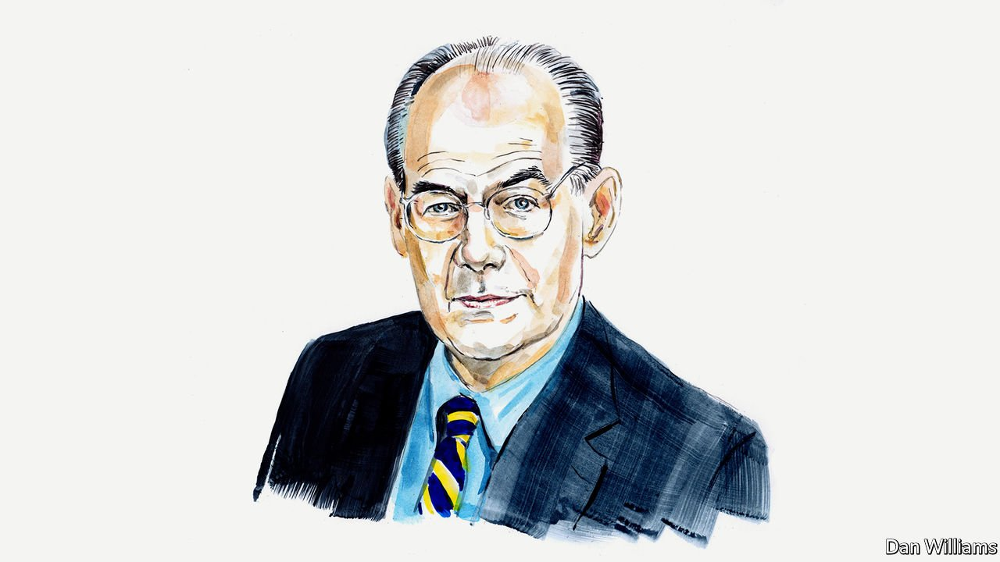

###### Russia and Ukraine

# John Mearsheimer on why the West is principally responsible for the Ukrainian crisis 

##### The political scientist believes the reckless expansion of NATO provoked Russia 

 

> Mar 19th 2022 

THE WAR in Ukraine is the most dangerous international conflict since the 1962 Cuban missile crisis. Understanding its root causes is essential if we are to prevent it from getting worse and, instead, to find a way to bring it to a close.

There is no question that Vladimir Putin started the war and is responsible for how it is being waged. But why he did so is another matter. The mainstream view in the West is that he is an irrational, out-of-touch aggressor bent on creating a greater Russia in the mould of the former Soviet Union. Thus, he alone bears full responsibility for the Ukraine crisis.


But that story is wrong. The West, and especially America, is principally responsible for the crisis which began in February 2014. It has now turned into a war that not only threatens to destroy Ukraine, but also has the potential to escalate into a nuclear war between Russia and NATO.

The trouble over Ukraine actually started at NATO’s Bucharest summit in April 2008, when George W. Bush’s administration pushed the alliance to announce that Ukraine and Georgia “will become members”. Russian leaders responded immediately with outrage, characterising this decision as an existential threat to Russia and vowing to thwart it. According to a respected Russian journalist, Mr Putin “flew into a rage” and warned that “if Ukraine joins NATO, it will do so without Crimea and the eastern regions. It will simply fall apart.” America ignored Moscow’s red line, however, and pushed forward to make Ukraine a Western bulwark on Russia’s border. That strategy included two other elements: bringing Ukraine closer to the eu and making it a pro-American democracy.

These efforts eventually sparked hostilities in February 2014, after an uprising (which was supported by America) caused Ukraine’s pro-Russian president, Viktor Yanukovych, to flee the country. In response, Russia took Crimea from Ukraine and helped fuel a civil war that broke out in the Donbas region of eastern Ukraine.

The next major confrontation came in December 2021 and led directly to the current war. The main cause was that Ukraine was becoming a de facto member of NATO. The process started in December 2017, when the Trump administration decided to sell Kyiv “defensive weapons”. What counts as “defensive” is hardly clear-cut, however, and these weapons certainly looked offensive to Moscow and its allies in the Donbas region. Other NATO countries got in on the act, shipping weapons to Ukraine, training its armed forces and allowing it to participate in joint air and naval exercises. In July 2021, Ukraine and America co-hosted a major naval exercise in the Black Sea region involving navies from 32 countries. Operation Sea Breeze almost provoked Russia to fire at a British naval destroyer that deliberately entered what Russia considers its territorial waters.

The links between Ukraine and America continued growing under the Biden administration. This commitment is reflected throughout an important document—the “us-Ukraine Charter on Strategic Partnership”—that was signed in November by Antony Blinken, America’s secretary of state, and Dmytro Kuleba, his Ukrainian counterpart. The aim was to “underscore … a commitment to Ukraine’s implementation of the deep and comprehensive reforms necessary for full integration into European and Euro-Atlantic institutions.” The document explicitly builds on “the commitments made to strengthen the Ukraine-u.s. strategic partnership by Presidents Zelensky and Biden,” and also emphasises that the two countries will be guided by the “2008 Bucharest Summit Declaration.”

Unsurprisingly, Moscow found this evolving situation intolerable and began mobilising its army on Ukraine’s border last spring to signal its resolve to Washington. But it had no effect, as the Biden administration continued to move closer to Ukraine. This led Russia to precipitate a full-blown diplomatic stand-off in December. As Sergey Lavrov, Russia’s foreign minister, put it: “We reached our boiling point.” Russia demanded a written guarantee that Ukraine would never become a part of NATO and that the alliance remove the military assets it had deployed in eastern Europe since 1997. The subsequent negotiations failed, as Mr Blinken made clear: “There is no change. There will be no change.” A month later Mr Putin launched an invasion of Ukraine to eliminate the threat he saw from NATO.

This interpretation of events is at odds with the prevailing mantra in the West, which portrays NATO expansion as irrelevant to the Ukraine crisis, blaming instead Mr Putin’s expansionist goals. According to a recent NATO document sent to Russian leaders, “NATO is a defensive Alliance and poses no threat to Russia.” The available evidence contradicts these claims. For starters, the issue at hand is not what Western leaders say NATO’s purpose or intentions are; it is how Moscow sees NATO’s actions.

Mr Putin surely knows that the costs of conquering and occupying large amounts of territory in eastern Europe would be prohibitive for Russia. As he once put it, “Whoever does not miss the Soviet Union has no heart. Whoever wants it back has no brain.” His beliefs about the tight bonds between Russia and Ukraine notwithstanding, trying to take back all of Ukraine would be like trying to swallow a porcupine. Furthermore, Russian policymakers—including Mr Putin—have said hardly anything about conquering new territory to recreate the Soviet Union or build a greater Russia. Rather, since the 2008 Bucharest summit Russian leaders have repeatedly said that they view Ukraine joining NATO as an existential threat that must be prevented. As Mr Lavrov noted in January, “the key to everything is the guarantee that NATO will not expand eastward.”

Tellingly, Western leaders rarely described Russia as a military threat to Europe before 2014. As America’s former ambassador to Moscow Michael McFaul notes, Mr Putin’s seizure of Crimea was not planned for long; it was an impulsive move in response to the coup that overthrew Ukraine’s pro-Russian leader. In fact, until then, NATO expansion was aimed at turning all of Europe into a giant zone of peace, not containing a dangerous Russia. Once the crisis started, however, American and European policymakers could not admit they had provoked it by trying to integrate Ukraine into the West. They declared the real source of the problem was Russia’s revanchism and its desire to dominate if not conquer Ukraine.

My story about the conflict’s causes should not be controversial, given that many prominent American foreign-policy experts have warned against NATO expansion since the late 1990s. America’s secretary of defence at the time of the Bucharest summit, Robert Gates, recognised that “trying to bring Georgia and Ukraine into NATO was truly overreaching”. Indeed, at that summit, both the German chancellor, Angela Merkel, and the French president, Nicolas Sarkozy, were opposed to moving forward on NATO membership for Ukraine because they feared it would infuriate Russia.

The upshot of my interpretation is that we are in an extremely dangerous situation, and Western policy is exacerbating these risks. For Russia’s leaders, what happens in Ukraine has little to do with their imperial ambitions being thwarted; it is about dealing with what they regard as a direct threat to Russia’s future. Mr Putin may have misjudged Russia’s military capabilities, the effectiveness of the Ukrainian resistance and the scope and speed of the Western response, but one should never underestimate how ruthless great powers can be when they believe they are in dire straits. America and its allies, however, are doubling down, hoping to inflict a humiliating defeat on Mr Putin and to maybe even trigger his removal. They are increasing aid to Ukraine while using economic sanctions to inflict massive punishment on Russia, a step that Putin now sees as “akin to a declaration of war”.

America and its allies may be able to prevent a Russian victory in Ukraine, but the country will be gravely damaged, if not dismembered. Moreover, there is a serious threat of escalation beyond Ukraine, not to mention the danger of nuclear war. If the West not only thwarts Moscow on Ukraine’s battlefields, but also does serious, lasting damage to Russia’s economy, it is in effect pushing a great power to the brink. Mr Putin might then turn to nuclear weapons.

At this point it is impossible to know the terms on which this conflict will be settled. But, if we do not understand its deep cause, we will be unable to end it before Ukraine is wrecked and NATO ends up in a war with Russia.

John J. Mearsheimer is the R. Wendell Harrison Distinguished Service Professor of Political Science at the University of Chicago.

Our recent coverage of the Ukraine crisis can be found .

