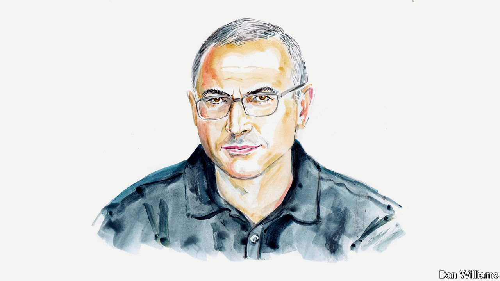

###### Russia and Ukraine

# Mikhail Khodorkovsky on how to deal with the “bandit” in the Kremlin 

##### A former oil mogul and political prisoner warns the West it must face down Vladimir Putin now or prepare for something worse 

 

> Mar 19th 2022 

I HAVE BEEN fighting a personal war with Vladimir Putin for nearly 20 years. It led to my being jailed in Russia for ten years and then expelled, with a warning that life imprisonment awaited me if I ever returned. Do I know the man who did all this to me? I think I do. That is why I look with despair at the defeatist approach of Western leaders, such as Joe Biden, Emmanuel Macron and Naftali Bennett.

It is difficult for me to judge how their actions are seen by their electorates. However, I know well how they are perceived by Mr Putin, sitting at the end of his long table. They fly to Moscow, call him, ask him to stop, but assure him that they will not interfere and do not want him to perceive certain movements as a provocation. The president sees all of this as weakness, and that is extremely dangerous.


Part of the problem is that the current leaders of Western countries have never dealt with thugs. Their experience and education relate to interactions between statesmen. The principle of these people’s behaviour is that both sides concede to each other in the interests of their electorate or subjects. War is evil to them, and the use of force is a last resort.

This is not the case with Vladimir Putin. He was raised in the KGB, an organisation that relied on force and disregard for the law. While working at St Petersburg City Hall in the early 1990s, he was responsible for the informal interaction of the law-enforcement agencies with gangsters. St Petersburg at that time was perceived in Russia just as Chicago was seen during prohibition. Instead of smuggled whisky, the gangsters were selling drugs and oil.

Times changed but his ways of solving issues remained. Some of the conversations between his confidants and known criminals, made public after an investigation by Spanish prosecutors, help us to understand how the murder of Alexander Litvinenko and the poisoning of Alexey Navalny and the Skripals came at the nod of the ringleader. Such acts are the norm within the president’s circles, because he is a thug by nature.

Even after more than 20 years in power, having acquired a strongman image and self-confidence, a bandit will always remain a bandit in terms of his perception among those around him. It is a drastic mistake when he is seen as a normal statesman. Russia’s foreign partners fail to understand who he really is.

I have plenty of experience of dealing with bandits. After spending ten years in Russian prisons, I can say that the most dangerous thing is to show them any weakness or uncertainty. Any step towards their demands, without a clear demonstration of strength, will be perceived as weakness. Following their logic, if Western countries say they will not give up Ukraine and yet they do exactly that, it means that they are weak. And that makes it likely that Mr Putin will look towards other neighbours, such as Estonia, Latvia, Lithuania and Poland, who were also previously part of the Russian Empire.

You have to understand that Mr Putin, in his head, has long been at war not with Ukraine, but with America. And now America and NATO look to be retreating. He is not the only thug who perceives the situation that way. Other bandits are also watching and waiting their turn, as America’s humiliation echoes around the world. Transnistria is stirring, the Balkans are restless again, Iran is attacking American bases. At some point, America and NATO will retaliate, but by that point, they will be tormented by crows and vultures in various parts of the world, and Mr Putin will not immediately realise that the pushback is serious. The habit of impunity among thugs does not subside so quickly. And that means a worse war, an even bigger one, is likely.

Perhaps you do not believe it. But consider this: Mr Putin managed to increase his ratings when he came to office, in 1999, with the war in Chechnya. He solved the problem of controlling his “interim president”, Dmitry Medvedev, by going to war with Georgia in 2008. Having gone to war on Mr Putin’s orders, Mr Medvedev was forced to abandon his own agenda of modernisation. Mr Putin solved the problem of his ratings plunge in 2013-14 by seizing Crimea.

Now, the war in Ukraine dwarfs any gripes about a decade of economic decline. If he is allowed to take over Ukraine, the economy will continue to collapse, as a result of corruption and sanctions. A flood of coffins will return home to Russia, for the guerrilla war cannot be stopped. The mood of the population will continue to deteriorate. And in 2024, there will be elections.

What is likely to be Mr Putin’s solution? It will be another “special operation”. Moldova is too small, so it is likely to be in the Baltic states or Poland. Unless Mr Putin is stopped in the air over Ukraine, NATO will have to fight him on the ground.

As for nuclear weapons, the Russian president has a manic psychosis. He is obsessed with being a historical figure like Stalin. He has placed a huge statue of Prince Vladimir, the creator of Russia, at his Kremlin gate. But he is not suicidal or he would not be sitting at the other end of a 20-foot table from his cronies. He will only use nuclear weapons if he believes there will be no response. But every day NATO rejects the no-fly zone over Ukraine, his self-confidence grows.

I do not want my country to face NATO in a global conflict, but trying to talk to a thug without showing him your strength leads exactly to that point. ■

_______________

Mikhail Khodorkovsky is an exiled Russian businessman.

Read more of our recent coverage of the 

