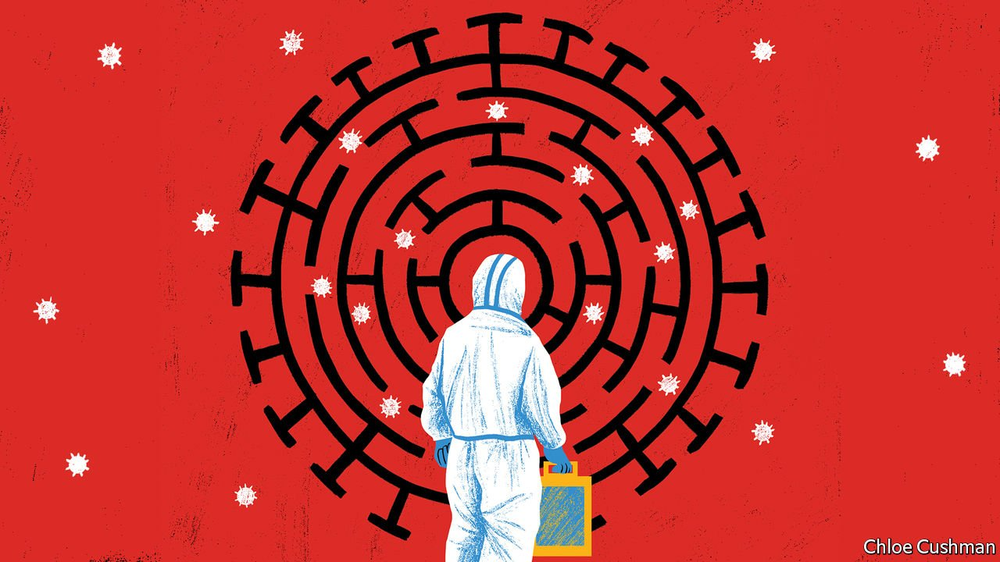

###### Chaguan

# Omicron is changing China’s covid strategy 

##### Beating the latest variant will require more vaccinations and less fear 

 

> Mar 19th 2022 

FOR MOST of the covid-19 pandemic, a bargain based on tough love has bonded China’s rulers and people. Leaders have imposed tight controls on an unlucky minority—meaning anyone hapless enough to cross paths or live near someone with covid, or even to be a close contact of these close contacts. Such unfortunates face being quarantined for days or weeks. Right now mainland China is enduring its first big outbreak of the Omicron variant, and the ranks of the unlucky have grown rapidly. At least 40m people are under some form of lockdown, including an entire province, Jilin. The southern metropolis of Shenzhen confined most residents to their homes except for trips to buy food, though it prefers the term “life on pause” to “lockdown”. Some border cities have spent months cut off from the rest of China.

In return for those sacrifices by the unlucky, a majority of China’s 1.4bn people have spent most of the pandemic leading relatively normal lives. As a result, it is common to hear ordinary folk praise strict covid controls. Even now, reported case numbers remain low by global standards, with about 3,000 new infections detected nationwide on March 15th, compared with 26,000 found on the same day in America. Keeping China mostly covid-free has cost residents a good deal of privacy. Those with smartphones must scan QR codes to enter public buildings or catch a taxi, train or domestic flight. The simplest walk in the park is logged by movement-tracking public-health apps installed on those same phones. The costs also include isolation from the world, for China has all but closed its borders for nearly two years.


Still, Chinese leaders are not shy about proclaiming this strategy, which they call their “dynamic zero-covid” policy, an act of love. They say it is proof that the Communist Party cares for all its people. They contrast China with countries such as America that have chosen to “live with covid” in the name of individual liberties, amid horrifying numbers of deaths. The party’s love has a paternalist edge. Because officials risk the sack for cases found on their watch, they compete to invent ever-stricter rules. Like overprotective parents, authorities have treated suspected cases as medical emergencies. Anyone who develops a fever, for any reason, is meant to head to a fever clinic for hours of covid-detecting nasal swabs, chest scans and blood tests.

With the party’s governing legitimacy bound up with keeping China covid-free and death numbers very low, leaders have to date rejected suggestions that they will have to change course, especially if that advice comes from foreigners. After inspecting pop-up quarantine clinics in Jilin, Sun Chunlan, a deputy prime minister, told officials to grit their teeth and “win the battle of epidemic prevention, control and eradication”. For all the defiant talk, there are signs that the authorities are ready to adjust their methods. Success in this endeavour comes with preconditions. Most important, to avoid a political crisis at home China will have to avoid the high death rates currently seen in its semi-autonomous territory of Hong Kong. The virus has exacted a grim toll on the city’s unvaccinated old people, a category that is also dangerously large in the mainland. Even if China can avoid mass fatalities, the whole population is going to experience the pandemic differently. If China’s covid bargain is to survive the Omicron strain, the public will have to accept a version that feels more tough and less loving.

Many Chinese are strikingly frightened of catching covid, after so many months of reports about pandemic deaths in the selfish, decadent West. The disease carries a stigma that extends beyond its impact on health. People who test positive know that many neighbours and work colleagues, and perhaps their child’s schoolmates, too, will be quarantined on their account.

Yet Omicron spreads so fast that tracking systems are flagging too many close contacts to fit into hospitals. New guidelines from the National Health Commission duly state that patients with mild symptoms will be monitored in isolation sites, rather than in clinics or hospitals. In the name of treatment rather than prevention, China has approved an antiviral medicine, Paxlovid, made by an American firm, Pfizer. Netizens have responded with panic, tinged with nationalism. An alarmist blog post by a student at Jilin Agricultural Science and Technology University declared that youngsters were “waiting to die” after being told to quarantine together amid a covid scare. It was viewed hundreds of millions of times. Reports of Paxlovid’s approval drew angry comments about its foreign origins, such as one asking: “900,000 Americans died from covid, is this medicine any good?”

When the party’s scare tactics work too well

Officials are not becoming less strict. During recent lockdowns, some people faced quarantine for receiving a package sent from a city with cases, for instance. But officials are sounding less tolerant of some fears. Health chiefs have called for greater efforts to get the elderly vaccinated, noting that two-thirds of Chinese with severe covid are aged over 60, and two-thirds of those sick mature folk have not had jabs. Anti-Western propaganda does not help: official media have repeatedly cast doubt on the safety of m RNA shots used abroad. To date only Chinese-made vaccines have been approved in the country. Although they offer decent protection against severe disease and death, they do not prevent infection—and thus do little to stop the virus spreading.

Public fear has suited officials, helping to drive compliance with disruptive controls. Omicron poses a new test, being more contagious but less lethal than earlier variants. If authorities are not ready to open the country, they will need millions of Chinese to feel safe if told to isolate while mildly ill but not in a hospital. To achieve an exit strategy one day, they will need the public to trust potent, imported treatments. After shamefully concealing the start of this pandemic, Chinese officials acted like stern parents for two years. Now, they need to treat their people like adults. ■

Read more from Chaguan, our columnist on China: (Mar 12th)

 (Mar 5th) 


All our stories relating to the pandemic can be found on our . You can also find trackers showing ,  and the virus’s spread across .

